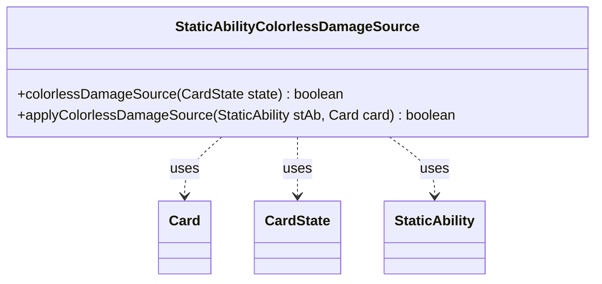

---
aliases:
  - StaticAbilityColorlessDamageSource
tags:
  - java/class
  - module/forge-game
  - pkg/forge/game/staticability
fqn: forge.game.staticability.StaticAbilityColorlessDamageSource
package: forge.game.staticability
module: forge-game
kind: Class
---

# StaticAbilityColorlessDamageSource

**Package:** `forge.game.staticability` &nbsp; **Module:** `forge-game` &nbsp; **Kind:** Class



## Relationships
**Uses:**
- [[forge.game.card.Card|Card]]
- [[forge.game.card.CardState|CardState]]
- [[forge.game.staticability.StaticAbility|StaticAbility]]

## Design Description

Java MTG static-ability helper. Let me write the SDD.

A stateless utility class within Forge's static-ability subsystem that implements the "colorless damage source" rule, which forces damage dealt by qualifying sources to be treated as colorless. Exposing only static methods and holding no state, it acts as a pure rule evaluator rather than a modeled domain entity. `colorlessDamageSource` scans all cards in the game's static-ability source zones, filters their `StaticAbility` definitions to those active in the `ColorlessDamageSource` mode via `checkConditions`, and delegates to `applyColorlessDamageSource`, which confirms the target `Card` satisfies the ability's `ValidCard` parameter. It collaborates with `Card` and `CardState` to reach the game state and with `StaticAbility` for condition and validity checks, mirroring the convention shared across sibling `StaticAbility*` classes of pairing a collection-scanning query method with a single-ability application method.

## Source
`forge-game/src/main/java/forge/game/staticability/StaticAbilityColorlessDamageSource.java`

```java
package forge.game.staticability;

import forge.game.card.Card;
import forge.game.card.CardState;
import forge.game.zone.ZoneType;

public class StaticAbilityColorlessDamageSource {

    public static boolean colorlessDamageSource(final CardState state) {
        final Card card = state.getCard();
        for (final Card ca : card.getGame().getCardsIn(ZoneType.STATIC_ABILITIES_SOURCE_ZONES)) {
            for (final StaticAbility stAb : ca.getStaticAbilities()) {
                if (!stAb.checkConditions(StaticAbilityMode.ColorlessDamageSource)) {
                    continue;
                }
                if (applyColorlessDamageSource(stAb, card)) {
                    return true;
                }
            }
        }
        return false;
    }

    public static boolean applyColorlessDamageSource(final StaticAbility stAb, final Card card) {
        if (!stAb.matchesValidParam("ValidCard", card)) {
            return false;
        }
        return true;
    }
}
```

## Python
`forge/game/staticability/StaticAbilityColorlessDamageSource.py`

```python
from forge.game.card.Card import Card
from forge.game.card.CardState import CardState
from forge.game.zone.ZoneType import ZoneType
from forge.game.staticability.StaticAbility import StaticAbility
from forge.game.staticability.StaticAbilityMode import StaticAbilityMode


class StaticAbilityColorlessDamageSource:

    @staticmethod
    def colorlessDamageSource(state: CardState) -> bool:
        card = state.getCard()
        for ca in card.getGame().getCardsIn(ZoneType.STATIC_ABILITIES_SOURCE_ZONES):
            for stAb in ca.getStaticAbilities():
                if not stAb.checkConditions(StaticAbilityMode.ColorlessDamageSource):
                    continue
                if StaticAbilityColorlessDamageSource.applyColorlessDamageSource(stAb, card):
                    return True
        return False

    @staticmethod
    def applyColorlessDamageSource(stAb: StaticAbility, card: Card) -> bool:
        if not stAb.matchesValidParam("ValidCard", card):
            return False
        return True
```
