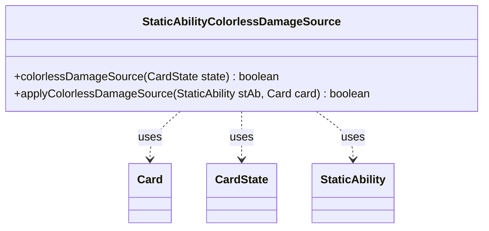

---
aliases:
  - StaticAbilityColorlessDamageSource
tags:
  - java/class
  - module/forge-game
  - pkg/forge/game/staticability
fqn: forge.game.staticability.StaticAbilityColorlessDamageSource
package: forge.game.staticability
module: forge-game
kind: Class
---

# StaticAbilityColorlessDamageSource

**Package:** `forge.game.staticability` &nbsp; **Module:** `forge-game` &nbsp; **Kind:** Class



## Relationships
**Uses:**
- [[forge.game.card.Card|Card]]
- [[forge.game.card.CardState|CardState]]
- [[forge.game.staticability.StaticAbility|StaticAbility]]

## Source
`forge-game/src/main/java/forge/game/staticability/StaticAbilityColorlessDamageSource.java`

```java
package forge.game.staticability;

import forge.game.card.Card;
import forge.game.card.CardState;
import forge.game.zone.ZoneType;

public class StaticAbilityColorlessDamageSource {

    public static boolean colorlessDamageSource(final CardState state) {
        final Card card = state.getCard();
        for (final Card ca : card.getGame().getCardsIn(ZoneType.STATIC_ABILITIES_SOURCE_ZONES)) {
            for (final StaticAbility stAb : ca.getStaticAbilities()) {
                if (!stAb.checkConditions(StaticAbilityMode.ColorlessDamageSource)) {
                    continue;
                }
                if (applyColorlessDamageSource(stAb, card)) {
                    return true;
                }
            }
        }
        return false;
    }

    public static boolean applyColorlessDamageSource(final StaticAbility stAb, final Card card) {
        if (!stAb.matchesValidParam("ValidCard", card)) {
            return false;
        }
        return true;
    }
}
```
