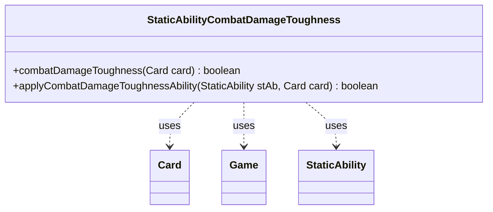

---
aliases:
  - StaticAbilityCombatDamageToughness
tags:
  - java/class
  - module/forge-game
  - pkg/forge/game/staticability
fqn: forge.game.staticability.StaticAbilityCombatDamageToughness
package: forge.game.staticability
module: forge-game
kind: Class
---

# StaticAbilityCombatDamageToughness

**Package:** `forge.game.staticability` &nbsp; **Module:** `forge-game` &nbsp; **Kind:** Class



## Relationships
**Uses:**
- [[forge.game.Game|Game]]
- [[forge.game.card.Card|Card]]
- [[forge.game.staticability.StaticAbility|StaticAbility]]

## Design Description

StaticAbilityCombatDamageToughness is a stateless utility that implements the "combat damage uses toughness instead of power" static-ability rule for Forge's Magic engine. Its static `combatDamageToughness` method scans every card in the game's static-ability source zones, iterating their `StaticAbility` objects and, for each one whose conditions match the `CombatDamageToughness` mode, delegating to `applyCombatDamageToughnessAbility` to test whether the given card satisfies the ability's `ValidCard` filter; a single match short-circuits to `true`.

Rather than extending a common base, the class collaborates loosely with `Card`, `Game`, and `StaticAbility`, reaching the game state through `card.getGame()`. The all-static, no-instance design reflects the package convention of one helper class per static-ability mode, keeping the rule logic centralized and side-effect-free so callers can cheaply query whether a card's combat damage should be measured by toughness.

## Source
`forge-game/src/main/java/forge/game/staticability/StaticAbilityCombatDamageToughness.java`

```java
package forge.game.staticability;

import forge.game.Game;
import forge.game.card.Card;
import forge.game.zone.ZoneType;

public class StaticAbilityCombatDamageToughness {

    public static boolean combatDamageToughness(final Card card)  {
        final Game game = card.getGame();
        for (final Card ca : game.getCardsIn(ZoneType.STATIC_ABILITIES_SOURCE_ZONES)) {
            for (final StaticAbility stAb : ca.getStaticAbilities()) {
                if (!stAb.checkConditions(StaticAbilityMode.CombatDamageToughness)) {
                    continue;
                }

                if (applyCombatDamageToughnessAbility(stAb, card)) {
                    return true;
                }
            }
        }
        return false;
    }

    public static boolean applyCombatDamageToughnessAbility(final StaticAbility stAb, final Card card) {
        if (!stAb.matchesValidParam("ValidCard", card)) {
            return false;
        }
        return true;
    }
}
```

## Python
`forge/game/staticability/StaticAbilityCombatDamageToughness.py`

```python
package = "forge.game.staticability"

from forge.game.Game import Game
from forge.game.card.Card import Card
from forge.game.zone.ZoneType import ZoneType
from forge.game.staticability.StaticAbility import StaticAbility
from forge.game.staticability.StaticAbilityMode import StaticAbilityMode


class StaticAbilityCombatDamageToughness:

    @staticmethod
    def combatDamageToughness(card: Card) -> bool:
        game = card.getGame()
        for ca in game.getCardsIn(ZoneType.STATIC_ABILITIES_SOURCE_ZONES):
            for stAb in ca.getStaticAbilities():
                if not stAb.checkConditions(StaticAbilityMode.CombatDamageToughness):
                    continue

                if StaticAbilityCombatDamageToughness.applyCombatDamageToughnessAbility(stAb, card):
                    return True
        return False

    @staticmethod
    def applyCombatDamageToughnessAbility(stAb: StaticAbility, card: Card) -> bool:
        if not stAb.matchesValidParam("ValidCard", card):
            return False
        return True
```
