---
aliases:
  - StaticAbilityContinuous
tags:
  - java/class
  - module/forge-game
  - pkg/forge/game/staticability
fqn: forge.game.staticability.StaticAbilityContinuous
package: forge.game.staticability
module: forge-game
kind: Class
---

# StaticAbilityContinuous

**Package:** `forge.game.staticability`   **Module:** `forge-game`   **Kind:** Class



```mermaid
classDiagram
    class StaticAbilityContinuous {
        +applyContinuousAbility(StaticAbility stAb, StaticAbilityLayer layer, CardCollectionView preList) CardCollectionView
        +applyContinuousAbility(StaticAbility stAb, CardCollectionView affectedCards, StaticAbilityLayer layer) CardCollectionView
        -getColorsFromParam(StaticAbility stAb, String colors) ColorSet
        -buildIgnoreEffectAbility(StaticAbility stAb, String costString, List~Player~ players, CardCollectionView cards) void
        -cardsGainedFrom(String param, Map~String,String~ params, Card hostCard, StaticAbility stAb, Game game) CardCollection
        -getAffectedPlayers(StaticAbility stAb) List~Player~
        +getAffectedCards(StaticAbility stAb, CardCollectionView preList) CardCollectionView
        -StaticAbilityContinuous()
    }
    StaticAbilityContinuous ..> AbilityStatic : uses
    StaticAbilityContinuous ..> Card : uses
    StaticAbilityContinuous ..> CardCollection : uses
    StaticAbilityContinuous ..> CardCollectionView : uses
    StaticAbilityContinuous ..> CardState : uses
    StaticAbilityContinuous ..> CardTraitBase : uses
    StaticAbilityContinuous ..> CardType : uses
    StaticAbilityContinuous ..> Color : uses
    StaticAbilityContinuous ..> ColorSet : uses
    StaticAbilityContinuous ..> Cost : uses
    StaticAbilityContinuous ..> Game : uses
    StaticAbilityContinuous ..> GameCommand : uses
    StaticAbilityContinuous ..> Keyword : uses
    StaticAbilityContinuous ..> KeywordInterface : uses
    StaticAbilityContinuous ..> MagicColor : uses
    StaticAbilityContinuous ..> ManaCost : uses
    StaticAbilityContinuous ..> Player : uses
    StaticAbilityContinuous ..> PlayerCollection : uses
    StaticAbilityContinuous ..> RemoveType : uses
    StaticAbilityContinuous ..> ReplacementEffect : uses
    StaticAbilityContinuous ..> SpellAbility : uses
    StaticAbilityContinuous ..> StaticAbility : uses
    StaticAbilityContinuous ..> StaticAbilityLayer : uses
    StaticAbilityContinuous ..> StaticEffect : uses
    StaticAbilityContinuous ..> Trigger : uses
    StaticAbilityContinuous ..> ZoneType : uses
```

## Relationships
**Uses:**
- [[forge.GameCommand|GameCommand]]
- [[forge.card.CardType|CardType]]
- [[forge.card.ColorSet|ColorSet]]
- [[forge.card.MagicColor|MagicColor]]
- [[forge.card.MagicColor.Color|Color]]
- [[forge.card.RemoveType|RemoveType]]
- [[forge.card.mana.ManaCost|ManaCost]]
- [[forge.game.CardTraitBase|CardTraitBase]]
- [[forge.game.Game|Game]]
- [[forge.game.StaticEffect|StaticEffect]]
- [[forge.game.card.Card|Card]]
- [[forge.game.card.CardCollection|CardCollection]]
- [[forge.game.card.CardCollectionView|CardCollectionView]]
- [[forge.game.card.CardState|CardState]]
- [[forge.game.cost.Cost|Cost]]
- [[forge.game.keyword.Keyword|Keyword]]
- [[forge.game.keyword.KeywordInterface|KeywordInterface]]
- [[forge.game.player.Player|Player]]
- [[forge.game.player.PlayerCollection|PlayerCollection]]
- [[forge.game.replacement.ReplacementEffect|ReplacementEffect]]
- [[forge.game.spellability.AbilityStatic|AbilityStatic]]
- [[forge.game.spellability.SpellAbility|SpellAbility]]
- [[forge.game.staticability.StaticAbility|StaticAbility]]
- [[forge.game.staticability.StaticAbilityLayer|StaticAbilityLayer]]
- [[forge.game.trigger.Trigger|Trigger]]
- [[forge.game.zone.ZoneType|ZoneType]]

## Design Description

StaticAbilityContinuous is a final, non-instantiable utility class that implements the resolution engine for continuous static abilities in Forge's layered effect system. Its core method, `applyContinuousAbility`, interprets a `StaticAbility`'s parameter map one `StaticAbilityLayer` at a time, translating declarative card-script directives—power/toughness changes, added or removed keywords, types, colors, abilities, triggers, replacements, and rules modifications such as MayPlay or control changes—into mutations applied to the affected `Card`s and `Player`s with the ability's timestamp.

Rather than subclassing anything, it acts as a stateless coordinator over the game model, delegating amount calculations to `AbilityUtils` and resolving the affected set via `getAffectedCards`/`getAffectedPlayers` against zones, defined cards, and validity restrictions. Helpers like `getColorsFromParam`, `cardsGainedFrom`, and `buildIgnoreEffectAbility` factor out parameter parsing and the optional cost-to-ignore mechanism. The design intent is a single, exhaustive, layer-ordered dispatcher that keeps Magic's complex continuous-effect rules centralized and data-driven.

## Source
`forge-game/src/main/java/forge/game/staticability/StaticAbilityContinuous.java`

```java
/*
 * Forge: Play Magic: the Gathering.
 * Copyright (C) 2011  Forge Team
 *
 * This program is free software: you can redistribute it and/or modify
 * it under the terms of the GNU General Public License as published by
 * the Free Software Foundation, either version 3 of the License, or
 * (at your option) any later version.
 *
 * This program is distributed in the hope that it will be useful,
 * but WITHOUT ANY WARRANTY; without even the implied warranty of
 * MERCHANTABILITY or FITNESS FOR A PARTICULAR PURPOSE.  See the
 * GNU General Public License for more details.
 *
 * You should have received a copy of the GNU General Public License
 * along with this program.  If not, see <http://www.gnu.org/licenses/>.
 */
package forge.game.staticability;

import com.google.common.collect.Iterables;
import com.google.common.collect.Lists;
import com.google.common.collect.Maps;

import forge.GameCommand;
import forge.card.*;
import forge.game.CardTraitBase;
import forge.game.Game;
import forge.game.StaticEffect;
import forge.game.ability.AbilityUtils;
import forge.game.ability.ApiType;
import forge.game.card.*;
import forge.game.cost.Cost;
import forge.card.mana.ManaCost;
import forge.game.keyword.Keyword;
import forge.game.keyword.KeywordInterface;
import forge.game.player.Player;
import forge.game.player.PlayerCollection;
import forge.game.replacement.ReplacementEffect;
import forge.game.spellability.AbilityStatic;
import forge.game.spellability.SpellAbility;
import forge.game.trigger.Trigger;
import forge.game.zone.ZoneType;
import forge.util.TextUtil;
import org.apache.commons.lang3.StringUtils;

import java.util.*;
import java.util.function.Predicate;
import java.util.regex.Matcher;
import java.util.stream.Collectors;

/**
 * The Class StaticAbility_Continuous.
 */
public final class StaticAbilityContinuous {

    // Private constructor to prevent instantiation
    private StaticAbilityContinuous() {
    }

    /**
     * Apply the effects of a static ability that apply in a particular layer.
     * The cards to which the effects are applied are dynamically determined.
     *
     * @param stAb
     *            a {@link StaticAbility}.
     * @param layer
     *            the {@link StaticAbilityLayer} of effects to apply.
     * @return a {@link CardCollectionView} of cards that have been affected.
     * @see #applyContinuousAbility(StaticAbility, CardCollectionView,
     *      StaticAbilityLayer)
     */
	public static CardCollectionView applyContinuousAbility(final StaticAbility stAb, final StaticAbilityLayer layer, final CardCollectionView preList) {
        final CardCollectionView affectedCards = getAffectedCards(stAb, preList);
        return applyContinuousAbility(stAb, affectedCards, layer);
    }

    /**
     * Apply the effects of a static ability that apply in a particular layer to
     * a predefined set of cards.
     *
     * @param stAb
     *            a {@link StaticAbility}.
     * @param affectedCards
     *            a {@link CardCollectionView} of cards that are to be affected.
     * @param layer
     *            the {@link StaticAbilityLayer} of effects to apply.
     * @return a {@link CardCollectionView} of cards that have been affected,
     *         identical to {@code affectedCards}.
     */
    public static CardCollectionView applyContinuousAbility(final StaticAbility stAb, final CardCollectionView affectedCards, final StaticAbilityLayer layer) {
        final Map<String, String> params = stAb.getMapParams();
        final Card hostCard = stAb.getHostCard();
        final Player controller = hostCard.getController();
        final List<Player> affectedPlayers = StaticAbilityContinuous.getAffectedPlayers(stAb);

        // nothing more to do
        if (stAb.hasParam("Affected") && affectedPlayers.isEmpty() && affectedCards.isEmpty()) {
            return affectedCards;
        }

        final Game game = hostCard.getGame();
        final StaticEffect se = game.getStaticEffects().getStaticEffect(stAb);
        se.setAffectedCards(affectedCards);
        se.setAffectedPlayers(affectedPlayers);
        se.setParams(params);
        se.setTimestamp(stAb.getTimestamp());

        String addP = "";
        int powerBonus = 0;
        String addT = "";
        int toughnessBonus = 0;
        String setP = "";
        Integer setPower = null;
        String setT = "";
        Integer setToughness = null;

        List<String> addKeywords = null;
        List<String> addHiddenKeywords = Lists.newArrayList();
        List<String> removeKeywords = null;
        String[] addAbilities = null;
        String[] addReplacements = null;
        String[] addSVars = null;
        List<String> addTypes = null;
        List<String> removeTypes = null;
        ColorSet addColors = null;
        String[] addTriggers = null;
        String[] addStatics = null;
        Predicate<CardTraitBase> removeAbilities = null;
        boolean addAllCreatureTypes = false;
        Set<RemoveType> remove = EnumSet.noneOf(RemoveType.class);

        boolean overwriteColors = false;

        Set<Keyword> cantHaveKeyword = null;

        List<Player> mayLookAt = null;

        boolean controllerMayPlay = false, mayPlayWithoutManaCost = false, mayPlayWithFlash = false;
        String mayPlayAltManaCost = null;
        boolean mayPlayGrantZonePermissions = true;
        Integer mayPlayLimit = null;

        if (layer == StaticAbilityLayer.SETPT || layer == StaticAbilityLayer.CHARACTERISTIC) {
            if (params.containsKey("SetPower")) {
                setP = params.get("SetPower");
                setPower = AbilityUtils.calculateAmount(hostCard, setP, stAb);
            }

            if (params.containsKey("SetToughness")) {
                setT = params.get("SetToughness");
                setToughness = AbilityUtils.calculateAmount(hostCard, setT, stAb);
            }
        }

        if (layer == StaticAbilityLayer.MODIFYPT) {
            if (params.containsKey("AddPower")) {
                addP = params.get("AddPower");
                powerBonus = AbilityUtils.calculateAmount(hostCard, addP, stAb, true);
            }

            if (params.containsKey("AddToughness")) {
                addT = params.get("AddToughness");
                toughnessBonus = AbilityUtils.calculateAmount(hostCard, addT, stAb, true);
            }
        }

        if (layer == StaticAbilityLayer.ABILITIES) {
            if (params.containsKey("AddKeyword")) {
                addKeywords = Lists.newArrayList(Arrays.asList(params.get("AddKeyword").split(" & ")));
                final List<String> newKeywords = Lists.newArrayList();

                // Protection with "doesn't remove" effect
                final String hostCardUID = Integer.toString(hostCard.getId());
                final String hostCardControllerUID = Integer.toString(hostCard.getController().getId());

                // update keywords with Chosen parts
                addKeywords.removeIf(input -> {
                    if (!hostCard.hasChosenColor() && input.contains("ChosenColor")) {
                        return true;
                    }
                    if (!hostCard.hasChosenType() && input.contains("ChosenType")) {
                        return true;
                    }
                    if (!hostCard.hasChosenNumber() && input.contains("ChosenNumber")) {
                        return true;
                    }
                    if (!hostCard.hasChosenPlayer() && input.contains("ChosenPlayer")) {
                        return true;
                    }
                    if (!hostCard.hasNamedCard() && input.contains("ChosenName")) {
                        return true;
                    }
                    if (!hostCard.hasChosenEvenOdd() && (input.contains("ChosenEvenOdd") || input.contains("chosenEvenOdd"))) {
                        return true;
                    }

                    if (input.contains("AllColors") || input.contains("allColors")) {
                        for (byte color : MagicColor.WUBRG) {
                            final String colorWord = MagicColor.toLongString(color);
                            String y = input.replaceAll("AllColors", StringUtils.capitalize(colorWord));
                            y = y.replaceAll("allColors", colorWord);
                            newKeywords.add(y);
                        }
                        return true;
                    }
                    if (input.contains("CommanderColorID")) {
                        if (!hostCard.getController().getCommanders().isEmpty()) {
                            if (input.contains("NotCommanderColorID")) {
                                for (MagicColor.Color color : hostCard.getController().getNotCommanderColorID()) {
                                    newKeywords.add(input.replace("NotCommanderColorID", color.getName()));
                                }
                                return true;
                            } else for (MagicColor.Color color : hostCard.getController().getCommanderColorID()) {
                                newKeywords.add(input.replace("CommanderColorID", color.getName()));
                            }
                            return true;
                        }
                        return true;
                    }
                    // two variants for Red vs. red in keyword
                    if (input.contains("ColorsYouCtrl") || input.contains("colorsYouCtrl")) {
                        for (MagicColor.Color color : CardUtil.getColorsFromCards(controller.getCardsIn(ZoneType.Battlefield))) {
                            String y = input.replaceAll("ColorsYouCtrl", StringUtils.capitalize(color.getName()));
                            y = y.replaceAll("colorsYouCtrl", color.getName());
                            newKeywords.add(y);
                        }
                        return true;
                    }
                    if (input.contains("YourBasic")) {
                        CardCollectionView lands = hostCard.getController().getLandsInPlay();
                        final List<String> basic = MagicColor.Constant.BASIC_LANDS;
                        for (String type : basic) {
                            if (lands.anyMatch(CardPredicates.isType(type))) {
                                String y = input.replaceAll("YourBasic", type);
                                newKeywords.add(y);
                            }
                        }
                        return true;
                    }
                    if (input.contains("EachCMCAmongDefined")) {
                        String keywordDefined = params.get("KeywordDefined");
                        CardCollectionView definedCards = game.getCardsIn(ZoneType.Battlefield);
                        definedCards = CardLists.getValidCards(definedCards, keywordDefined, hostCard.getController(),
                                hostCard, stAb);
                        for (Card c : definedCards) {
                            final int cmc = c.getCMC();
                            String y = (input.replace(" from EachCMCAmongDefined", ":Card.cmcEQ"
                                    + (cmc) + ":Protection from mana value " + (cmc)));
                            if (!newKeywords.contains(y)) {
                                newKeywords.add(y);
                            }
                        }
                        return true;
                    }

                    return false;
                });

                addKeywords.addAll(newKeywords);

                addKeywords = addKeywords.stream().map(input -> {
                    if (hostCard.hasChosenColor()) {
                        input = input.replaceAll("ChosenColor", StringUtils.capitalize(hostCard.getChosenColor()));
                        input = input.replaceAll("chosenColor", hostCard.getChosenColor().toLowerCase());
                    }
                    if (hostCard.hasChosenType()) {
                        input = input.replaceAll("ChosenType", hostCard.getChosenType());
                    }
                    if (hostCard.hasChosenNumber()) {
                        input = input.replaceAll("ChosenNumber", String.valueOf(hostCard.getChosenNumber()));
                    }
                    if (hostCard.hasChosenPlayer()) {
                        Player cp = hostCard.getChosenPlayer();
                        input = input.replaceAll("ChosenPlayerUID", String.valueOf(cp.getId()));
                        input = input.replaceAll("ChosenPlayerName", Matcher.quoteReplacement(cp.getName()));
                    }
                    if (hostCard.hasNamedCard()) {
                        final String chosenName = hostCard.getNamedCard().replace(",", ";");
                        input = input.replaceAll("ChosenName", "Card.named" + chosenName);
                    }
                    if (hostCard.hasChosenEvenOdd()) {
                        input = input.replaceAll("ChosenEvenOdd", hostCard.getChosenEvenOdd().toString());
                        input = input.replaceAll("chosenEvenOdd", hostCard.getChosenEvenOdd().toString().toLowerCase());
                    }
                    input = input.replace("HostCardUID", hostCardUID);
                    input = input.replace("HostCardControllerUID", hostCardControllerUID);
                    if (params.containsKey("CalcKeywordN")) {
                        input = input.replace("N", String.valueOf(AbilityUtils.calculateAmount(hostCard, params.get("CalcKeywordN"), stAb)));
                    }
                    return input;
                }).collect(Collectors.toList());

                if (params.containsKey("SharedKeywordsZone")) {
                    List<ZoneType> zones = ZoneType.listValueOf(params.get("SharedKeywordsZone"));
                    String[] restrictions = params.containsKey("SharedRestrictions") ? params.get("SharedRestrictions").split(",") : new String[] {"Card"};
                    addKeywords = CardFactoryUtil.sharedKeywords(addKeywords, restrictions, zones, hostCard, stAb);
                }

                if (params.containsKey("FromDraftNotes")) {
                    addKeywords = Lists.newArrayList(hostCard.getController().getDraftNotes().getOrDefault(params.get("FromDraftNotes"), "").split(","));
                }
            } else if (params.containsKey("ShareRememberedKeywords")) {
                List<String> kwToShare = Lists.newArrayList();
                for (final Object o : hostCard.getRemembered()) {
                    final String k = (String) o;
                    kwToShare.add(k);
                }
                if (!kwToShare.isEmpty()) {
                    addKeywords = kwToShare;
                }
            }

            if (params.containsKey("CantHaveKeyword")) {
                cantHaveKeyword = Keyword.setValueOf(params.get("CantHaveKeyword"));
            }

            if (params.containsKey("RemoveKeyword")) {
                removeKeywords = Arrays.asList(params.get("RemoveKeyword").split(" & "));
            }
        }

        if (layer == StaticAbilityLayer.RULES && params.containsKey("AddHiddenKeyword")) {
            addHiddenKeywords.addAll(Arrays.asList(params.get("AddHiddenKeyword").split(" & ")));
        }

        if (layer == StaticAbilityLayer.ABILITIES) {
            if (params.containsKey("RemoveAllAbilities")) {
                removeAbilities = e -> true;
            } else if (params.containsKey("RemoveNonManaAbilities")) {
                removeAbilities = Predicate.not(CardTraitBase::isManaAbility);
            }

            if (params.containsKey("AddAbility")) {
                final String[] sVars = params.get("AddAbility").split(" & ");
                for (int i = 0; i < sVars.length; i++) {
                    sVars[i] = AbilityUtils.getSVar(stAb, sVars[i]);
                }
                addAbilities = sVars;
            }

            if (params.containsKey("AddReplacementEffect")) {
                final String[] sVars = params.get("AddReplacementEffect").split(" & ");
                for (int i = 0; i < sVars.length; i++) {
                    sVars[i] = AbilityUtils.getSVar(stAb, sVars[i]);
                }
                addReplacements = sVars;
            }

            if (params.containsKey("AddTrigger")) {
                final String[] sVars = params.get("AddTrigger").split(" & ");
                for (int i = 0; i < sVars.length; i++) {
                    sVars[i] = AbilityUtils.getSVar(stAb, sVars[i]);
                }
                addTriggers = sVars;
            }

            if (params.containsKey("AddStaticAbility")) {
                final String[] sVars = params.get("AddStaticAbility").split(" & ");
                for (int i = 0; i < sVars.length; i++) {
                    sVars[i] = AbilityUtils.getSVar(stAb, sVars[i]);
                }
                addStatics = sVars;
            }

            if (params.containsKey("AddSVar")) {
                addSVars = params.get("AddSVar").split(" & ");
            }
        }

        if (layer == StaticAbilityLayer.TYPE) {
            if (params.containsKey("AddType")) {
                addTypes = Lists.newArrayList(Arrays.asList(params.get("AddType").split(" & ")));
                List<String> newTypes = Lists.newArrayList();

                addTypes.removeIf(input -> {
                    if (input.equals("ChosenType") && !hostCard.hasChosenType()) {
                        return true;
                    }
                    if (input.equals("ChosenType2") && !hostCard.hasChosenType2()) {
                        return true;
                    }
                    if (input.equals("ImprintedCreatureType")) {
                        if (hostCard.hasImprintedCard()) {
                            newTypes.addAll(hostCard.getImprintedCards().getLast().getType().getCreatureTypes());
                        }
                        return true;
                    }
                    if (input.equals("AllBasicLandType")) {
                        newTypes.addAll(CardType.getBasicTypes());
                        return true;
                    }
                    if (input.equals("AllNonBasicLandType")) {
                        newTypes.addAll(CardType.getNonBasicTypes());
                        return true;
                    }
                    return false;
                });
                addTypes.addAll(newTypes);

                addTypes = addTypes.stream().map(input -> {
                    if (hostCard.hasChosenType2()) {
                        input = input.replaceAll("ChosenType2", hostCard.getChosenType2());
                    }
                    if (hostCard.hasChosenType()) {
                        input = input.replaceAll("ChosenType", hostCard.getChosenType());
                    }
                    return input;
                }).collect(Collectors.toList());
            }

            if (params.containsKey("RemoveType")) {
                removeTypes = Lists.newArrayList(Arrays.asList(params.get("RemoveType").split(" & ")));

                removeTypes.removeIf(input -> {
                    if (input.equals("ChosenType") && !hostCard.hasChosenType()) {
                        return true;
                    }
                    return false;
                });
            }
            if (params.containsKey("AddAllCreatureTypes")) {
                addAllCreatureTypes = true;
            }

            // overwrite doesn't work without new value (e.g. Conspiracy missing choice)
            if (addTypes == null || !addTypes.isEmpty()) {
                if (params.containsKey("RemoveSuperTypes")) {
                    remove.add(RemoveType.SuperTypes);
                }
                if (params.containsKey("RemoveCardTypes")) {
                    remove.add(RemoveType.CardTypes);
                }
                if (params.containsKey("RemoveSubTypes")) {
                    remove.add(RemoveType.SubTypes);
                }
                if (params.containsKey("RemoveLandTypes")) {
                    remove.add(RemoveType.LandTypes);
                }
                if (params.containsKey("RemoveCreatureTypes")) {
                    remove.add(RemoveType.CreatureTypes);
                }
                if (params.containsKey("RemoveArtifactTypes")) {
                    remove.add(RemoveType.ArtifactTypes);
                }
                if (params.containsKey("RemoveEnchantmentTypes")) {
                    remove.add(RemoveType.EnchantmentTypes);
                }
            }
        }

        if (layer == StaticAbilityLayer.COLOR) {
            if (params.containsKey("AddColor")) {
                addColors = getColorsFromParam(stAb, params.get("AddColor"));
            }

            if (params.containsKey("SetColor")) {
                addColors = getColorsFromParam(stAb, params.get("SetColor"));
                overwriteColors = true;
            }
        }

        if (layer == StaticAbilityLayer.RULES) {
            // These fall under Rule changes, as they don't fit any other category
            if (params.containsKey("MayLookAt")) {
                String look = params.get("MayLookAt");
                if ("True".equals(look)) {
                    // shortcut when combined with MayPlay
                    mayLookAt = new PlayerCollection();
                } else {
                    mayLookAt = AbilityUtils.getDefinedPlayers(hostCard, look, stAb);
                }
            }
            if (params.containsKey("MayPlay")) {
                controllerMayPlay = true;
                if (params.containsKey("MayPlayWithoutManaCost")) {
                    mayPlayWithoutManaCost = true;
                } else if (params.containsKey("MayPlayAltManaCost")) {
                    mayPlayAltManaCost = params.get("MayPlayAltManaCost");
                }
                if (params.containsKey("MayPlayWithFlash")) {
                    mayPlayWithFlash = true;
                }
                if (params.containsKey("MayPlayLimit")) {
                    mayPlayLimit = Integer.parseInt(params.get("MayPlayLimit"));
                }
                if (params.containsKey("MayPlayDontGrantZonePermissions")) {
                    mayPlayGrantZonePermissions = false;
                }
            }

            if (params.containsKey("IgnoreEffectCost")) {
                String cost = params.get("IgnoreEffectCost");
                buildIgnoreEffectAbility(stAb, cost, affectedPlayers, affectedCards);
            }
        }

        // modify players
        for (final Player p : affectedPlayers) {
            // add keywords
            if (addKeywords != null && !addKeywords.isEmpty()) {
                p.addChangedKeywords(addKeywords, removeKeywords, se.getTimestamp(), stAb.getId());
            }

            if (layer == StaticAbilityLayer.RULES) {
                if (params.containsKey("SetMaxHandSize")) {
                    String mhs = params.get("SetMaxHandSize");
                    if (mhs.equals("Unlimited")) {
                        p.setUnlimitedHandSize(true);
                    } else {
                        p.setUnlimitedHandSize(false);
                        int max = AbilityUtils.calculateAmount(hostCard, mhs, stAb);
                        p.setMaxHandSize(max);
                    }
                }
                if (params.containsKey("RaiseMaxHandSize")) {
                    String rmhs = params.get("RaiseMaxHandSize");
                    int rmax = AbilityUtils.calculateAmount(hostCard, rmhs, stAb);
                    p.setMaxHandSize(p.getMaxHandSize() + rmax);
                }

                if (params.containsKey("AdjustLandPlays")) {
                    String mhs = params.get("AdjustLandPlays");
                    if (mhs.equals("Unlimited")) {
                        p.addMaxLandPlaysInfinite(se.getTimestamp());
                    } else {
                        int add = AbilityUtils.calculateAmount(hostCard, mhs, stAb);
                        p.addMaxLandPlays(se.getTimestamp(), add);
                    }
                }

                if (params.containsKey("ControlOpponentsSearchingLibrary")) {
                    Player cntl = Iterables.getFirst(AbilityUtils.getDefinedPlayers(hostCard, params.get("ControlOpponentsSearchingLibrary"), stAb), null);
                    p.addControlledWhileSearching(se.getTimestamp(), cntl);
                }

                if (params.containsKey("ControlVote")) {
                    p.addControlVote(se.getTimestamp());
                }
                if (params.containsKey("AdditionalVote")) {
                    String mhs = params.get("AdditionalVote");
                    int add = AbilityUtils.calculateAmount(hostCard, mhs, stAb);
                    p.addAdditionalVote(se.getTimestamp(), add);
                }
                if (params.containsKey("AdditionalOptionalVote")) {
                    String mhs = params.get("AdditionalOptionalVote");
                    int add = AbilityUtils.calculateAmount(hostCard, mhs, stAb);
                    p.addAdditionalOptionalVote(se.getTimestamp(), add);
                }
                if (params.containsKey("AdditionalVillainousChoice")) {
                    String mhs = params.get("AdditionalVillainousChoice");
                    int add = AbilityUtils.calculateAmount(hostCard, mhs, stAb);
                    p.addAdditionalVillainousChoices(se.getTimestamp(), add);
                }

                if (params.containsKey("DeclaresAttackers")) {
                    PlayerCollection players = AbilityUtils.getDefinedPlayers(hostCard, params.get("DeclaresAttackers"), stAb);
                    if (!players.isEmpty())
                        p.addDeclaresAttackers(se.getTimestamp(), players.getFirst());
                }
                if (params.containsKey("DeclaresBlockers")) {
                    PlayerCollection players = AbilityUtils.getDefinedPlayers(hostCard, params.get("DeclaresBlockers"), stAb);
                    if (!players.isEmpty())
                        p.addDeclaresBlockers(se.getTimestamp(), players.getFirst());
                }
            }
        }

        // start modifying the cards
        for (Card affectedCard : affectedCards) {
            // Gain control
            if (layer == StaticAbilityLayer.CONTROL && params.containsKey("GainControl")) {
                final PlayerCollection gain = AbilityUtils.getDefinedPlayers(hostCard, params.get("GainControl"), stAb);
                if (!gain.isEmpty()) {
                    affectedCard.addTempController(gain.get(0), se.getTimestamp());
                }
            }

            // Gain text from another card
            if (layer == StaticAbilityLayer.TEXT) {
                if (params.containsKey("GainTextOf")) {
                    CardCollection allValid = AbilityUtils.getDefinedCards(hostCard, params.get("GainTextOf"), stAb);
                    if (!allValid.isEmpty()) {
                        Card first = allValid.getFirst();

                        // for Volrath’s Shapeshifter, respect flipped state if able?
                        CardState state = first.getState(affectedCard.isFlipped() && first.isFlipCard() ? CardStateName.Flipped : first.getCurrentStateName());

                        List<SpellAbility> spellAbilities = Lists.newArrayList();
                        List<Trigger> trigger = Lists.newArrayList();
                        List<ReplacementEffect> replacementEffects = Lists.newArrayList();
                        List<StaticAbility> staticAbilities = Lists.newArrayList();
                        List<KeywordInterface> keywords = Lists.newArrayList();

                        for (SpellAbility sa : state.getSpellAbilities()) {
                            spellAbilities.add(affectedCard.getSpellAbilityForStaticAbilityByText(sa, stAb));
                        }
                        if (params.containsKey("GainTextAbilities")) {
                            for (String ability : params.get("GainTextAbilities").split(" & ")) {
                                spellAbilities.add(affectedCard.getSpellAbilityForStaticAbilityGainedByText(AbilityUtils.getSVar(stAb, ability), stAb));
                            }
                        }
                        for (Trigger tr : state.getTriggers()) {
                            trigger.add(affectedCard.getTriggerForStaticAbilityByText(tr, stAb));
                        }
                        for (ReplacementEffect re : state.getReplacementEffects()) {
                            replacementEffects.add(affectedCard.getReplacementEffectForStaticAbilityByText(re, stAb));
                        }
                        for (StaticAbility st : state.getStaticAbilities()) {
                            staticAbilities.add(affectedCard.getStaticAbilityForStaticAbilityByText(st, stAb));
                        }
                        long kwIdx = 1;
                        for (KeywordInterface ki : state.getIntrinsicKeywords()) {
                            keywords.add(affectedCard.getKeywordForStaticAbilityByText(ki, stAb, kwIdx));
                            kwIdx++;
                        }

                        // Volrath’s Shapeshifter has that card’s name, mana cost, color, types, abilities, power, and toughness.

                        // name
                        affectedCard.addChangedName(state.getName(), false, se.getTimestamp(), stAb.getId());
                        // Mana cost
                        affectedCard.addChangedManaCost(state.getManaCost(), false, se.getTimestamp(), stAb.getId());
                        // color
                        affectedCard.addColorByText(state.getColor(), false, se.getTimestamp(), stAb);
                        // type
                        affectedCard.addChangedCardTypesByText(state.getType(), se.getTimestamp(), stAb.getId());
                        // abilities
                        affectedCard.addChangedCardTraitsByText(spellAbilities, trigger, replacementEffects, staticAbilities, se.getTimestamp(), stAb.getId());
                        affectedCard.addChangedCardKeywordsByText(keywords, se.getTimestamp(), stAb.getId(), false);
                        // power and toughness
                        affectedCard.addNewPTByText(state.getBasePower(), state.getBaseToughness(), se.getTimestamp(), stAb.getId());
                    }
                }
                if (stAb.hasParam("Incorporate")) {
                    final ManaCost manaCost = new ManaCost(stAb.getParam("Incorporate"));
                    affectedCard.addChangedManaCost(manaCost, true, se.getTimestamp(), stAb.getId());
                    affectedCard.addColorByText(ColorSet.fromMask(manaCost.getColorProfile()), true, se.getTimestamp(), stAb);
                }
                if (stAb.hasParam("ManaCost")) {
                    final ManaCost manaCost = new ManaCost(stAb.getParam("ManaCost"));
                    affectedCard.addChangedManaCost(manaCost, false, se.getTimestamp(), stAb.getId());
                }

                if (stAb.hasParam("AddNames")) { // currently only for AllNonLegendaryCreatureNames
                    affectedCard.addChangedName(null, true, se.getTimestamp(), stAb.getId());
                }
                if (stAb.hasParam("SetName")) {
                    String newName = stAb.getParam("SetName");
                    if (newName.equals("ChosenName")) {
                        newName = hostCard.getNamedCard();
                    }
                    if (!newName.isEmpty()) {
                        affectedCard.addChangedName(newName, false, se.getTimestamp(), stAb.getId());
                    }
                }

                // Change color words
                if (params.containsKey("ChangeColorWordsTo")) {
                    final byte color;
                    String changeColorWordsTo = params.get("ChangeColorWordsTo");
                    if (changeColorWordsTo.equals("ChosenColor")) {
                        if (hostCard.hasChosenColor()) {
                            color = MagicColor.fromName(Iterables.getFirst(hostCard.getChosenColors(), null));
                        } else {
                            color = 0;
                        }
                    } else {
                        color = MagicColor.fromName(changeColorWordsTo);
                    }

                    if (color != 0) {
                        final String colorName = MagicColor.toLongString(color);
                        affectedCard.addChangedTextColorWord(stAb.getParamOrDefault("ChangeColorWordsFrom", "Any"), colorName, se.getTimestamp(), stAb.getId());
                    }
                }
            }

            // set P/T
            if (layer == StaticAbilityLayer.SETPT || layer == StaticAbilityLayer.CHARACTERISTIC) {
                if (setPower != null || setToughness != null) {
                    // non CharacteristicDefining
                    if (setP.contains("Affected")) {
                        setPower = AbilityUtils.calculateAmount(affectedCard, setP, stAb, true);
                    }
                    if (setT.contains("Affected")) {
                        setToughness = AbilityUtils.calculateAmount(affectedCard, setT, stAb, true);
                    }
                    affectedCard.addNewPT(setPower, setToughness,
                        se.getTimestamp(), stAb.getId(), layer == StaticAbilityLayer.CHARACTERISTIC, false);
                }
            }

            // add P/T bonus
            if (layer == StaticAbilityLayer.MODIFYPT) {
                if (addP.contains("Affected")) {
                    // TODO don't calculate these above if this gets used instead
                    powerBonus = AbilityUtils.calculateAmount(affectedCard, addP, stAb, true);
                }
                if (addT.contains("Affected")) {
                    toughnessBonus = AbilityUtils.calculateAmount(affectedCard, addT, stAb, true);
                }
                affectedCard.addPTBoost(powerBonus, toughnessBonus, se.getTimestamp(), stAb.getId());
            }

            // add keywords
            if ((addKeywords != null && !addKeywords.isEmpty()) || removeKeywords != null || removeAbilities != null) {
                List<String> newKeywords = null;
                if (addKeywords != null) {
                    newKeywords = Lists.newArrayList(addKeywords);
                    final List<String> extraKeywords = Lists.newArrayList();

                    newKeywords.removeIf(input -> {
                        // replace one Keyword with list of keywords
                        if (input.contains("CardColors") || input.contains("cardColors")) {
                            if (!(affectedCard.getColor().isColorless())) {
                                for (MagicColor.Color color : affectedCard.getColor()) {
                                    extraKeywords.add(
                                            input.replaceAll("CardColors", StringUtils.capitalize(color.getName()))
                                                    .replaceAll("cardColors", color.getName())
                                    );
                                }
                            }
                            return true;
                        }

                        return false;
                    });
                    newKeywords.addAll(extraKeywords);

                    newKeywords = newKeywords.stream().map(input -> {
                        if (input.contains("CardManaCost")) {
                            input = input.replace("CardManaCost", affectedCard.getManaCost().getShortString());
                        } else if (input.contains("ConvertedManaCost")) {
                            final String costcmc = Integer.toString(affectedCard.getCMC());
                            input = input.replace("ConvertedManaCost", costcmc);
                        }
                        return input;
                    }).collect(Collectors.toList());
                }

                if (newKeywords != null && !newKeywords.isEmpty() && params.containsKey("KeywordMultiplier")) {
                    newKeywords = newKeywords.stream().flatMap(s -> Collections.nCopies(Integer.valueOf(params.get("KeywordMultiplier")), s).stream()).collect(Collectors.toList());
                }

                affectedCard.addChangedCardKeywords(newKeywords, removeKeywords,
                        removeAbilities != null, se.getTimestamp(), stAb, false);
                affectedCard.updateKeywordsCache();
            }

            // add HIDDEN keywords
            if (!addHiddenKeywords.isEmpty()) {
                affectedCard.addHiddenExtrinsicKeywords(se.getTimestamp(), stAb.getId(), addHiddenKeywords);
            }

            // add SVars
            if (addSVars != null) {
                Map<String, String> map = Maps.newHashMap();
                for (final String sVar : addSVars) {
                    String actualSVar = AbilityUtils.getSVar(stAb, sVar);
                    String name = sVar;
                    if (actualSVar.startsWith("SVar:")) {
                        actualSVar = actualSVar.split("SVar:")[1];
                        name = actualSVar.split(":")[0];
                        actualSVar = actualSVar.split(":")[1];
                    }
                    map.put(name, actualSVar);
                }
                affectedCard.addChangedSVars(map, se.getTimestamp(), stAb.getId());
            }

            if (layer == StaticAbilityLayer.ABILITIES) {
                List<SpellAbility> addedAbilities = Lists.newArrayList();
                List<ReplacementEffect> addedReplacementEffects = Lists.newArrayList();
                List<Trigger> addedTrigger = Lists.newArrayList();
                List<StaticAbility> addedStaticAbility = Lists.newArrayList();
                // add abilities
                if (addAbilities != null) {
                    for (String ability : addAbilities) {
                        if (ability.contains("CardManaCost")) {
                            ability = TextUtil.fastReplace(ability, "CardManaCost", affectedCard.getManaCost().getShortString());
                        } else if (ability.contains("ConvertedManaCost")) {
                            final String costcmc = Integer.toString(affectedCard.getCMC());
                            ability = TextUtil.fastReplace(ability, "ConvertedManaCost", costcmc);
                        }
                        addedAbilities.add(affectedCard.getSpellAbilityForStaticAbility(ability, stAb));
                    }
                }

                if (params.containsKey("GainsAbilitiesOf") || params.containsKey("GainsAbilitiesOfDefined")) {
                    CardCollection cards = cardsGainedFrom(params.containsKey("GainsAbilitiesOfDefined") ?
                            "GainsAbilitiesOfDefined" : "GainsAbilitiesOf", params, hostCard, stAb, game);

                    for (Card c : cards) {
                        for (SpellAbility sa : c.getSpellAbilities()) {
                            if (sa.isActivatedAbility()) {
                                if (!stAb.matchesValidParam("GainsValidAbilities", sa)) {
                                    continue;
                                }
                                SpellAbility newSA = sa.copy(affectedCard, sa.getActivatingPlayer(), false, true);
                                if (params.containsKey("GainsAbilitiesLimitPerTurn")) {
                                    newSA.setRestrictions(sa.getRestrictions());
                                    newSA.getRestrictions().setLimitToCheck(params.get("GainsAbilitiesLimitPerTurn"));
                                }
                                newSA.setOriginalAbility(sa); // need to be set to get the Once Per turn Clause correct
                                newSA.setGrantorStatic(stAb);
                                newSA.setIntrinsic(false);
                                addedAbilities.add(newSA);
                            }
                        }
                    }
                }

                // add Replacement effects
                if (addReplacements != null) {
                    for (String rep : addReplacements) {
                        addedReplacementEffects.add(affectedCard.getReplacementEffectForStaticAbility(rep, stAb));
                    }
                }

                // add triggers
                if (addTriggers != null) {
                    for (final String trigger : addTriggers) {
                        addedTrigger.add(affectedCard.getTriggerForStaticAbility(trigger, stAb));
                    }
                }

                if (params.containsKey("GainsTriggerAbsOf")) {
                    CardCollection cards = cardsGainedFrom("GainsTriggerAbsOf", params, hostCard, stAb, game);

                    for (Card c : cards) {
                        for (final Trigger trig : c.getTriggers()) {
                            final Trigger newTrigger = affectedCard.addTriggerForStaticAbility(trig, stAb);
                            if (newTrigger.getKeyword() != null) {
                                newTrigger.removeParam("Secondary");
                            }
                            addedTrigger.add(newTrigger);
                        }
                    }
                }

                // add static abilities
                if (addStatics != null) {
                    for (String s : addStatics) {
                        if (s.contains("ConvertedManaCost")) {
                            final String costcmc = Integer.toString(affectedCard.getCMC());
                            s = TextUtil.fastReplace(s, "ConvertedManaCost", costcmc);
                        }

                        addedStaticAbility.add(affectedCard.getStaticAbilityForStaticAbility(s, stAb));
                    }
                }

                if (!addedAbilities.isEmpty() || !addedTrigger.isEmpty() || addReplacements != null || addStatics != null
                    || removeAbilities != null) {
                    affectedCard.addChangedCardTraits(
                        addedAbilities, addedTrigger, addedReplacementEffects, addedStaticAbility, removeAbilities, se.getTimestamp(), stAb.getId(), false
                    );
                }

                if (cantHaveKeyword != null) {
                    affectedCard.addCantHaveKeyword(se.getTimestamp(), cantHaveKeyword);
                }
            }

            // add Types
            if ((addTypes != null && !addTypes.isEmpty()) || (removeTypes != null && !removeTypes.isEmpty()) || addAllCreatureTypes || !remove.isEmpty()) {
                affectedCard.addChangedCardTypes(addTypes != null ? new CardType(addTypes, true) : null, removeTypes != null ? new CardType(removeTypes, true) : null, addAllCreatureTypes, remove,
                        se.getTimestamp(), stAb.getId(), false, stAb.isCharacteristicDefining());
            }

            // add colors
            if (addColors != null) {
                affectedCard.addColor(addColors, !overwriteColors, se.getTimestamp(), stAb);
            }

            if (layer == StaticAbilityLayer.RULES) {
                if (params.containsKey("Goad")) {
                    affectedCard.addGoad(se.getTimestamp(), hostCard.getController());
                }
                if (params.containsKey("CanBlockAny")) {
                    affectedCard.addCanBlockAny(se.getTimestamp());
                }
                if (params.containsKey("CanBlockAmount")) {
                    int v = AbilityUtils.calculateAmount(hostCard, params.get("CanBlockAmount"), stAb, true);
                    affectedCard.addCanBlockAdditional(v, se.getTimestamp());
                }
            }

            if (controllerMayPlay && (mayPlayLimit == null || stAb.getMayPlayTurn() < mayPlayLimit)) {
                String mayPlayAltCost = mayPlayAltManaCost;

                if (mayPlayAltCost != null) {
                    if (mayPlayAltCost.contains("ConvertedManaCost")) {
                        final String costcmc = Integer.toString(affectedCard.getCMC());
                        mayPlayAltCost = mayPlayAltCost.replace("ConvertedManaCost", costcmc);
                    }
                }

                Player mayPlayController = params.containsKey("MayPlayPlayer") ?
                    AbilityUtils.getDefinedPlayers(affectedCard, params.get("MayPlayPlayer"), stAb).get(0) :
                    controller;
                affectedCard.setMayPlay(mayPlayController, mayPlayWithoutManaCost,
                        mayPlayAltCost != null ? new Cost(mayPlayAltCost, false, affectedCard.equals(hostCard)) : null, mayPlayWithFlash,
                        mayPlayGrantZonePermissions, stAb);

                if (mayLookAt != null && mayLookAt.isEmpty()) {
                    mayLookAt.add(mayPlayController);
                }

                // If the MayPlay effect only affected itself, check if it is in graveyard and give other player who cast Shaman's Trance MayPlay
                if (stAb.hasParam("Affected") && stAb.getParam("Affected").equals("Card.Self") && affectedCard.isInZone(ZoneType.Graveyard)) {
                    for (final Player p : game.getPlayers()) {
                        if (p.hasKeyword("Shaman's Trance") && mayPlayController != p) {
                            affectedCard.setMayPlay(p, mayPlayWithoutManaCost,
                                    mayPlayAltCost != null ? new Cost(mayPlayAltCost, false) : null,
                                    mayPlayWithFlash, mayPlayGrantZonePermissions, stAb);
                        }
                    }
                }
            }

            if (mayLookAt != null && (!affectedCard.getOwner().getTopXCardsFromLibrary(1).contains(affectedCard) || game.getTopLibForPlayer(affectedCard.getOwner()) == null || game.getTopLibForPlayer(affectedCard.getOwner()) == affectedCard)) {
                affectedCard.addMayLookAt(se.getTimestamp(), mayLookAt);
            }
        }

        return affectedCards;
    }

    private static ColorSet getColorsFromParam(StaticAbility stAb, final String colors) {
        final Card hostCard = stAb.getHostCard();
        ColorSet addColors = null;
        if (colors.equals("ChosenColor")) {
            if (hostCard.hasChosenColor()) {
                addColors = ColorSet.fromNames(hostCard.getChosenColors());
            }
        } else if (colors.equals("All")) {
            addColors = ColorSet.WUBRG;
        } else {
            addColors = ColorSet.fromNames(colors.split(" & "));
        }
        return addColors;
    }

    private static void buildIgnoreEffectAbility(final StaticAbility stAb, final String costString, final List<Player> players, final CardCollectionView cards) {
        final List<Player> validActivator = new ArrayList<>(players);
        for (final Card c : cards) {
            validActivator.add(c.getController());
        }
        final Card sourceCard = stAb.getHostCard();
        Cost cost = new Cost(costString, true);
        final AbilityStatic addIgnore = new AbilityStatic(sourceCard, cost, null) {

            @Override
            public void resolve() {
                stAb.addIgnoreEffectPlayers(this.getActivatingPlayer());
                stAb.setIgnoreEffectCards(cards);
            }

            @Override
            public boolean canPlay() {
                return validActivator.contains(this.getActivatingPlayer())
                        && sourceCard.isInPlay();
            }

        };

        addIgnore.setIntrinsic(false);
        addIgnore.setApi(ApiType.InternalIgnoreEffect);
        addIgnore.setDescription(cost + " Ignore the effect until end of turn.");
        sourceCard.addChangedCardTraits(List.of(addIgnore), null, null, null, null, sourceCard.getLayerTimestamp(), stAb.getId());

        final GameCommand removeIgnore = new GameCommand() {
            private static final long serialVersionUID = -5415775215053216360L;
            @Override
            public void run() {
                stAb.clearIgnoreEffects();
            }
        };
        sourceCard.getGame().getEndOfTurn().addUntil(removeIgnore);
        sourceCard.addLeavesPlayCommand(removeIgnore);
    }

    private static CardCollection cardsGainedFrom(final String param, final Map<String, String> params,
                                                  final Card hostCard, final StaticAbility stAb, final Game game) {
        CardCollection cards = new CardCollection();
        if (param.contains("Defined")) {
            cards.addAll(AbilityUtils.getDefinedCards(hostCard, params.get(param), stAb));
        } else {
            final String[] valids = params.get(param).split(",");
            List<ZoneType> validZones;
            if (params.containsKey("GainsAbilitiesOfZones")) {
                validZones = ZoneType.listValueOf(params.get("GainsAbilitiesOfZones"));
            } else {
                validZones = List.of(ZoneType.Battlefield);
            }
            cards.addAll(CardLists.getValidCards(game.getCardsIn(validZones), valids, hostCard.getController(), hostCard, stAb));
        }
        return cards;
    }

    private static List<Player> getAffectedPlayers(final StaticAbility stAb) {
        final Map<String, String> params = stAb.getMapParams();
        final Card hostCard = stAb.getHostCard();
        final Player controller = hostCard.getController();

        final List<Player> players = new ArrayList<>();

        if (!params.containsKey("Affected")) {
            return players;
        }

        final String[] strngs = params.get("Affected").split(",");

        for (Player p : controller.getGame().getPlayersInTurnOrder()) {
            if (p.isValid(strngs, controller, hostCard, stAb)) {
                players.add(p);
            }
        }
        players.removeAll(stAb.getIgnoreEffectPlayers());

        return players;
    }

    public static CardCollectionView getAffectedCards(final StaticAbility stAb, final CardCollectionView preList) {
        final Card hostCard = stAb.getHostCard();
        final Game game = hostCard.getGame();
        final Player controller = hostCard.getController();

        if (stAb.isCharacteristicDefining()) {
            if (stAb.hasParam("ExcludeZone")) {
                for (ZoneType zt : ZoneType.listValueOf(stAb.getParam("ExcludeZone"))) {
                    if (hostCard.isInZone(zt)) {
                        return CardCollection.EMPTY;
                    }
                }
            }
            return new CardCollection(hostCard); // will always be the card itself
        }

        // non - CharacteristicDefining
        CardCollection affectedCards = new CardCollection();

        CardCollection definedCards = null;
        if (stAb.hasParam("AffectedDefined")) {
            definedCards = AbilityUtils.getDefinedCards(hostCard, stAb.getParam("AffectedDefined"), stAb).filter(CardPredicates.phasedIn());
        }

        // add preList in addition to the normal affected cards
        // need to add before game cards to have preference over them
        if (!preList.isEmpty()) {
            if (stAb.hasParam("AffectedDefined")) {
                affectedCards.addAll(preList);
                affectedCards.retainAll(definedCards);
            } else if (stAb.hasParam("AffectedZone")) {
                affectedCards.addAll(CardLists.filter(preList, CardPredicates.inZone(
                        ZoneType.listValueOf(stAb.getParam("AffectedZone")))));
            } else {
                affectedCards.addAll(CardLists.filter(preList, CardPredicates.inZone(ZoneType.Battlefield)));
            }
        }

        if (stAb.hasParam("AffectedDefined")) {
            affectedCards.addAll(definedCards);
        } else if (stAb.hasParam("AffectedZone")) {
            affectedCards.addAll(game.getCardsIn(ZoneType.listValueOf(stAb.getParam("AffectedZone"))));
        } else {
            affectedCards.addAll(game.getCardsIn(ZoneType.Battlefield));
        }
        if (stAb.hasParam("Affected")) {
            // Handle Shaman's Trance
            CardCollection affectedCardsOriginal = null;
            if (controller.hasKeyword("Shaman's Trance") && stAb.hasParam("MayPlay")) {
                affectedCardsOriginal = new CardCollection(affectedCards);
            }

            affectedCards = CardLists.getValidCards(affectedCards, stAb.getParam("Affected"), controller, hostCard, stAb);

            // Add back all cards that are in other player's graveyard, and meet the restrictions without YouOwn/YouCtrl (treat it as in your graveyard)
            if (affectedCardsOriginal != null) {
                String affectedParam = stAb.getParam("Affected");
                affectedParam = affectedParam.replaceAll("[\\.\\+]YouOwn", "");
                affectedParam = affectedParam.replaceAll("[\\.\\+]YouCtrl", "");
                String[] restrictions = affectedParam.split(",");
                for (final Card card : affectedCardsOriginal) {
                    if (card.isInZone(ZoneType.Graveyard) && card.getController() != controller && card.isValid(restrictions, controller, hostCard, stAb)) {
                        affectedCards.add(card);
                    }
                }
            }
        }

        affectedCards.removeAll(stAb.getIgnoreEffectCards());
        return affectedCards;
    }
}
```

## Python
`forge/game/staticability/StaticAbilityContinuous.py`

```python
from __future__ import annotations

from forge.GameCommand import GameCommand
from forge.card.CardType import CardType
from forge.card.ColorSet import ColorSet
from forge.card.MagicColor import MagicColor
from forge.card.MagicColor.Color import Color
from forge.card.RemoveType import RemoveType
from forge.card.CardStateName import CardStateName
from forge.card.mana.ManaCost import ManaCost
from forge.game.CardTraitBase import CardTraitBase
from forge.game.Game import Game
from forge.game.StaticEffect import StaticEffect
from forge.game.ability.AbilityUtils import AbilityUtils
from forge.game.ability.ApiType import ApiType
from forge.game.card.Card import Card
from forge.game.card.CardCollection import CardCollection
from forge.game.card.CardCollectionView import CardCollectionView
from forge.game.card.CardState import CardState
from forge.game.card.CardUtil import CardUtil
from forge.game.card.CardLists import CardLists
from forge.game.card.CardPredicates import CardPredicates
from forge.game.card.CardFactoryUtil import CardFactoryUtil
from forge.game.cost.Cost import Cost
from forge.game.keyword.Keyword import Keyword
from forge.game.keyword.KeywordInterface import KeywordInterface
from forge.game.player.Player import Player
from forge.game.player.PlayerCollection import PlayerCollection
from forge.game.replacement.ReplacementEffect import ReplacementEffect
from forge.game.spellability.AbilityStatic import AbilityStatic
from forge.game.spellability.SpellAbility import SpellAbility
from forge.game.staticability.StaticAbility import StaticAbility
from forge.game.staticability.StaticAbilityLayer import StaticAbilityLayer
from forge.game.trigger.Trigger import Trigger
from forge.game.zone.ZoneType import ZoneType
from forge.util.TextUtil import TextUtil
from org.apache.commons.lang3.StringUtils import StringUtils


class StaticAbilityContinuous:
    """The Class StaticAbility_Continuous."""

    # Private constructor to prevent instantiation
    def __init__(self):
        pass

    @staticmethod
    def applyContinuousAbility(stAb: StaticAbility, arg2, arg3) -> CardCollectionView:
        # Java has two overloads of applyContinuousAbility:
        #   (StaticAbility, StaticAbilityLayer, CardCollectionView)
        #   (StaticAbility, CardCollectionView, StaticAbilityLayer)
        if isinstance(arg2, StaticAbilityLayer):
            layer = arg2
            preList = arg3
            affectedCards = StaticAbilityContinuous.getAffectedCards(stAb, preList)
            return StaticAbilityContinuous.applyContinuousAbility(stAb, affectedCards, layer)

        affectedCards = arg2
        layer = arg3

        params = stAb.getMapParams()
        hostCard = stAb.getHostCard()
        controller = hostCard.getController()
        affectedPlayers = StaticAbilityContinuous.getAffectedPlayers(stAb)

        # nothing more to do
        if stAb.hasParam("Affected") and not affectedPlayers and affectedCards.isEmpty():
            return affectedCards

        game = hostCard.getGame()
        se = game.getStaticEffects().getStaticEffect(stAb)
        se.setAffectedCards(affectedCards)
        se.setAffectedPlayers(affectedPlayers)
        se.setParams(params)
        se.setTimestamp(stAb.getTimestamp())

        addP = ""
        powerBonus = 0
        addT = ""
        toughnessBonus = 0
        setP = ""
        setPower = None
        setT = ""
        setToughness = None

        addKeywords = None
        addHiddenKeywords = []
        removeKeywords = None
        addAbilities = None
        addReplacements = None
        addSVars = None
        addTypes = None
        removeTypes = None
        addColors = None
        addTriggers = None
        addStatics = None
        removeAbilities = None
        addAllCreatureTypes = False
        remove = set()

        overwriteColors = False

        cantHaveKeyword = None

        mayLookAt = None

        controllerMayPlay = False
        mayPlayWithoutManaCost = False
        mayPlayWithFlash = False
        mayPlayAltManaCost = None
        mayPlayGrantZonePermissions = True
        mayPlayLimit = None

        if layer == StaticAbilityLayer.SETPT or layer == StaticAbilityLayer.CHARACTERISTIC:
            if "SetPower" in params:
                setP = params.get("SetPower")
                setPower = AbilityUtils.calculateAmount(hostCard, setP, stAb)

            if "SetToughness" in params:
                setT = params.get("SetToughness")
                setToughness = AbilityUtils.calculateAmount(hostCard, setT, stAb)

        if layer == StaticAbilityLayer.MODIFYPT:
            if "AddPower" in params:
                addP = params.get("AddPower")
                powerBonus = AbilityUtils.calculateAmount(hostCard, addP, stAb, True)

            if "AddToughness" in params:
                addT = params.get("AddToughness")
                toughnessBonus = AbilityUtils.calculateAmount(hostCard, addT, stAb, True)

        if layer == StaticAbilityLayer.ABILITIES:
            if "AddKeyword" in params:
                addKeywords = list(params.get("AddKeyword").split(" & "))
                newKeywords = []

                # Protection with "doesn't remove" effect
                hostCardUID = str(hostCard.getId())
                hostCardControllerUID = str(hostCard.getController().getId())

                # update keywords with Chosen parts
                def _filterAddKeyword(input):
                    if not hostCard.hasChosenColor() and "ChosenColor" in input:
                        return True
                    if not hostCard.hasChosenType() and "ChosenType" in input:
                        return True
                    if not hostCard.hasChosenNumber() and "ChosenNumber" in input:
                        return True
                    if not hostCard.hasChosenPlayer() and "ChosenPlayer" in input:
                        return True
                    if not hostCard.hasNamedCard() and "ChosenName" in input:
                        return True
                    if not hostCard.hasChosenEvenOdd() and ("ChosenEvenOdd" in input or "chosenEvenOdd" in input):
                        return True

                    if "AllColors" in input or "allColors" in input:
                        for color in MagicColor.WUBRG:
                            colorWord = MagicColor.toLongString(color)
                            y = input.replace("AllColors", StringUtils.capitalize(colorWord))
                            y = y.replace("allColors", colorWord)
                            newKeywords.append(y)
                        return True
                    if "CommanderColorID" in input:
                        if not hostCard.getController().getCommanders().isEmpty():
                            if "NotCommanderColorID" in input:
                                for color in hostCard.getController().getNotCommanderColorID():
                                    newKeywords.append(input.replace("NotCommanderColorID", color.getName()))
                                return True
                            else:
                                for color in hostCard.getController().getCommanderColorID():
                                    newKeywords.append(input.replace("CommanderColorID", color.getName()))
                                return True
                        return True
                    # two variants for Red vs. red in keyword
                    if "ColorsYouCtrl" in input or "colorsYouCtrl" in input:
                        for color in CardUtil.getColorsFromCards(controller.getCardsIn(ZoneType.Battlefield)):
                            y = input.replace("ColorsYouCtrl", StringUtils.capitalize(color.getName()))
                            y = y.replace("colorsYouCtrl", color.getName())
                            newKeywords.append(y)
                        return True
                    if "YourBasic" in input:
                        lands = hostCard.getController().getLandsInPlay()
                        basic = MagicColor.Constant.BASIC_LANDS
                        for type in basic:
                            if lands.anyMatch(CardPredicates.isType(type)):
                                y = input.replace("YourBasic", type)
                                newKeywords.append(y)
                        return True
                    if "EachCMCAmongDefined" in input:
                        keywordDefined = params.get("KeywordDefined")
                        definedCards = game.getCardsIn(ZoneType.Battlefield)
                        definedCards = CardLists.getValidCards(definedCards, keywordDefined, hostCard.getController(),
                                hostCard, stAb)
                        for c in definedCards:
                            cmc = c.getCMC()
                            y = input.replace(" from EachCMCAmongDefined", ":Card.cmcEQ"
                                    + str(cmc) + ":Protection from mana value " + str(cmc))
                            if y not in newKeywords:
                                newKeywords.append(y)
                        return True

                    return False

                addKeywords = [x for x in addKeywords if not _filterAddKeyword(x)]

                addKeywords.extend(newKeywords)

                def _mapAddKeyword(input):
                    if hostCard.hasChosenColor():
                        input = input.replace("ChosenColor", StringUtils.capitalize(hostCard.getChosenColor()))
                        input = input.replace("chosenColor", hostCard.getChosenColor().lower())
                    if hostCard.hasChosenType():
                        input = input.replace("ChosenType", hostCard.getChosenType())
                    if hostCard.hasChosenNumber():
                        input = input.replace("ChosenNumber", str(hostCard.getChosenNumber()))
                    if hostCard.hasChosenPlayer():
                        cp = hostCard.getChosenPlayer()
                        input = input.replace("ChosenPlayerUID", str(cp.getId()))
                        input = input.replace("ChosenPlayerName", cp.getName())
                    if hostCard.hasNamedCard():
                        chosenName = hostCard.getNamedCard().replace(",", ";")
                        input = input.replace("ChosenName", "Card.named" + chosenName)
                    if hostCard.hasChosenEvenOdd():
                        input = input.replace("ChosenEvenOdd", str(hostCard.getChosenEvenOdd()))
                        input = input.replace("chosenEvenOdd", str(hostCard.getChosenEvenOdd()).lower())
                    input = input.replace("HostCardUID", hostCardUID)
                    input = input.replace("HostCardControllerUID", hostCardControllerUID)
                    if "CalcKeywordN" in params:
                        input = input.replace("N", str(AbilityUtils.calculateAmount(hostCard, params.get("CalcKeywordN"), stAb)))
                    return input

                addKeywords = [_mapAddKeyword(x) for x in addKeywords]

                if "SharedKeywordsZone" in params:
                    zones = ZoneType.listValueOf(params.get("SharedKeywordsZone"))
                    restrictions = params.get("SharedRestrictions").split(",") if "SharedRestrictions" in params else ["Card"]
                    addKeywords = CardFactoryUtil.sharedKeywords(addKeywords, restrictions, zones, hostCard, stAb)

                if "FromDraftNotes" in params:
                    addKeywords = list(hostCard.getController().getDraftNotes().getOrDefault(params.get("FromDraftNotes"), "").split(","))
            elif "ShareRememberedKeywords" in params:
                kwToShare = []
                for o in hostCard.getRemembered():
                    k = o
                    kwToShare.append(k)
                if kwToShare:
                    addKeywords = kwToShare

            if "CantHaveKeyword" in params:
                cantHaveKeyword = Keyword.setValueOf(params.get("CantHaveKeyword"))

            if "RemoveKeyword" in params:
                removeKeywords = params.get("RemoveKeyword").split(" & ")

        if layer == StaticAbilityLayer.RULES and "AddHiddenKeyword" in params:
            addHiddenKeywords.extend(params.get("AddHiddenKeyword").split(" & "))

        if layer == StaticAbilityLayer.ABILITIES:
            if "RemoveAllAbilities" in params:
                removeAbilities = lambda e: True
            elif "RemoveNonManaAbilities" in params:
                removeAbilities = lambda e: not e.isManaAbility()

            if "AddAbility" in params:
                sVars = params.get("AddAbility").split(" & ")
                for i in range(len(sVars)):
                    sVars[i] = AbilityUtils.getSVar(stAb, sVars[i])
                addAbilities = sVars

            if "AddReplacementEffect" in params:
                sVars = params.get("AddReplacementEffect").split(" & ")
                for i in range(len(sVars)):
                    sVars[i] = AbilityUtils.getSVar(stAb, sVars[i])
                addReplacements = sVars

            if "AddTrigger" in params:
                sVars = params.get("AddTrigger").split(" & ")
                for i in range(len(sVars)):
                    sVars[i] = AbilityUtils.getSVar(stAb, sVars[i])
                addTriggers = sVars

            if "AddStaticAbility" in params:
                sVars = params.get("AddStaticAbility").split(" & ")
                for i in range(len(sVars)):
                    sVars[i] = AbilityUtils.getSVar(stAb, sVars[i])
                addStatics = sVars

            if "AddSVar" in params:
                addSVars = params.get("AddSVar").split(" & ")

        if layer == StaticAbilityLayer.TYPE:
            if "AddType" in params:
                addTypes = list(params.get("AddType").split(" & "))
                newTypes = []

                def _filterAddType(input):
                    if input == "ChosenType" and not hostCard.hasChosenType():
                        return True
                    if input == "ChosenType2" and not hostCard.hasChosenType2():
                        return True
                    if input == "ImprintedCreatureType":
                        if hostCard.hasImprintedCard():
                            newTypes.extend(hostCard.getImprintedCards().getLast().getType().getCreatureTypes())
                        return True
                    if input == "AllBasicLandType":
                        newTypes.extend(CardType.getBasicTypes())
                        return True
                    if input == "AllNonBasicLandType":
                        newTypes.extend(CardType.getNonBasicTypes())
                        return True
                    return False

                addTypes = [x for x in addTypes if not _filterAddType(x)]
                addTypes.extend(newTypes)

                def _mapAddType(input):
                    if hostCard.hasChosenType2():
                        input = input.replace("ChosenType2", hostCard.getChosenType2())
                    if hostCard.hasChosenType():
                        input = input.replace("ChosenType", hostCard.getChosenType())
                    return input

                addTypes = [_mapAddType(x) for x in addTypes]

            if "RemoveType" in params:
                removeTypes = list(params.get("RemoveType").split(" & "))

                def _filterRemoveType(input):
                    if input == "ChosenType" and not hostCard.hasChosenType():
                        return True
                    return False

                removeTypes = [x for x in removeTypes if not _filterRemoveType(x)]
            if "AddAllCreatureTypes" in params:
                addAllCreatureTypes = True

            # overwrite doesn't work without new value (e.g. Conspiracy missing choice)
            if addTypes is None or addTypes:
                if "RemoveSuperTypes" in params:
                    remove.add(RemoveType.SuperTypes)
                if "RemoveCardTypes" in params:
                    remove.add(RemoveType.CardTypes)
                if "RemoveSubTypes" in params:
                    remove.add(RemoveType.SubTypes)
                if "RemoveLandTypes" in params:
                    remove.add(RemoveType.LandTypes)
                if "RemoveCreatureTypes" in params:
                    remove.add(RemoveType.CreatureTypes)
                if "RemoveArtifactTypes" in params:
                    remove.add(RemoveType.ArtifactTypes)
                if "RemoveEnchantmentTypes" in params:
                    remove.add(RemoveType.EnchantmentTypes)

        if layer == StaticAbilityLayer.COLOR:
            if "AddColor" in params:
                addColors = StaticAbilityContinuous.getColorsFromParam(stAb, params.get("AddColor"))

            if "SetColor" in params:
                addColors = StaticAbilityContinuous.getColorsFromParam(stAb, params.get("SetColor"))
                overwriteColors = True

        if layer == StaticAbilityLayer.RULES:
            # These fall under Rule changes, as they don't fit any other category
            if "MayLookAt" in params:
                look = params.get("MayLookAt")
                if "True" == look:
                    # shortcut when combined with MayPlay
                    mayLookAt = PlayerCollection()
                else:
                    mayLookAt = AbilityUtils.getDefinedPlayers(hostCard, look, stAb)
            if "MayPlay" in params:
                controllerMayPlay = True
                if "MayPlayWithoutManaCost" in params:
                    mayPlayWithoutManaCost = True
                elif "MayPlayAltManaCost" in params:
                    mayPlayAltManaCost = params.get("MayPlayAltManaCost")
                if "MayPlayWithFlash" in params:
                    mayPlayWithFlash = True
                if "MayPlayLimit" in params:
                    mayPlayLimit = int(params.get("MayPlayLimit"))
                if "MayPlayDontGrantZonePermissions" in params:
                    mayPlayGrantZonePermissions = False

            if "IgnoreEffectCost" in params:
                cost = params.get("IgnoreEffectCost")
                StaticAbilityContinuous.buildIgnoreEffectAbility(stAb, cost, affectedPlayers, affectedCards)

        # modify players
        for p in affectedPlayers:
            # add keywords
            if addKeywords is not None and addKeywords:
                p.addChangedKeywords(addKeywords, removeKeywords, se.getTimestamp(), stAb.getId())

            if layer == StaticAbilityLayer.RULES:
                if "SetMaxHandSize" in params:
                    mhs = params.get("SetMaxHandSize")
                    if mhs == "Unlimited":
                        p.setUnlimitedHandSize(True)
                    else:
                        p.setUnlimitedHandSize(False)
                        max = AbilityUtils.calculateAmount(hostCard, mhs, stAb)
                        p.setMaxHandSize(max)
                if "RaiseMaxHandSize" in params:
                    rmhs = params.get("RaiseMaxHandSize")
                    rmax = AbilityUtils.calculateAmount(hostCard, rmhs, stAb)
                    p.setMaxHandSize(p.getMaxHandSize() + rmax)

                if "AdjustLandPlays" in params:
                    mhs = params.get("AdjustLandPlays")
                    if mhs == "Unlimited":
                        p.addMaxLandPlaysInfinite(se.getTimestamp())
                    else:
                        add = AbilityUtils.calculateAmount(hostCard, mhs, stAb)
                        p.addMaxLandPlays(se.getTimestamp(), add)

                if "ControlOpponentsSearchingLibrary" in params:
                    cntl = next(iter(AbilityUtils.getDefinedPlayers(hostCard, params.get("ControlOpponentsSearchingLibrary"), stAb)), None)
                    p.addControlledWhileSearching(se.getTimestamp(), cntl)

                if "ControlVote" in params:
                    p.addControlVote(se.getTimestamp())
                if "AdditionalVote" in params:
                    mhs = params.get("AdditionalVote")
                    add = AbilityUtils.calculateAmount(hostCard, mhs, stAb)
                    p.addAdditionalVote(se.getTimestamp(), add)
                if "AdditionalOptionalVote" in params:
                    mhs = params.get("AdditionalOptionalVote")
                    add = AbilityUtils.calculateAmount(hostCard, mhs, stAb)
                    p.addAdditionalOptionalVote(se.getTimestamp(), add)
                if "AdditionalVillainousChoice" in params:
                    mhs = params.get("AdditionalVillainousChoice")
                    add = AbilityUtils.calculateAmount(hostCard, mhs, stAb)
                    p.addAdditionalVillainousChoices(se.getTimestamp(), add)

                if "DeclaresAttackers" in params:
                    players = AbilityUtils.getDefinedPlayers(hostCard, params.get("DeclaresAttackers"), stAb)
                    if not players.isEmpty():
                        p.addDeclaresAttackers(se.getTimestamp(), players.getFirst())
                if "DeclaresBlockers" in params:
                    players = AbilityUtils.getDefinedPlayers(hostCard, params.get("DeclaresBlockers"), stAb)
                    if not players.isEmpty():
                        p.addDeclaresBlockers(se.getTimestamp(), players.getFirst())

        # start modifying the cards
        for affectedCard in affectedCards:
            # Gain control
            if layer == StaticAbilityLayer.CONTROL and "GainControl" in params:
                gain = AbilityUtils.getDefinedPlayers(hostCard, params.get("GainControl"), stAb)
                if not gain.isEmpty():
                    affectedCard.addTempController(gain.get(0), se.getTimestamp())

            # Gain text from another card
            if layer == StaticAbilityLayer.TEXT:
                if "GainTextOf" in params:
                    allValid = AbilityUtils.getDefinedCards(hostCard, params.get("GainTextOf"), stAb)
                    if not allValid.isEmpty():
                        first = allValid.getFirst()

                        # for Volrath's Shapeshifter, respect flipped state if able?
                        state = first.getState(CardStateName.Flipped if affectedCard.isFlipped() and first.isFlipCard() else first.getCurrentStateName())

                        spellAbilities = []
                        trigger = []
                        replacementEffects = []
                        staticAbilities = []
                        keywords = []

                        for sa in state.getSpellAbilities():
                            spellAbilities.append(affectedCard.getSpellAbilityForStaticAbilityByText(sa, stAb))
                        if "GainTextAbilities" in params:
                            for ability in params.get("GainTextAbilities").split(" & "):
                                spellAbilities.append(affectedCard.getSpellAbilityForStaticAbilityGainedByText(AbilityUtils.getSVar(stAb, ability), stAb))
                        for tr in state.getTriggers():
                            trigger.append(affectedCard.getTriggerForStaticAbilityByText(tr, stAb))
                        for re in state.getReplacementEffects():
                            replacementEffects.append(affectedCard.getReplacementEffectForStaticAbilityByText(re, stAb))
                        for st in state.getStaticAbilities():
                            staticAbilities.append(affectedCard.getStaticAbilityForStaticAbilityByText(st, stAb))
                        kwIdx = 1
                        for ki in state.getIntrinsicKeywords():
                            keywords.append(affectedCard.getKeywordForStaticAbilityByText(ki, stAb, kwIdx))
                            kwIdx += 1

                        # Volrath's Shapeshifter has that card's name, mana cost, color, types, abilities, power, and toughness.

                        # name
                        affectedCard.addChangedName(state.getName(), False, se.getTimestamp(), stAb.getId())
                        # Mana cost
                        affectedCard.addChangedManaCost(state.getManaCost(), False, se.getTimestamp(), stAb.getId())
                        # color
                        affectedCard.addColorByText(state.getColor(), False, se.getTimestamp(), stAb)
                        # type
                        affectedCard.addChangedCardTypesByText(state.getType(), se.getTimestamp(), stAb.getId())
                        # abilities
                        affectedCard.addChangedCardTraitsByText(spellAbilities, trigger, replacementEffects, staticAbilities, se.getTimestamp(), stAb.getId())
                        affectedCard.addChangedCardKeywordsByText(keywords, se.getTimestamp(), stAb.getId(), False)
                        # power and toughness
                        affectedCard.addNewPTByText(state.getBasePower(), state.getBaseToughness(), se.getTimestamp(), stAb.getId())
                if stAb.hasParam("Incorporate"):
                    manaCost = ManaCost(stAb.getParam("Incorporate"))
                    affectedCard.addChangedManaCost(manaCost, True, se.getTimestamp(), stAb.getId())
                    affectedCard.addColorByText(ColorSet.fromMask(manaCost.getColorProfile()), True, se.getTimestamp(), stAb)
                if stAb.hasParam("ManaCost"):
                    manaCost = ManaCost(stAb.getParam("ManaCost"))
                    affectedCard.addChangedManaCost(manaCost, False, se.getTimestamp(), stAb.getId())

                if stAb.hasParam("AddNames"):  # currently only for AllNonLegendaryCreatureNames
                    affectedCard.addChangedName(None, True, se.getTimestamp(), stAb.getId())
                if stAb.hasParam("SetName"):
                    newName = stAb.getParam("SetName")
                    if newName == "ChosenName":
                        newName = hostCard.getNamedCard()
                    if newName != "":
                        affectedCard.addChangedName(newName, False, se.getTimestamp(), stAb.getId())

                # Change color words
                if "ChangeColorWordsTo" in params:
                    changeColorWordsTo = params.get("ChangeColorWordsTo")
                    if changeColorWordsTo == "ChosenColor":
                        if hostCard.hasChosenColor():
                            color = MagicColor.fromName(next(iter(hostCard.getChosenColors()), None))
                        else:
                            color = 0
                    else:
                        color = MagicColor.fromName(changeColorWordsTo)

                    if color != 0:
                        colorName = MagicColor.toLongString(color)
                        affectedCard.addChangedTextColorWord(stAb.getParamOrDefault("ChangeColorWordsFrom", "Any"), colorName, se.getTimestamp(), stAb.getId())

            # set P/T
            if layer == StaticAbilityLayer.SETPT or layer == StaticAbilityLayer.CHARACTERISTIC:
                if setPower is not None or setToughness is not None:
                    # non CharacteristicDefining
                    if "Affected" in setP:
                        setPower = AbilityUtils.calculateAmount(affectedCard, setP, stAb, True)
                    if "Affected" in setT:
                        setToughness = AbilityUtils.calculateAmount(affectedCard, setT, stAb, True)
                    affectedCard.addNewPT(setPower, setToughness,
                        se.getTimestamp(), stAb.getId(), layer == StaticAbilityLayer.CHARACTERISTIC, False)

            # add P/T bonus
            if layer == StaticAbilityLayer.MODIFYPT:
                if "Affected" in addP:
                    # TODO don't calculate these above if this gets used instead
                    powerBonus = AbilityUtils.calculateAmount(affectedCard, addP, stAb, True)
                if "Affected" in addT:
                    toughnessBonus = AbilityUtils.calculateAmount(affectedCard, addT, stAb, True)
                affectedCard.addPTBoost(powerBonus, toughnessBonus, se.getTimestamp(), stAb.getId())

            # add keywords
            if (addKeywords is not None and addKeywords) or removeKeywords is not None or removeAbilities is not None:
                newKeywords = None
                if addKeywords is not None:
                    newKeywords = list(addKeywords)
                    extraKeywords = []

                    def _filterCardKeyword(input):
                        # replace one Keyword with list of keywords
                        if "CardColors" in input or "cardColors" in input:
                            if not affectedCard.getColor().isColorless():
                                for color in affectedCard.getColor():
                                    extraKeywords.append(
                                            input.replace("CardColors", StringUtils.capitalize(color.getName()))
                                                    .replace("cardColors", color.getName())
                                    )
                            return True

                        return False

                    newKeywords = [x for x in newKeywords if not _filterCardKeyword(x)]
                    newKeywords.extend(extraKeywords)

                    def _mapCardKeyword(input):
                        if "CardManaCost" in input:
                            input = input.replace("CardManaCost", affectedCard.getManaCost().getShortString())
                        elif "ConvertedManaCost" in input:
                            costcmc = str(affectedCard.getCMC())
                            input = input.replace("ConvertedManaCost", costcmc)
                        return input

                    newKeywords = [_mapCardKeyword(x) for x in newKeywords]

                if newKeywords is not None and newKeywords and "KeywordMultiplier" in params:
                    mult = int(params.get("KeywordMultiplier"))
                    newKeywords = [s for s in newKeywords for _ in range(mult)]

                affectedCard.addChangedCardKeywords(newKeywords, removeKeywords,
                        removeAbilities is not None, se.getTimestamp(), stAb, False)
                affectedCard.updateKeywordsCache()

            # add HIDDEN keywords
            if addHiddenKeywords:
                affectedCard.addHiddenExtrinsicKeywords(se.getTimestamp(), stAb.getId(), addHiddenKeywords)

            # add SVars
            if addSVars is not None:
                map = {}
                for sVar in addSVars:
                    actualSVar = AbilityUtils.getSVar(stAb, sVar)
                    name = sVar
                    if actualSVar.startswith("SVar:"):
                        actualSVar = actualSVar.split("SVar:")[1]
                        name = actualSVar.split(":")[0]
                        actualSVar = actualSVar.split(":")[1]
                    map[name] = actualSVar
                affectedCard.addChangedSVars(map, se.getTimestamp(), stAb.getId())

            if layer == StaticAbilityLayer.ABILITIES:
                addedAbilities = []
                addedReplacementEffects = []
                addedTrigger = []
                addedStaticAbility = []
                # add abilities
                if addAbilities is not None:
                    for ability in addAbilities:
                        if "CardManaCost" in ability:
                            ability = TextUtil.fastReplace(ability, "CardManaCost", affectedCard.getManaCost().getShortString())
                        elif "ConvertedManaCost" in ability:
                            costcmc = str(affectedCard.getCMC())
                            ability = TextUtil.fastReplace(ability, "ConvertedManaCost", costcmc)
                        addedAbilities.append(affectedCard.getSpellAbilityForStaticAbility(ability, stAb))

                if "GainsAbilitiesOf" in params or "GainsAbilitiesOfDefined" in params:
                    cards = StaticAbilityContinuous.cardsGainedFrom("GainsAbilitiesOfDefined" if "GainsAbilitiesOfDefined" in params else "GainsAbilitiesOf", params, hostCard, stAb, game)

                    for c in cards:
                        for sa in c.getSpellAbilities():
                            if sa.isActivatedAbility():
                                if not stAb.matchesValidParam("GainsValidAbilities", sa):
                                    continue
                                newSA = sa.copy(affectedCard, sa.getActivatingPlayer(), False, True)
                                if "GainsAbilitiesLimitPerTurn" in params:
                                    newSA.setRestrictions(sa.getRestrictions())
                                    newSA.getRestrictions().setLimitToCheck(params.get("GainsAbilitiesLimitPerTurn"))
                                newSA.setOriginalAbility(sa)  # need to be set to get the Once Per turn Clause correct
                                newSA.setGrantorStatic(stAb)
                                newSA.setIntrinsic(False)
                                addedAbilities.append(newSA)

                # add Replacement effects
                if addReplacements is not None:
                    for rep in addReplacements:
                        addedReplacementEffects.append(affectedCard.getReplacementEffectForStaticAbility(rep, stAb))

                # add triggers
                if addTriggers is not None:
                    for trigger in addTriggers:
                        addedTrigger.append(affectedCard.getTriggerForStaticAbility(trigger, stAb))

                if "GainsTriggerAbsOf" in params:
                    cards = StaticAbilityContinuous.cardsGainedFrom("GainsTriggerAbsOf", params, hostCard, stAb, game)

                    for c in cards:
                        for trig in c.getTriggers():
                            newTrigger = affectedCard.addTriggerForStaticAbility(trig, stAb)
                            if newTrigger.getKeyword() is not None:
                                newTrigger.removeParam("Secondary")
                            addedTrigger.append(newTrigger)

                # add static abilities
                if addStatics is not None:
                    for s in addStatics:
                        if "ConvertedManaCost" in s:
                            costcmc = str(affectedCard.getCMC())
                            s = TextUtil.fastReplace(s, "ConvertedManaCost", costcmc)

                        addedStaticAbility.append(affectedCard.getStaticAbilityForStaticAbility(s, stAb))

                if addedAbilities or addedTrigger or addReplacements is not None or addStatics is not None \
                    or removeAbilities is not None:
                    affectedCard.addChangedCardTraits(
                        addedAbilities, addedTrigger, addedReplacementEffects, addedStaticAbility, removeAbilities, se.getTimestamp(), stAb.getId(), False
                    )

                if cantHaveKeyword is not None:
                    affectedCard.addCantHaveKeyword(se.getTimestamp(), cantHaveKeyword)

            # add Types
            if (addTypes is not None and addTypes) or (removeTypes is not None and removeTypes) or addAllCreatureTypes or remove:
                affectedCard.addChangedCardTypes(CardType(addTypes, True) if addTypes is not None else None, CardType(removeTypes, True) if removeTypes is not None else None, addAllCreatureTypes, remove,
                        se.getTimestamp(), stAb.getId(), False, stAb.isCharacteristicDefining())

            # add colors
            if addColors is not None:
                affectedCard.addColor(addColors, not overwriteColors, se.getTimestamp(), stAb)

            if layer == StaticAbilityLayer.RULES:
                if "Goad" in params:
                    affectedCard.addGoad(se.getTimestamp(), hostCard.getController())
                if "CanBlockAny" in params:
                    affectedCard.addCanBlockAny(se.getTimestamp())
                if "CanBlockAmount" in params:
                    v = AbilityUtils.calculateAmount(hostCard, params.get("CanBlockAmount"), stAb, True)
                    affectedCard.addCanBlockAdditional(v, se.getTimestamp())

            if controllerMayPlay and (mayPlayLimit is None or stAb.getMayPlayTurn() < mayPlayLimit):
                mayPlayAltCost = mayPlayAltManaCost

                if mayPlayAltCost is not None:
                    if "ConvertedManaCost" in mayPlayAltCost:
                        costcmc = str(affectedCard.getCMC())
                        mayPlayAltCost = mayPlayAltCost.replace("ConvertedManaCost", costcmc)

                mayPlayController = AbilityUtils.getDefinedPlayers(affectedCard, params.get("MayPlayPlayer"), stAb).get(0) if "MayPlayPlayer" in params else controller
                affectedCard.setMayPlay(mayPlayController, mayPlayWithoutManaCost,
                        Cost(mayPlayAltCost, False, affectedCard.equals(hostCard)) if mayPlayAltCost is not None else None, mayPlayWithFlash,
                        mayPlayGrantZonePermissions, stAb)

                if mayLookAt is not None and mayLookAt.isEmpty():
                    mayLookAt.add(mayPlayController)

                # If the MayPlay effect only affected itself, check if it is in graveyard and give other player who cast Shaman's Trance MayPlay
                if stAb.hasParam("Affected") and stAb.getParam("Affected") == "Card.Self" and affectedCard.isInZone(ZoneType.Graveyard):
                    for p in game.getPlayers():
                        if p.hasKeyword("Shaman's Trance") and mayPlayController != p:
                            affectedCard.setMayPlay(p, mayPlayWithoutManaCost,
                                    Cost(mayPlayAltCost, False) if mayPlayAltCost is not None else None,
                                    mayPlayWithFlash, mayPlayGrantZonePermissions, stAb)

            if mayLookAt is not None and (not affectedCard.getOwner().getTopXCardsFromLibrary(1).contains(affectedCard) or game.getTopLibForPlayer(affectedCard.getOwner()) is None or game.getTopLibForPlayer(affectedCard.getOwner()) == affectedCard):
                affectedCard.addMayLookAt(se.getTimestamp(), mayLookAt)

        return affectedCards

    @staticmethod
    def getColorsFromParam(stAb: StaticAbility, colors: str) -> ColorSet:
        hostCard = stAb.getHostCard()
        addColors = None
        if colors == "ChosenColor":
            if hostCard.hasChosenColor():
                addColors = ColorSet.fromNames(hostCard.getChosenColors())
        elif colors == "All":
            addColors = ColorSet.WUBRG
        else:
            addColors = ColorSet.fromNames(colors.split(" & "))
        return addColors

    @staticmethod
    def buildIgnoreEffectAbility(stAb: StaticAbility, costString: str, players: list[Player], cards: CardCollectionView) -> None:
        validActivator = list(players)
        for c in cards:
            validActivator.append(c.getController())
        sourceCard = stAb.getHostCard()
        cost = Cost(costString, True)

        class _AddIgnore(AbilityStatic):
            def resolve(self):
                stAb.addIgnoreEffectPlayers(self.getActivatingPlayer())
                stAb.setIgnoreEffectCards(cards)

            def canPlay(self):
                return self.getActivatingPlayer() in validActivator \
                        and sourceCard.isInPlay()

        addIgnore = _AddIgnore(sourceCard, cost, None)

        addIgnore.setIntrinsic(False)
        addIgnore.setApi(ApiType.InternalIgnoreEffect)
        addIgnore.setDescription(str(cost) + " Ignore the effect until end of turn.")
        sourceCard.addChangedCardTraits([addIgnore], None, None, None, None, sourceCard.getLayerTimestamp(), stAb.getId())

        class _RemoveIgnore(GameCommand):
            serialVersionUID = -5415775215053216360

            def run(self):
                stAb.clearIgnoreEffects()

        removeIgnore = _RemoveIgnore()
        sourceCard.getGame().getEndOfTurn().addUntil(removeIgnore)
        sourceCard.addLeavesPlayCommand(removeIgnore)

    @staticmethod
    def cardsGainedFrom(param: str, params: dict[str, str], hostCard: Card, stAb: StaticAbility, game: Game) -> CardCollection:
        cards = CardCollection()
        if "Defined" in param:
            cards.addAll(AbilityUtils.getDefinedCards(hostCard, params.get(param), stAb))
        else:
            valids = params.get(param).split(",")
            if "GainsAbilitiesOfZones" in params:
                validZones = ZoneType.listValueOf(params.get("GainsAbilitiesOfZones"))
            else:
                validZones = [ZoneType.Battlefield]
            cards.addAll(CardLists.getValidCards(game.getCardsIn(validZones), valids, hostCard.getController(), hostCard, stAb))
        return cards

    @staticmethod
    def getAffectedPlayers(stAb: StaticAbility) -> list[Player]:
        params = stAb.getMapParams()
        hostCard = stAb.getHostCard()
        controller = hostCard.getController()

        players = []

        if "Affected" not in params:
            return players

        strngs = params.get("Affected").split(",")

        for p in controller.getGame().getPlayersInTurnOrder():
            if p.isValid(strngs, controller, hostCard, stAb):
                players.append(p)
        ignore = stAb.getIgnoreEffectPlayers()
        players = [p for p in players if p not in ignore]

        return players

    @staticmethod
    def getAffectedCards(stAb: StaticAbility, preList: CardCollectionView) -> CardCollectionView:
        hostCard = stAb.getHostCard()
        game = hostCard.getGame()
        controller = hostCard.getController()

        if stAb.isCharacteristicDefining():
            if stAb.hasParam("ExcludeZone"):
                for zt in ZoneType.listValueOf(stAb.getParam("ExcludeZone")):
                    if hostCard.isInZone(zt):
                        return CardCollection.EMPTY
            return CardCollection(hostCard)  # will always be the card itself

        # non - CharacteristicDefining
        affectedCards = CardCollection()

        definedCards = None
        if stAb.hasParam("AffectedDefined"):
            definedCards = AbilityUtils.getDefinedCards(hostCard, stAb.getParam("AffectedDefined"), stAb).filter(CardPredicates.phasedIn())

        # add preList in addition to the normal affected cards
        # need to add before game cards to have preference over them
        if not preList.isEmpty():
            if stAb.hasParam("AffectedDefined"):
                affectedCards.addAll(preList)
                affectedCards.retainAll(definedCards)
            elif stAb.hasParam("AffectedZone"):
                affectedCards.addAll(CardLists.filter(preList, CardPredicates.inZone(
                        ZoneType.listValueOf(stAb.getParam("AffectedZone")))))
            else:
                affectedCards.addAll(CardLists.filter(preList, CardPredicates.inZone(ZoneType.Battlefield)))

        if stAb.hasParam("AffectedDefined"):
            affectedCards.addAll(definedCards)
        elif stAb.hasParam("AffectedZone"):
            affectedCards.addAll(game.getCardsIn(ZoneType.listValueOf(stAb.getParam("AffectedZone"))))
        else:
            affectedCards.addAll(game.getCardsIn(ZoneType.Battlefield))
        if stAb.hasParam("Affected"):
            # Handle Shaman's Trance
            affectedCardsOriginal = None
            if controller.hasKeyword("Shaman's Trance") and stAb.hasParam("MayPlay"):
                affectedCardsOriginal = CardCollection(affectedCards)

            affectedCards = CardLists.getValidCards(affectedCards, stAb.getParam("Affected"), controller, hostCard, stAb)

            # Add back all cards that are in other player's graveyard, and meet the restrictions without YouOwn/YouCtrl (treat it as in your graveyard)
            if affectedCardsOriginal is not None:
                affectedParam = stAb.getParam("Affected")
                affectedParam = re.sub(r"[.\+]YouOwn", "", affectedParam)
                affectedParam = re.sub(r"[.\+]YouCtrl", "", affectedParam)
                restrictions = affectedParam.split(",")
                for card in affectedCardsOriginal:
                    if card.isInZone(ZoneType.Graveyard) and card.getController() != controller and card.isValid(restrictions, controller, hostCard, stAb):
                        affectedCards.add(card)

        affectedCards.removeAll(stAb.getIgnoreEffectCards())
        return affectedCards
```
