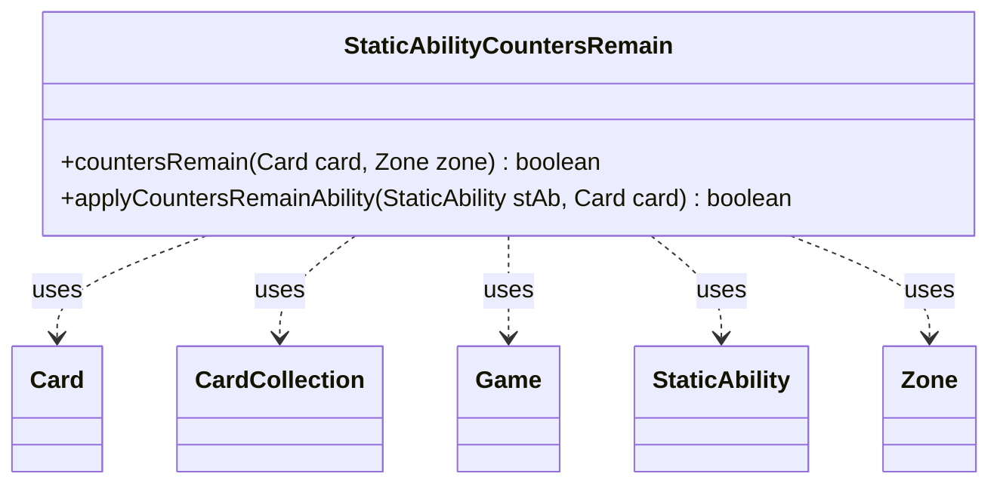

---
aliases:
  - StaticAbilityCountersRemain
tags:
  - java/class
  - module/forge-game
  - pkg/forge/game/staticability
fqn: forge.game.staticability.StaticAbilityCountersRemain
package: forge.game.staticability
module: forge-game
kind: Class
---

# StaticAbilityCountersRemain

**Package:** `forge.game.staticability` &nbsp; **Module:** `forge-game` &nbsp; **Kind:** Class



## Relationships
**Uses:**
- [[forge.game.Game|Game]]
- [[forge.game.card.Card|Card]]
- [[forge.game.card.CardCollection|CardCollection]]
- [[forge.game.staticability.StaticAbility|StaticAbility]]
- [[forge.game.zone.Zone|Zone]]

## Source
`forge-game/src/main/java/forge/game/staticability/StaticAbilityCountersRemain.java`

```java

/*
 * Forge: Play Magic: the Gathering.
 * Copyright (C) 2011  Forge Team
 *
 * This program is free software: you can redistribute it and/or modify
 * it under the terms of the GNU General Public License as published by
 * the Free Software Foundation, either version 3 of the License, or
 * (at your option) any later version.
 *
 * This program is distributed in the hope that it will be useful,
 * but WITHOUT ANY WARRANTY; without even the implied warranty of
 * MERCHANTABILITY or FITNESS FOR A PARTICULAR PURPOSE.  See the
 * GNU General Public License for more details.
 *
 * You should have received a copy of the GNU General Public License
 * along with this program.  If not, see <http://www.gnu.org/licenses/>.
 */
package forge.game.staticability;

import forge.game.Game;
import forge.game.card.Card;
import forge.game.card.CardCollection;
import forge.game.zone.Zone;
import forge.game.zone.ZoneType;

public class StaticAbilityCountersRemain {

    public static boolean countersRemain(final Card card, final Zone zone) {
        if (zone == null || zone.getZoneType().isHidden()) {
            return false;
        }

        final Game game = card.getGame();
        final CardCollection allp = new CardCollection(game.getCardsIn(ZoneType.STATIC_ABILITIES_SOURCE_ZONES));
        allp.add(card);
        for (final Card ca : allp) {
            for (final StaticAbility stAb : ca.getStaticAbilities()) {
                if (!stAb.checkConditions(StaticAbilityMode.CountersRemain)) {
                    continue;
                }
                if (applyCountersRemainAbility(stAb, card)) {
                    return true;
                }
            }
        }
        return false;
    }

    public static boolean applyCountersRemainAbility(final StaticAbility stAb, final Card card) {
        if (!stAb.matchesValidParam("ValidCard", card)) {
            return false;
        }
        return true;
    }
}
```
