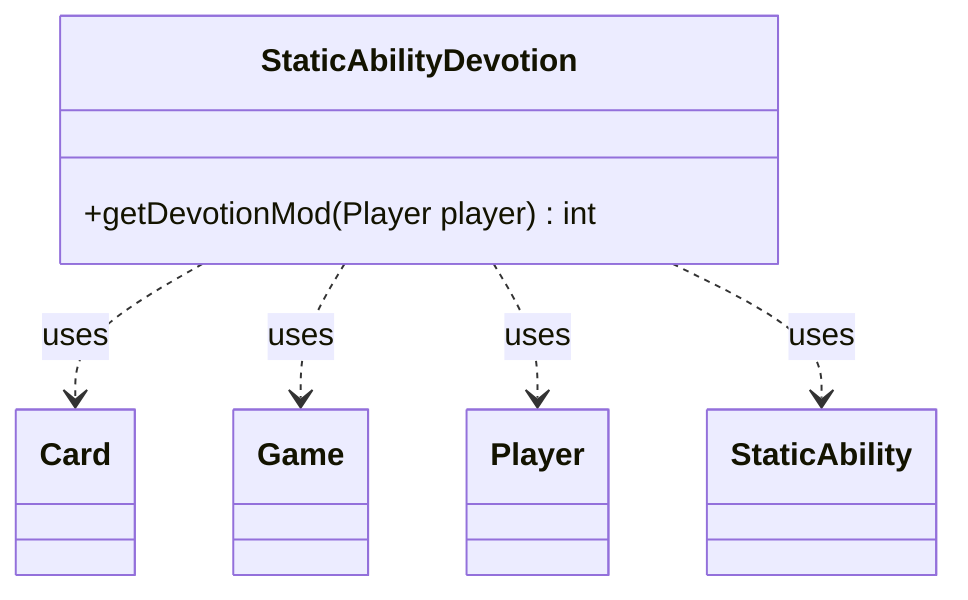

---
aliases:
  - StaticAbilityDevotion
tags:
  - java/class
  - module/forge-game
  - pkg/forge/game/staticability
fqn: forge.game.staticability.StaticAbilityDevotion
package: forge.game.staticability
module: forge-game
kind: Class
---

# StaticAbilityDevotion

**Package:** `forge.game.staticability` &nbsp; **Module:** `forge-game` &nbsp; **Kind:** Class



## Relationships
**Uses:**
- [[forge.game.Game|Game]]
- [[forge.game.card.Card|Card]]
- [[forge.game.player.Player|Player]]
- [[forge.game.staticability.StaticAbility|StaticAbility]]

## Design Description

Devotion is a static-ability resolver that computes a player's total devotion modifier toward a given color or condition. Its sole entry point, the static `getDevotionMod(Player player)`, scans every card in the zones that can host static abilities, filters each card's `StaticAbility` instances down to those operating in `Devotion` mode whose `ValidPlayer` parameter matches the queried player, and sums their parsed `Value` contributions.

As a stateless utility, it holds no fields and exposes only behavior, delegating condition-matching and parameter parsing to the `StaticAbility` objects it iterates. It collaborates with `Player` and `Game` to reach the relevant card zones and with `Card` to enumerate static abilities, embodying the engine's pattern of isolating each static-ability mode in a dedicated helper rather than centralizing the logic.

## Source
`forge-game/src/main/java/forge/game/staticability/StaticAbilityDevotion.java`

```java
package forge.game.staticability;

import forge.game.Game;
import forge.game.card.Card;
import forge.game.player.Player;
import forge.game.zone.ZoneType;

public class StaticAbilityDevotion {

    public static int getDevotionMod(final Player player) {
        int i = 0;
        final Game game = player.getGame();
        for (final Card ca : game.getCardsIn(ZoneType.STATIC_ABILITIES_SOURCE_ZONES)) {
            for (final StaticAbility stAb : ca.getStaticAbilities()) {
                if (!stAb.checkConditions(StaticAbilityMode.Devotion)) {
                    continue;
                }
                if (!stAb.matchesValidParam("ValidPlayer", player)) {
                    continue;
                }
                int t = Integer.parseInt(stAb.getParamOrDefault("Value", "1"));
                i += t;
            }
        }
        return i;
    }
}
```

## Python
`forge/game/staticability/StaticAbilityDevotion.py`

```python
from forge.game.Game import Game
from forge.game.card.Card import Card
from forge.game.player.Player import Player
from forge.game.staticability.StaticAbility import StaticAbility
from forge.game.staticability.StaticAbilityMode import StaticAbilityMode
from forge.game.zone.ZoneType import ZoneType


class StaticAbilityDevotion:

    @staticmethod
    def getDevotionMod(player: Player) -> int:
        i = 0
        game = player.getGame()
        for ca in game.getCardsIn(ZoneType.STATIC_ABILITIES_SOURCE_ZONES):
            for stAb in ca.getStaticAbilities():
                if not stAb.checkConditions(StaticAbilityMode.Devotion):
                    continue
                if not stAb.matchesValidParam("ValidPlayer", player):
                    continue
                t = int(stAb.getParamOrDefault("Value", "1"))
                i += t
        return i
```
