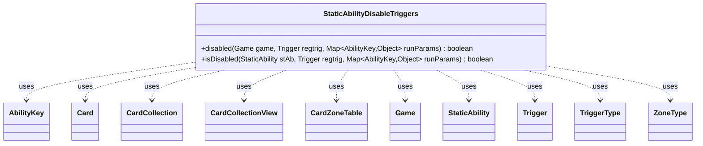

---
aliases:
  - StaticAbilityDisableTriggers
tags:
  - java/class
  - module/forge-game
  - pkg/forge/game/staticability
fqn: forge.game.staticability.StaticAbilityDisableTriggers
package: forge.game.staticability
module: forge-game
kind: Class
---

# StaticAbilityDisableTriggers

**Package:** `forge.game.staticability` &nbsp; **Module:** `forge-game` &nbsp; **Kind:** Class



## Relationships
**Uses:**
- [[forge.game.Game|Game]]
- [[forge.game.ability.AbilityKey|AbilityKey]]
- [[forge.game.card.Card|Card]]
- [[forge.game.card.CardCollection|CardCollection]]
- [[forge.game.card.CardCollectionView|CardCollectionView]]
- [[forge.game.card.CardZoneTable|CardZoneTable]]
- [[forge.game.staticability.StaticAbility|StaticAbility]]
- [[forge.game.trigger.Trigger|Trigger]]
- [[forge.game.trigger.TriggerType|TriggerType]]
- [[forge.game.zone.ZoneType|ZoneType]]

## Source
`forge-game/src/main/java/forge/game/staticability/StaticAbilityDisableTriggers.java`

```java
package forge.game.staticability;

import com.google.common.collect.Table.Cell;

import forge.game.Game;
import forge.game.card.*;
import forge.game.ability.AbilityKey;
import forge.game.trigger.Trigger;
import forge.game.trigger.TriggerType;
import forge.game.zone.ZoneType;
import org.apache.commons.lang3.ArrayUtils;

import java.util.Map;
import java.util.function.Predicate;

public class StaticAbilityDisableTriggers {

    public static boolean disabled(final Game game, final Trigger regtrig, final Map<AbilityKey, Object> runParams)  {
        CardCollectionView cardList = null;
        // if LTB look back
        if (regtrig.looksBackInTime()) {
            if (runParams.containsKey(AbilityKey.LastStateBattlefield)) {
                cardList = (CardCollectionView) runParams.get(AbilityKey.LastStateBattlefield);
            }
            if (cardList == null) {
                cardList = game.getLastStateBattlefield();
            }
        } else {
            cardList = game.getCardsIn(ZoneType.STATIC_ABILITIES_SOURCE_ZONES);
        }

        for (final Card ca : cardList) {
            for (final StaticAbility stAb : ca.getStaticAbilities()) {
                if (!stAb.checkConditions(StaticAbilityMode.DisableTriggers)) {
                    continue;
                }

                if (isDisabled(stAb, regtrig, runParams)) {
                    return true;
                }
            }
        }
        return false;
    }

    public static boolean isDisabled(final StaticAbility stAb, final Trigger regtrig, final Map<AbilityKey, Object> runParams) {
        final TriggerType trigMode = regtrig.getMode();

        // CR 603.2e
        if (stAb.hasParam("ValidCard") && regtrig.getSpawningAbility() != null) {
            return false;
        }

        if (!stAb.matchesValidParam("ValidCard", regtrig.getHostCard())) {
            return false;
        }

        // Trigger currently has no isValid, take Trigger Ability instead
        if (!stAb.matchesValidParam("ValidTrigger", regtrig.getOverridingAbility())) {
            return false;
        }

        if (stAb.hasParam("ValidMode")) {
            if (!ArrayUtils.contains(stAb.getParam("ValidMode").split(","), trigMode.toString())) {
                return false;
            }
        }

        if (trigMode.equals(TriggerType.ChangesZone)) {
            // Cause of the trigger – the card changing zones
            Card moved = (Card) runParams.get(AbilityKey.Card);
            if ("Battlefield".equals(regtrig.getParam("Origin"))) {
                moved = (Card) runParams.get(AbilityKey.CardLKI);
            }
            if (!stAb.matchesValidParam("ValidCause", moved)) {
                return false;
            }
            if (!stAb.matchesValidParam("Destination", runParams.get(AbilityKey.Destination))) {
                return false;
            }
            if (!stAb.matchesValidParam("Origin", runParams.get(AbilityKey.Origin))) {
                return false;
            }
            if ("Graveyard".equals(runParams.get(AbilityKey.Destination))
                    && "Battlefield".equals(runParams.get(AbilityKey.Origin))) {
                // Allow triggered ability of a dying creature that triggers
                // only when that creature is put into a graveyard from anywhere
                if ("Card.Self".equals(regtrig.getParam("ValidCard"))
                        && (!regtrig.hasParam("Origin") || "Any".equals(regtrig.getParam("Origin")))) {
                    return false;
                }
            }
        } else if (trigMode.equals(TriggerType.ChangesZoneAll)) {
            final String origin = stAb.getParam("Origin");
            final String destination = stAb.getParam("Destination");
            // check if some causes were already ignored by a different ability, then the forbidden causes will be combined
            CardZoneTable table = (CardZoneTable) runParams.get(AbilityKey.CardsFiltered);
            if (table == null) {
                table = (CardZoneTable) runParams.get(AbilityKey.Cards);
            }
            CardZoneTable filtered = new CardZoneTable(table.getLastStateBattlefield(), table.getLastStateGraveyard());
            boolean possiblyDisabled = false;

            // purge all forbidden causes from table
            for (Cell<ZoneType, ZoneType, CardCollection> cell : table.cellSet()) {
                CardCollection changers = cell.getValue();
                if ((origin == null || cell.getRowKey() == ZoneType.valueOf(origin)) &&
                (destination == null || cell.getColumnKey() == ZoneType.valueOf(destination))) {
                    Predicate<Card> validCause = CardPredicates.restriction(stAb.getParam("ValidCause").split(","), stAb.getHostCard().getController(), stAb.getHostCard(), stAb);
                    changers = CardLists.filter(changers, validCause.negate());
                    // static will match some of the causes
                    if (changers.size() < cell.getValue().size()) {
                        possiblyDisabled = true;
                    }
                }
                filtered.put(cell.getRowKey(), cell.getColumnKey(), changers);
            }

            if (!possiblyDisabled) {
                return false;
            }

            // test if trigger would still fire when ignoring forbidden causes
            final Map<AbilityKey, Object> runParamsFiltered = AbilityKey.newMap(runParams);
            runParamsFiltered.put(AbilityKey.Cards, filtered);
            if (regtrig.performTest(runParamsFiltered)) {
                // store the filtered Cards because Panharmonicon shouldn't see the others
                runParams.put(AbilityKey.CardsFiltered, filtered);

                return false;
            }
        }
        return true;
    }
}
```
