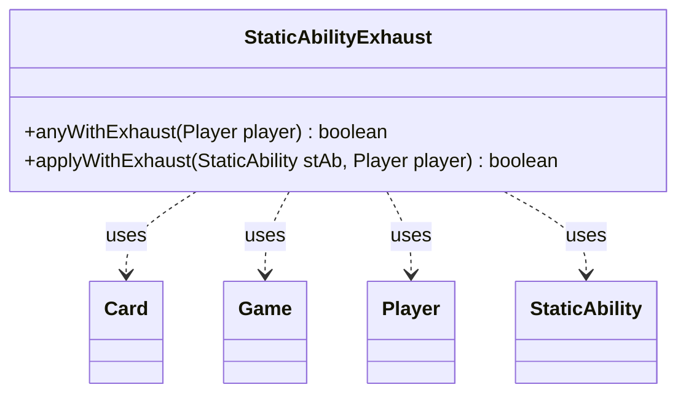

---
aliases:
  - StaticAbilityExhaust
tags:
  - java/class
  - module/forge-game
  - pkg/forge/game/staticability
fqn: forge.game.staticability.StaticAbilityExhaust
package: forge.game.staticability
module: forge-game
kind: Class
---

# StaticAbilityExhaust

**Package:** `forge.game.staticability` &nbsp; **Module:** `forge-game` &nbsp; **Kind:** Class



## Relationships
**Uses:**
- [[forge.game.Game|Game]]
- [[forge.game.card.Card|Card]]
- [[forge.game.player.Player|Player]]
- [[forge.game.staticability.StaticAbility|StaticAbility]]

## Design Description

StaticAbilityExhaust is a stateless utility class in the static-ability subsystem that determines whether a player is permitted to use the Exhaust mechanic. It exposes only static methods: `anyWithExhaust` scans every active static-ability source across the relevant zones, inspecting each `Card`'s `StaticAbility` instances for those whose conditions match the `CanExhaust` mode, while `applyWithExhaust` evaluates an individual ability against the player via its `ValidPlayer` parameter. Reaching the game state through `Player.getGame()`, it collaborates with `Game`, `Card`, `Player`, and `StaticAbility` purely as a query helper rather than holding state. Unlike many static abilities it implements no interface and is not instantiated, reflecting an intentionally lightweight, side-effect-free design that centralizes the Exhaust eligibility check for callers elsewhere in the rules engine.

## Source
`forge-game/src/main/java/forge/game/staticability/StaticAbilityExhaust.java`

```java
package forge.game.staticability;

import forge.game.Game;
import forge.game.card.Card;
import forge.game.player.Player;
import forge.game.zone.ZoneType;
    
public class StaticAbilityExhaust {

    public static boolean anyWithExhaust(final Player player) {
        final Game game = player.getGame();
        for (final Card ca : game.getCardsIn(ZoneType.STATIC_ABILITIES_SOURCE_ZONES)) {
            for (final StaticAbility stAb : ca.getStaticAbilities()) {
                if (!stAb.checkConditions(StaticAbilityMode.CanExhaust)) {
                    continue;
                }
                if (applyWithExhaust(stAb, player)) {
                    return true;
                }
            }
        }
        return false;
    }

    public static boolean applyWithExhaust(final StaticAbility stAb, final Player player) {
        if (!stAb.matchesValidParam("ValidPlayer", player)) {
            return false;
        }

        return true;
    }
}
```

## Python
`forge/game/staticability/StaticAbilityExhaust.py`

```python
from forge.game.Game import Game
from forge.game.card.Card import Card
from forge.game.player.Player import Player
from forge.game.zone.ZoneType import ZoneType
from forge.game.staticability.StaticAbility import StaticAbility
from forge.game.staticability.StaticAbilityMode import StaticAbilityMode


class StaticAbilityExhaust:

    @staticmethod
    def anyWithExhaust(player: Player) -> bool:
        game = player.getGame()
        for ca in game.getCardsIn(ZoneType.STATIC_ABILITIES_SOURCE_ZONES):
            for stAb in ca.getStaticAbilities():
                if not stAb.checkConditions(StaticAbilityMode.CanExhaust):
                    continue
                if StaticAbilityExhaust.applyWithExhaust(stAb, player):
                    return True
        return False

    @staticmethod
    def applyWithExhaust(stAb: StaticAbility, player: Player) -> bool:
        if not stAb.matchesValidParam("ValidPlayer", player):
            return False

        return True
```
