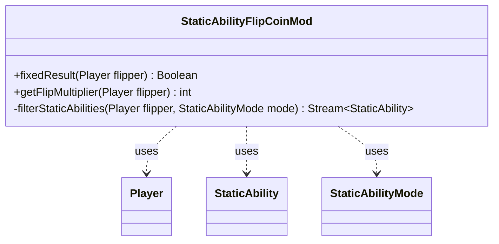

---
aliases:
  - StaticAbilityFlipCoinMod
tags:
  - java/class
  - module/forge-game
  - pkg/forge/game/staticability
fqn: forge.game.staticability.StaticAbilityFlipCoinMod
package: forge.game.staticability
module: forge-game
kind: Class
---

# StaticAbilityFlipCoinMod

**Package:** `forge.game.staticability` &nbsp; **Module:** `forge-game` &nbsp; **Kind:** Class



## Relationships
**Uses:**
- [[forge.game.player.Player|Player]]
- [[forge.game.staticability.StaticAbility|StaticAbility]]
- [[forge.game.staticability.StaticAbilityMode|StaticAbilityMode]]

## Source
`forge-game/src/main/java/forge/game/staticability/StaticAbilityFlipCoinMod.java`

```java
package forge.game.staticability;

import forge.game.player.Player;
import forge.game.zone.ZoneType;

import java.util.stream.Stream;

import static forge.game.staticability.StaticAbilityMode.FlipCoinDoubler;
import static forge.game.staticability.StaticAbilityMode.FlipCoinMod;

public class StaticAbilityFlipCoinMod {

    public static Boolean fixedResult(final Player flipper) {
        return filterStaticAbilities(flipper, FlipCoinMod)
                .map(stAb -> Boolean.valueOf(stAb.getParam("Result")))
                .findFirst()
                .orElse(null);
    }

    public static int getFlipMultiplier(final Player flipper) {
        return 1 << filterStaticAbilities(flipper, FlipCoinDoubler)
                .count();
    }

    private static Stream<StaticAbility> filterStaticAbilities(final Player flipper, final StaticAbilityMode mode) {
        return flipper.getGame()
                .getCardsIn(ZoneType.STATIC_ABILITIES_SOURCE_ZONES)
                .stream()
                .flatMap(card -> card.getStaticAbilities().stream())
                .filter(stAb -> stAb.checkConditions(mode) && stAb.matchesValidParam("ValidPlayer", flipper));
    }

}
```
