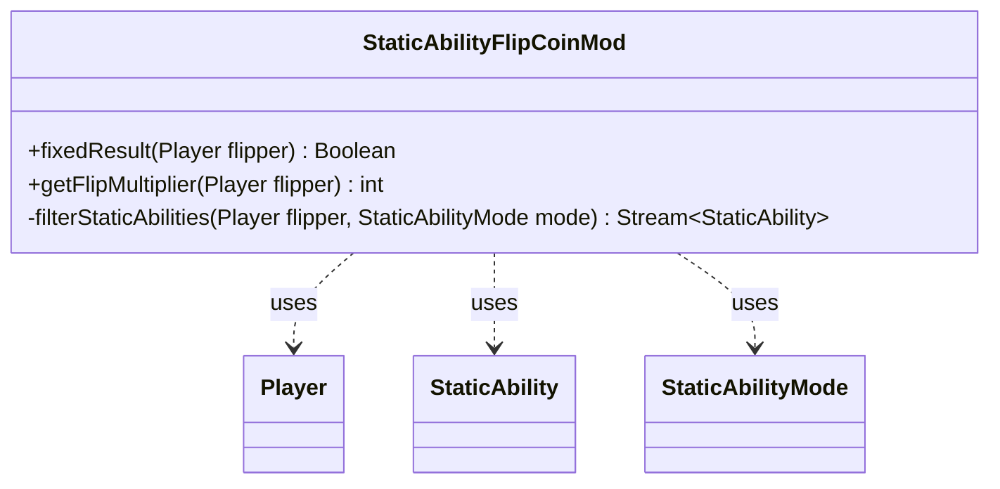

---
aliases:
  - StaticAbilityFlipCoinMod
tags:
  - java/class
  - module/forge-game
  - pkg/forge/game/staticability
fqn: forge.game.staticability.StaticAbilityFlipCoinMod
package: forge.game.staticability
module: forge-game
kind: Class
---

# StaticAbilityFlipCoinMod

**Package:** `forge.game.staticability` &nbsp; **Module:** `forge-game` &nbsp; **Kind:** Class



## Relationships
**Uses:**
- [[forge.game.player.Player|Player]]
- [[forge.game.staticability.StaticAbility|StaticAbility]]
- [[forge.game.staticability.StaticAbilityMode|StaticAbilityMode]]

## Design Description

StaticAbilityFlipCoinMod is a stateless utility that resolves how continuous static abilities modify coin flips for a given player. Its two public methods answer distinct questions: `fixedResult` reports whether some effect forces a predetermined flip outcome, while `getFlipMultiplier` computes how many times flips are doubled, returning a power of two via a bit shift over the count of applicable doublers. Both delegate to the private `filterStaticAbilities` helper, which scans cards in the relevant zones, flattens their StaticAbility instances, and filters by StaticAbilityMode (FlipCoinMod or FlipCoinDoubler) and player validity.

As a non-instantiable helper rather than a subtype, it centralizes flip-modification logic so callers stay decoupled from how abilities are located. It collaborates with Player to reach the game state, StaticAbility for ability data and condition checks, and StaticAbilityMode to distinguish effect categories, using Java streams for a compact, declarative query.

## Source
`forge-game/src/main/java/forge/game/staticability/StaticAbilityFlipCoinMod.java`

```java
package forge.game.staticability;

import forge.game.player.Player;
import forge.game.zone.ZoneType;

import java.util.stream.Stream;

import static forge.game.staticability.StaticAbilityMode.FlipCoinDoubler;
import static forge.game.staticability.StaticAbilityMode.FlipCoinMod;

public class StaticAbilityFlipCoinMod {

    public static Boolean fixedResult(final Player flipper) {
        return filterStaticAbilities(flipper, FlipCoinMod)
                .map(stAb -> Boolean.valueOf(stAb.getParam("Result")))
                .findFirst()
                .orElse(null);
    }

    public static int getFlipMultiplier(final Player flipper) {
        return 1 << filterStaticAbilities(flipper, FlipCoinDoubler)
                .count();
    }

    private static Stream<StaticAbility> filterStaticAbilities(final Player flipper, final StaticAbilityMode mode) {
        return flipper.getGame()
                .getCardsIn(ZoneType.STATIC_ABILITIES_SOURCE_ZONES)
                .stream()
                .flatMap(card -> card.getStaticAbilities().stream())
                .filter(stAb -> stAb.checkConditions(mode) && stAb.matchesValidParam("ValidPlayer", flipper));
    }

}
```

## Python
`forge/game/staticability/StaticAbilityFlipCoinMod.py`

```python
from forge.game.player.Player import Player
from forge.game.zone.ZoneType import ZoneType
from forge.game.staticability.StaticAbility import StaticAbility
from forge.game.staticability.StaticAbilityMode import StaticAbilityMode

import typing


class StaticAbilityFlipCoinMod:

    @staticmethod
    def fixedResult(flipper: Player) -> typing.Optional[bool]:
        for stAb in StaticAbilityFlipCoinMod.filterStaticAbilities(flipper, StaticAbilityMode.FlipCoinMod):
            return bool(stAb.getParam("Result"))
        return None

    @staticmethod
    def getFlipMultiplier(flipper: Player) -> int:
        return 1 << sum(1 for _ in StaticAbilityFlipCoinMod.filterStaticAbilities(flipper, StaticAbilityMode.FlipCoinDoubler))

    @staticmethod
    def filterStaticAbilities(flipper: Player, mode: StaticAbilityMode) -> typing.Iterator[StaticAbility]:
        for card in flipper.getGame().getCardsIn(ZoneType.STATIC_ABILITIES_SOURCE_ZONES):
            for stAb in card.getStaticAbilities():
                if stAb.checkConditions(mode) and stAb.matchesValidParam("ValidPlayer", flipper):
                    yield stAb
```
