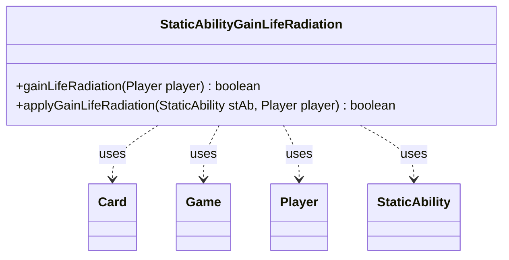

---
aliases:
  - StaticAbilityGainLifeRadiation
tags:
  - java/class
  - module/forge-game
  - pkg/forge/game/staticability
fqn: forge.game.staticability.StaticAbilityGainLifeRadiation
package: forge.game.staticability
module: forge-game
kind: Class
---

# StaticAbilityGainLifeRadiation

**Package:** `forge.game.staticability` &nbsp; **Module:** `forge-game` &nbsp; **Kind:** Class



## Relationships
**Uses:**
- [[forge.game.Game|Game]]
- [[forge.game.card.Card|Card]]
- [[forge.game.player.Player|Player]]
- [[forge.game.staticability.StaticAbility|StaticAbility]]

## Design Description

StaticAbilityGainLifeRadiation is a stateless utility that resolves the "gain life from radiation" static-ability effect, determining whether any active continuous ability permits a given player to gain life when shedding radiation counters. Its static `gainLifeRadiation` method scans every Card in the relevant source zones via the player's Game, inspects each Card's StaticAbilities, and filters them to those matching the `GainLifeRadiation` StaticAbilityMode before delegating to `applyGainLifeRadiation`, which validates the player against the ability's `ValidPlayer` parameter.

Unlike a typical subclass, it implements no supertype or interface; instead it follows the package convention of a mode-specific helper that collaborates with the core StaticAbility framework, returning a boolean on the first qualifying match. The design favors short-circuit evaluation and keeps all state in the passed-in Player and Game, isolating one narrow rules interaction for the engine's static-ability dispatcher to invoke.

## Source
`forge-game/src/main/java/forge/game/staticability/StaticAbilityGainLifeRadiation.java`

```java
package forge.game.staticability;

import forge.game.Game;
import forge.game.card.Card;
import forge.game.player.Player;
import forge.game.zone.ZoneType;

public class StaticAbilityGainLifeRadiation {

    static public boolean gainLifeRadiation(Player player) {
        final Game game = player.getGame();
        for (final Card ca : game.getCardsIn(ZoneType.STATIC_ABILITIES_SOURCE_ZONES)) {
            for (final StaticAbility stAb : ca.getStaticAbilities()) {
                if (!stAb.checkConditions(StaticAbilityMode.GainLifeRadiation)) {
                    continue;
                }
                if (applyGainLifeRadiation(stAb, player)) {
                    return true;
                }
            }
        }
        return false;
    }

    static public boolean applyGainLifeRadiation(StaticAbility stAb, Player player) {
        if (!stAb.matchesValidParam("ValidPlayer", player)) {
            return false;
        }
        return true;
    }

}
```

## Python
`forge/game/staticability/StaticAbilityGainLifeRadiation.py`

```python
from forge.game.Game import Game
from forge.game.card.Card import Card
from forge.game.player.Player import Player
from forge.game.staticability.StaticAbility import StaticAbility
from forge.game.zone.ZoneType import ZoneType
from forge.game.staticability.StaticAbilityMode import StaticAbilityMode


class StaticAbilityGainLifeRadiation:

    @staticmethod
    def gainLifeRadiation(player: Player) -> bool:
        game = player.getGame()
        for ca in game.getCardsIn(ZoneType.STATIC_ABILITIES_SOURCE_ZONES):
            for stAb in ca.getStaticAbilities():
                if not stAb.checkConditions(StaticAbilityMode.GainLifeRadiation):
                    continue
                if StaticAbilityGainLifeRadiation.applyGainLifeRadiation(stAb, player):
                    return True
        return False

    @staticmethod
    def applyGainLifeRadiation(stAb: StaticAbility, player: Player) -> bool:
        if not stAb.matchesValidParam("ValidPlayer", player):
            return False
        return True
```
