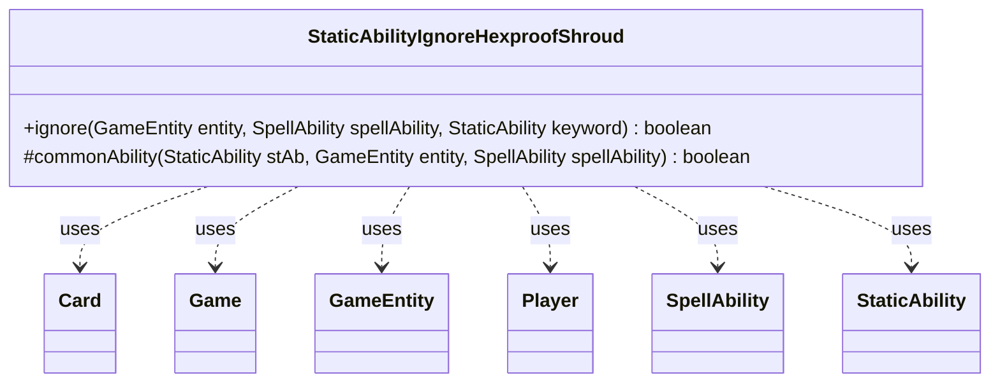

---
aliases:
  - StaticAbilityIgnoreHexproofShroud
tags:
  - java/class
  - module/forge-game
  - pkg/forge/game/staticability
fqn: forge.game.staticability.StaticAbilityIgnoreHexproofShroud
package: forge.game.staticability
module: forge-game
kind: Class
---

# StaticAbilityIgnoreHexproofShroud

**Package:** `forge.game.staticability` &nbsp; **Module:** `forge-game` &nbsp; **Kind:** Class



## Relationships
**Uses:**
- [[forge.game.Game|Game]]
- [[forge.game.GameEntity|GameEntity]]
- [[forge.game.card.Card|Card]]
- [[forge.game.player.Player|Player]]
- [[forge.game.spellability.SpellAbility|SpellAbility]]
- [[forge.game.staticability.StaticAbility|StaticAbility]]

## Design Description

StaticAbilityIgnoreHexproofShroud is a stateless utility that determines whether a card's static abilities permit a spell or ability to bypass an entity's Hexproof or Shroud protection. Its public `ignore` method scans every static-ability source zone in the game, filtering for static abilities whose mode (IgnoreHexproof or IgnoreShroud) matches the protection keyword being challenged, and delegates the final eligibility test to the protected `commonAbility` helper.

Rather than modeling protection itself, the class collaborates with the broader static-ability subsystem: it queries the `Game` for relevant `Card` sources, inspects each `StaticAbility`, and validates the triggering `SpellAbility`'s activating `Player` and the target `GameEntity` against the ability's `Activator` and `ValidEntity` parameters. The all-static, no-state design reflects its role as a pure rules-resolution check invoked on demand, keeping keyword-bypass logic centralized and decoupled from the entities it evaluates.

## Source
`forge-game/src/main/java/forge/game/staticability/StaticAbilityIgnoreHexproofShroud.java`

```java
package forge.game.staticability;

import forge.game.Game;
import forge.game.GameEntity;
import forge.game.card.Card;
import forge.game.keyword.Keyword;
import forge.game.player.Player;
import forge.game.spellability.SpellAbility;
import forge.game.zone.ZoneType;

public class StaticAbilityIgnoreHexproofShroud {

    static public boolean ignore(GameEntity entity, final SpellAbility spellAbility, StaticAbility keyword) {
        final Game game = entity.getGame();
        for (final Card ca : game.getCardsIn(ZoneType.STATIC_ABILITIES_SOURCE_ZONES)) {
            for (final StaticAbility stAb : ca.getStaticAbilities()) {
                if (keyword.isKeyword(Keyword.HEXPROOF) && !stAb.checkConditions(StaticAbilityMode.IgnoreHexproof)) {
                    continue;
                }
                if (keyword.isKeyword(Keyword.SHROUD) && !stAb.checkConditions(StaticAbilityMode.IgnoreShroud)) {
                    continue;
                }
                if (commonAbility(stAb, entity, spellAbility)) {
                    return true;
                }
            }
        }
        return false;
    }

    static protected boolean commonAbility(StaticAbility stAb, GameEntity entity, final SpellAbility spellAbility) {
        final Player activator = spellAbility.getActivatingPlayer();

        if (!stAb.matchesValidParam("Activator", activator)) {
            return false;
        }

        if (!stAb.matchesValidParam("ValidEntity", entity)) {
            return false;
        }

        return true;
    }
}
```

## Python
`forge/game/staticability/StaticAbilityIgnoreHexproofShroud.py`

```python
from forge.game.Game import Game
from forge.game.GameEntity import GameEntity
from forge.game.card.Card import Card
from forge.game.keyword.Keyword import Keyword
from forge.game.player.Player import Player
from forge.game.spellability.SpellAbility import SpellAbility
from forge.game.staticability.StaticAbility import StaticAbility
from forge.game.staticability.StaticAbilityMode import StaticAbilityMode
from forge.game.zone.ZoneType import ZoneType


class StaticAbilityIgnoreHexproofShroud:

    @staticmethod
    def ignore(entity: GameEntity, spellAbility: SpellAbility, keyword: StaticAbility) -> bool:
        game = entity.getGame()
        for ca in game.getCardsIn(ZoneType.STATIC_ABILITIES_SOURCE_ZONES):
            for stAb in ca.getStaticAbilities():
                if keyword.isKeyword(Keyword.HEXPROOF) and not stAb.checkConditions(StaticAbilityMode.IgnoreHexproof):
                    continue
                if keyword.isKeyword(Keyword.SHROUD) and not stAb.checkConditions(StaticAbilityMode.IgnoreShroud):
                    continue
                if StaticAbilityIgnoreHexproofShroud.commonAbility(stAb, entity, spellAbility):
                    return True
        return False

    @staticmethod
    def commonAbility(stAb: StaticAbility, entity: GameEntity, spellAbility: SpellAbility) -> bool:
        activator = spellAbility.getActivatingPlayer()

        if not stAb.matchesValidParam("Activator", activator):
            return False

        if not stAb.matchesValidParam("ValidEntity", entity):
            return False

        return True
```
