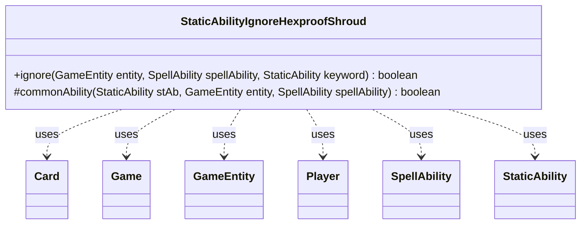

---
aliases:
  - StaticAbilityIgnoreHexproofShroud
tags:
  - java/class
  - module/forge-game
  - pkg/forge/game/staticability
fqn: forge.game.staticability.StaticAbilityIgnoreHexproofShroud
package: forge.game.staticability
module: forge-game
kind: Class
---

# StaticAbilityIgnoreHexproofShroud

**Package:** `forge.game.staticability` &nbsp; **Module:** `forge-game` &nbsp; **Kind:** Class



## Relationships
**Uses:**
- [[forge.game.Game|Game]]
- [[forge.game.GameEntity|GameEntity]]
- [[forge.game.card.Card|Card]]
- [[forge.game.player.Player|Player]]
- [[forge.game.spellability.SpellAbility|SpellAbility]]
- [[forge.game.staticability.StaticAbility|StaticAbility]]

## Source
`forge-game/src/main/java/forge/game/staticability/StaticAbilityIgnoreHexproofShroud.java`

```java
package forge.game.staticability;

import forge.game.Game;
import forge.game.GameEntity;
import forge.game.card.Card;
import forge.game.keyword.Keyword;
import forge.game.player.Player;
import forge.game.spellability.SpellAbility;
import forge.game.zone.ZoneType;

public class StaticAbilityIgnoreHexproofShroud {

    static public boolean ignore(GameEntity entity, final SpellAbility spellAbility, StaticAbility keyword) {
        final Game game = entity.getGame();
        for (final Card ca : game.getCardsIn(ZoneType.STATIC_ABILITIES_SOURCE_ZONES)) {
            for (final StaticAbility stAb : ca.getStaticAbilities()) {
                if (keyword.isKeyword(Keyword.HEXPROOF) && !stAb.checkConditions(StaticAbilityMode.IgnoreHexproof)) {
                    continue;
                }
                if (keyword.isKeyword(Keyword.SHROUD) && !stAb.checkConditions(StaticAbilityMode.IgnoreShroud)) {
                    continue;
                }
                if (commonAbility(stAb, entity, spellAbility)) {
                    return true;
                }
            }
        }
        return false;
    }

    static protected boolean commonAbility(StaticAbility stAb, GameEntity entity, final SpellAbility spellAbility) {
        final Player activator = spellAbility.getActivatingPlayer();

        if (!stAb.matchesValidParam("Activator", activator)) {
            return false;
        }

        if (!stAb.matchesValidParam("ValidEntity", entity)) {
            return false;
        }

        return true;
    }
}
```
