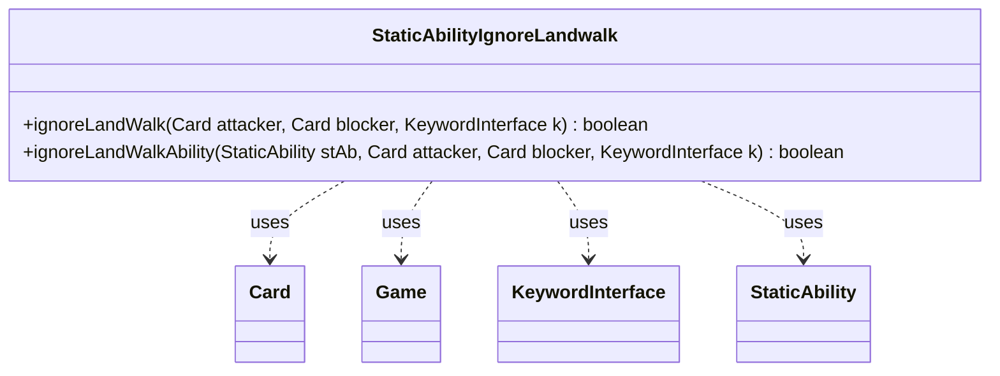

---
aliases:
  - StaticAbilityIgnoreLandwalk
tags:
  - java/class
  - module/forge-game
  - pkg/forge/game/staticability
fqn: forge.game.staticability.StaticAbilityIgnoreLandwalk
package: forge.game.staticability
module: forge-game
kind: Class
---

# StaticAbilityIgnoreLandwalk

**Package:** `forge.game.staticability`   **Module:** `forge-game`   **Kind:** Class



## Relationships
**Uses:**
- [[forge.game.Game|Game]]
- [[forge.game.card.Card|Card]]
- [[forge.game.keyword.KeywordInterface|KeywordInterface]]
- [[forge.game.staticability.StaticAbility|StaticAbility]]

## Design Description

StaticAbilityIgnoreLandwalk is a stateless utility class that resolves whether an active static ability cancels a creature's landwalk evasion during the combat blocking step. Its `ignoreLandWalk` method sweeps every card in the static-ability source zones, filters their static abilities by the `IgnoreLandwalk` mode and condition checks, and delegates to `ignoreLandWalkAbility`, which confirms the attacker, blocker, and triggering keyword each satisfy the ability's `ValidAttacker`, `ValidBlocker`, and `ValidKeyword` parameters.

As a package-private collaborator within the `staticability` framework, it owns no state and exposes only static methods, acting as a focused rules helper rather than a modeled entity. It leans on `Game` for zone enumeration, `Card` for ability and keyword access, `StaticAbility` for condition and validity matching, and `KeywordInterface` to identify the landwalk keyword being evaluated—keeping the landwalk-ignoring rule isolated from the broader combat logic that invokes it.

## Source
`forge-game/src/main/java/forge/game/staticability/StaticAbilityIgnoreLandwalk.java`

```java
package forge.game.staticability;

import forge.game.Game;
import forge.game.card.Card;
import forge.game.keyword.KeywordInterface;
import forge.game.zone.ZoneType;

public class StaticAbilityIgnoreLandwalk {

    public static boolean ignoreLandWalk(Card attacker, Card blocker, KeywordInterface k) {
        final Game game = attacker.getGame();
        for (final Card ca : game.getCardsIn(ZoneType.STATIC_ABILITIES_SOURCE_ZONES)) {
            for (final StaticAbility stAb : ca.getStaticAbilities()) {
                if (!stAb.checkConditions(StaticAbilityMode.IgnoreLandwalk)) {
                    continue;
                }

                if (ignoreLandWalkAbility(stAb, attacker, blocker, k)) {
                    return true;
                }
            }
        }
        return false;
    }

    public static boolean ignoreLandWalkAbility(final StaticAbility stAb, Card attacker, Card blocker, KeywordInterface k) {
        if (!stAb.matchesValidParam("ValidAttacker", attacker)) {
            return false;
        }
        if (!stAb.matchesValidParam("ValidBlocker", blocker)) {
            return false;
        }
        if (!stAb.matchesValidParam("ValidKeyword", k.getOriginal())) {
            return false;
        }

        return true;
    }
}
```

## Python
`forge/game/staticability/StaticAbilityIgnoreLandwalk.py`

```python
from forge.game.Game import Game
from forge.game.card.Card import Card
from forge.game.keyword.KeywordInterface import KeywordInterface
from forge.game.zone.ZoneType import ZoneType
from forge.game.staticability.StaticAbility import StaticAbility
from forge.game.staticability.StaticAbilityMode import StaticAbilityMode


class StaticAbilityIgnoreLandwalk:

    @staticmethod
    def ignoreLandWalk(attacker: Card, blocker: Card, k: KeywordInterface) -> bool:
        game = attacker.getGame()
        for ca in game.getCardsIn(ZoneType.STATIC_ABILITIES_SOURCE_ZONES):
            for stAb in ca.getStaticAbilities():
                if not stAb.checkConditions(StaticAbilityMode.IgnoreLandwalk):
                    continue

                if StaticAbilityIgnoreLandwalk.ignoreLandWalkAbility(stAb, attacker, blocker, k):
                    return True
        return False

    @staticmethod
    def ignoreLandWalkAbility(stAb: StaticAbility, attacker: Card, blocker: Card, k: KeywordInterface) -> bool:
        if not stAb.matchesValidParam("ValidAttacker", attacker):
            return False
        if not stAb.matchesValidParam("ValidBlocker", blocker):
            return False
        if not stAb.matchesValidParam("ValidKeyword", k.getOriginal()):
            return False

        return True
```
