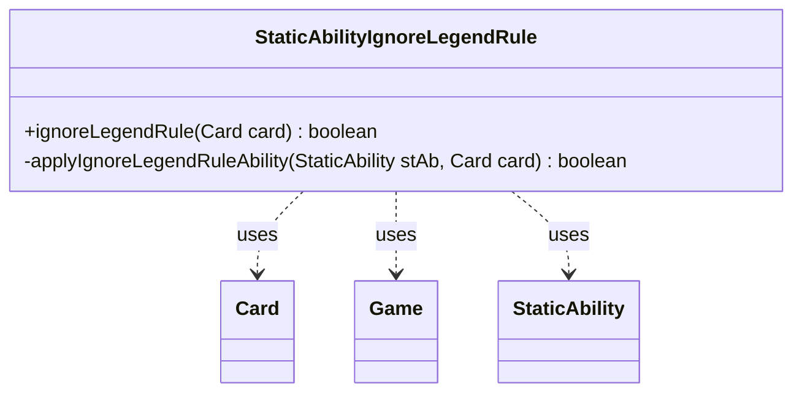

---
aliases:
  - StaticAbilityIgnoreLegendRule
tags:
  - java/class
  - module/forge-game
  - pkg/forge/game/staticability
fqn: forge.game.staticability.StaticAbilityIgnoreLegendRule
package: forge.game.staticability
module: forge-game
kind: Class
---

# StaticAbilityIgnoreLegendRule

**Package:** `forge.game.staticability`   **Module:** `forge-game`   **Kind:** Class



## Relationships
**Uses:**
- [[forge.game.Game|Game]]
- [[forge.game.card.Card|Card]]
- [[forge.game.staticability.StaticAbility|StaticAbility]]

## Design Description

Forge's mechanism for applying static abilities that suppress the "legend rule." Its sole public entry point, the static `ignoreLegendRule(Card)`, scans every card in the zones that can host static abilities, querying each `StaticAbility` whose mode matches `IgnoreLegendRule` and whose conditions are met. The private helper `applyIgnoreLegendRuleAbility` then validates the candidate card against the ability's `ValidCard` parameter, returning true on the first match so the caller can exempt that card from legend-rule destruction.

As a stateless utility class — no fields, no instances, only static methods — it acts as a focused rule resolver rather than a domain object, collaborating with `Card` (to reach its owning `Game` and enumerate static-ability sources) and `StaticAbility` (for condition checking and parameter matching). This mirrors Forge's broader `StaticAbility*` family, isolating one continuous-effect category behind a single short-circuiting query.

## Source
`forge-game/src/main/java/forge/game/staticability/StaticAbilityIgnoreLegendRule.java`

```java
package forge.game.staticability;

import forge.game.Game;
import forge.game.card.Card;
import forge.game.zone.ZoneType;

public class StaticAbilityIgnoreLegendRule {

    public static boolean ignoreLegendRule(final Card card)  {
        final Game game = card.getGame();
        for (final Card ca : game.getCardsIn(ZoneType.STATIC_ABILITIES_SOURCE_ZONES)) {
            for (final StaticAbility stAb : ca.getStaticAbilities()) {
                if (!stAb.checkConditions(StaticAbilityMode.IgnoreLegendRule)) {
                    continue;
                }

                if (applyIgnoreLegendRuleAbility(stAb, card)) {
                    return true;
                }
            }
        }
        return false;
    }

    private static boolean applyIgnoreLegendRuleAbility(final StaticAbility stAb, final Card card) {
        if (!stAb.matchesValidParam("ValidCard", card)) {
            return false;
        }
        return true;
    }
}
```

## Python
`forge/game/staticability/StaticAbilityIgnoreLegendRule.py`

```python
from forge.game.Game import Game
from forge.game.card.Card import Card
from forge.game.zone.ZoneType import ZoneType
from forge.game.staticability.StaticAbility import StaticAbility
from forge.game.staticability.StaticAbilityMode import StaticAbilityMode


class StaticAbilityIgnoreLegendRule:

    @staticmethod
    def ignoreLegendRule(card: Card) -> bool:
        game = card.getGame()
        for ca in game.getCardsIn(ZoneType.STATIC_ABILITIES_SOURCE_ZONES):
            for stAb in ca.getStaticAbilities():
                if not stAb.checkConditions(StaticAbilityMode.IgnoreLegendRule):
                    continue

                if StaticAbilityIgnoreLegendRule.applyIgnoreLegendRuleAbility(stAb, card):
                    return True
        return False

    @staticmethod
    def applyIgnoreLegendRuleAbility(stAb: StaticAbility, card: Card) -> bool:
        if not stAb.matchesValidParam("ValidCard", card):
            return False
        return True
```
