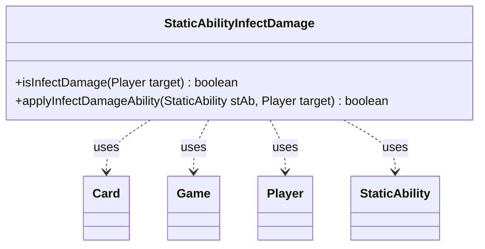

---
aliases:
  - StaticAbilityInfectDamage
tags:
  - java/class
  - module/forge-game
  - pkg/forge/game/staticability
fqn: forge.game.staticability.StaticAbilityInfectDamage
package: forge.game.staticability
module: forge-game
kind: Class
---

# StaticAbilityInfectDamage

**Package:** `forge.game.staticability` &nbsp; **Module:** `forge-game` &nbsp; **Kind:** Class



## Relationships
**Uses:**
- [[forge.game.Game|Game]]
- [[forge.game.card.Card|Card]]
- [[forge.game.player.Player|Player]]
- [[forge.game.staticability.StaticAbility|StaticAbility]]

## Design Description

Infect-style damage modification rules for player targets via the static-ability system. Its static `isInfectDamage` scans every card in the zones that can source static abilities, checking each `StaticAbility` whose mode and conditions match `InfectDamage`, and reports whether any applies to the given `Player` target. The companion `applyInfectDamageAbility` performs the per-ability test, validating the target against the ability's `ValidTarget` parameter.

As a stateless utility holding only static methods, it owns no data and implements no interface; it collaborates with `StaticAbility` for condition and parameter matching and reaches the relevant cards through `Player` and `Game`. This mirrors Forge's broader `StaticAbility*` convention of grouping each static-ability mode's evaluation logic into a dedicated helper, keeping rule-resolution concerns separate from the ability and game-state classes it consults.

## Source
`forge-game/src/main/java/forge/game/staticability/StaticAbilityInfectDamage.java`

```java
package forge.game.staticability;

import forge.game.Game;
import forge.game.card.Card;
import forge.game.player.Player;
import forge.game.zone.ZoneType;

public class StaticAbilityInfectDamage {

    static public boolean isInfectDamage(Player target) {
        final Game game = target.getGame();
        for (final Card ca : game.getCardsIn(ZoneType.STATIC_ABILITIES_SOURCE_ZONES)) {
            for (final StaticAbility stAb : ca.getStaticAbilities()) {
                if (!stAb.checkConditions(StaticAbilityMode.InfectDamage)) {
                    continue;
                }
                if (applyInfectDamageAbility(stAb, target)) {
                    return true;
                }
            }
        }
        return false;
    }

    static public boolean applyInfectDamageAbility(StaticAbility stAb, Player target) {
        if (!stAb.matchesValidParam("ValidTarget", target)) {
            return false;
        }
        return true;
    }
}
```

## Python
`forge/game/staticability/StaticAbilityInfectDamage.py`

```python
from forge.game.Game import Game
from forge.game.card.Card import Card
from forge.game.player.Player import Player
from forge.game.staticability.StaticAbility import StaticAbility
from forge.game.zone.ZoneType import ZoneType


class StaticAbilityInfectDamage:

    @staticmethod
    def isInfectDamage(target: Player) -> bool:
        game = target.getGame()
        for ca in game.getCardsIn(ZoneType.STATIC_ABILITIES_SOURCE_ZONES):
            for stAb in ca.getStaticAbilities():
                if not stAb.checkConditions(StaticAbilityMode.InfectDamage):
                    continue
                if StaticAbilityInfectDamage.applyInfectDamageAbility(stAb, target):
                    return True
        return False

    @staticmethod
    def applyInfectDamageAbility(stAb: StaticAbility, target: Player) -> bool:
        if not stAb.matchesValidParam("ValidTarget", target):
            return False
        return True
```
