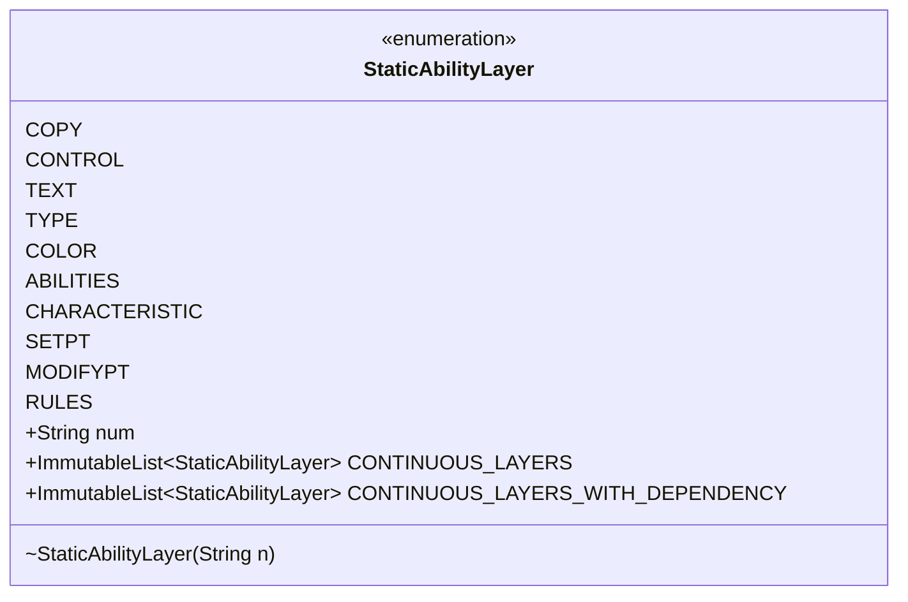

---
aliases:
  - StaticAbilityLayer
tags:
  - java/enum
  - module/forge-game
  - pkg/forge/game/staticability
fqn: forge.game.staticability.StaticAbilityLayer
package: forge.game.staticability
module: forge-game
kind: Enum
---

# StaticAbilityLayer

**Package:** `forge.game.staticability`   **Module:** `forge-game`   **Kind:** Enum



## Design Description

Forge's StaticAbilityLayer is an enum that models the layer system of Magic: The Gathering's continuous-effect application rules (rule 613), assigning each layer a canonical identifier string (e.g. "1" through "7c" and "8") via its `num` field. Each constant—from COPY and CONTROL through the power/toughness sublayers CHARACTERISTIC, SETPT, and MODIFYPT, up to RULES—names one stage at which static abilities modify game state, encoding the fixed order in which effects must be evaluated.

As a self-contained enum it has no supertype beyond `java.lang.Enum` and few collaborators, exposing two `ImmutableList` constants that fix iteration order for callers in the `forge.game.staticability` package: CONTINUOUS_LAYERS enumerates all applied layers, while CONTINUOUS_LAYERS_WITH_DEPENDENCY lists the subset subject to dependency-based reordering. Use of Guava immutable lists and a commented-out SWITCHPT layer reflect an intent toward stable, shared layer orderings that mirror the evolving comprehensive rules.

## Source
`forge-game/src/main/java/forge/game/staticability/StaticAbilityLayer.java`

```java
package forge.game.staticability;

import com.google.common.collect.ImmutableList;

public enum StaticAbilityLayer {
    /** Layer 1 for copiable values. */
    COPY("1"),

    /** Layer 2 for control-changing effects. */
    CONTROL("2"),

    /** Layer 3 for text-changing effects. */
    TEXT("3"),

    /** Layer 4 for type-changing effects. */
    TYPE("4"),

    /** Layer 5 for color-changing effects. */
    COLOR("5"),

    /** Layer 6 for ability effects. */
    ABILITIES("6"),

    /** Layer 7a for characteristic-defining power/toughness effects. */
    CHARACTERISTIC("7a"),

    /** Layer 7b for power- and/or toughness-setting effects. */
    SETPT("7b"),

    /** Layer 7c for power- and/or toughness-modifying effects. */
    MODIFYPT("7c"),

    /** Layer 7d for power- and/or toughness-switching effects. */
    //SWITCHPT("7d"),

    /** Layer for game rule-changing effects. */
    RULES("8");

    public final String num;

    StaticAbilityLayer(String n) {
        num = n;
    }

    public final static ImmutableList<StaticAbilityLayer> CONTINUOUS_LAYERS =
            ImmutableList.of(COPY, CONTROL, TEXT, TYPE, COLOR, ABILITIES, CHARACTERISTIC, SETPT, MODIFYPT, RULES);
    public final static ImmutableList<StaticAbilityLayer> CONTINUOUS_LAYERS_WITH_DEPENDENCY =
            ImmutableList.of(COPY, CONTROL, TEXT, TYPE, ABILITIES, CHARACTERISTIC, SETPT);
}
```

## Python
`forge/game/staticability/StaticAbilityLayer.py`

```python
from forge.game.staticability.StaticAbilityLayer import StaticAbilityLayer
from enum import Enum


class StaticAbilityLayer(Enum):
    """Layer system of Magic: The Gathering's continuous-effect application rules (rule 613)."""

    # Layer 1 for copiable values.
    COPY = "1"

    # Layer 2 for control-changing effects.
    CONTROL = "2"

    # Layer 3 for text-changing effects.
    TEXT = "3"

    # Layer 4 for type-changing effects.
    TYPE = "4"

    # Layer 5 for color-changing effects.
    COLOR = "5"

    # Layer 6 for ability effects.
    ABILITIES = "6"

    # Layer 7a for characteristic-defining power/toughness effects.
    CHARACTERISTIC = "7a"

    # Layer 7b for power- and/or toughness-setting effects.
    SETPT = "7b"

    # Layer 7c for power- and/or toughness-modifying effects.
    MODIFYPT = "7c"

    # Layer 7d for power- and/or toughness-switching effects.
    # SWITCHPT = "7d"

    # Layer for game rule-changing effects.
    RULES = "8"

    def __init__(self, n: str):
        self.num = n


StaticAbilityLayer.CONTINUOUS_LAYERS = [
    StaticAbilityLayer.COPY,
    StaticAbilityLayer.CONTROL,
    StaticAbilityLayer.TEXT,
    StaticAbilityLayer.TYPE,
    StaticAbilityLayer.COLOR,
    StaticAbilityLayer.ABILITIES,
    StaticAbilityLayer.CHARACTERISTIC,
    StaticAbilityLayer.SETPT,
    StaticAbilityLayer.MODIFYPT,
    StaticAbilityLayer.RULES,
]
StaticAbilityLayer.CONTINUOUS_LAYERS_WITH_DEPENDENCY = [
    StaticAbilityLayer.COPY,
    StaticAbilityLayer.CONTROL,
    StaticAbilityLayer.TEXT,
    StaticAbilityLayer.TYPE,
    StaticAbilityLayer.ABILITIES,
    StaticAbilityLayer.CHARACTERISTIC,
    StaticAbilityLayer.SETPT,
]
```
