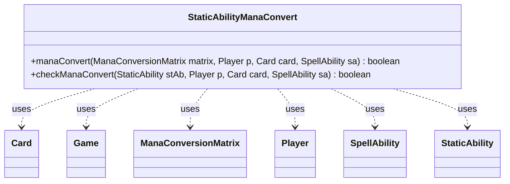

---
aliases:
  - StaticAbilityManaConvert
tags:
  - java/class
  - module/forge-game
  - pkg/forge/game/staticability
fqn: forge.game.staticability.StaticAbilityManaConvert
package: forge.game.staticability
module: forge-game
kind: Class
---

# StaticAbilityManaConvert

**Package:** `forge.game.staticability`   **Module:** `forge-game`   **Kind:** Class



## Relationships
**Uses:**
- [[forge.game.Game|Game]]
- [[forge.game.card.Card|Card]]
- [[forge.game.mana.ManaConversionMatrix|ManaConversionMatrix]]
- [[forge.game.player.Player|Player]]
- [[forge.game.spellability.SpellAbility|SpellAbility]]
- [[forge.game.staticability.StaticAbility|StaticAbility]]

## Design Description

StaticAbilityManaConvert is a stateless utility class that implements Magic's "spend mana as though it were any type" effects within the static-ability subsystem. Its static `manaConvert` method scans every card in the zones that can host static abilities, filters those whose conditions match the `ManaConvert` mode, and—via `checkManaConvert`—validates the affected Player, Card, and SpellAbility against the ability's `ValidPlayer`, `ValidCard`, and `ValidSA` parameters before applying the declared color conversion to the supplied ManaConversionMatrix.

Rather than extending StaticAbility, it acts as a focused helper that StaticAbility dispatches to, collaborating with Game (to enumerate source cards), Card, Player, and SpellAbility. Notable design intent includes support for an `Optional` parameter, which prompts the controlling player for confirmation and uses the host card's remembered-objects list to track the triggering spell, and reliance on `AbilityUtils.applyManaColorConversion` to keep the matrix-mutation logic centralized.

## Source
`forge-game/src/main/java/forge/game/staticability/StaticAbilityManaConvert.java`

```java
package forge.game.staticability;

import forge.game.Game;
import forge.game.ability.AbilityUtils;
import forge.game.card.Card;
import forge.game.mana.ManaConversionMatrix;
import forge.game.player.Player;
import forge.game.spellability.SpellAbility;
import forge.game.zone.ZoneType;

public class StaticAbilityManaConvert {

    public static boolean manaConvert(ManaConversionMatrix matrix, Player p, Card card, SpellAbility sa) {
        final Game game = p.getGame();
        boolean changed = false;
        for (final Card ca : game.getCardsIn(ZoneType.STATIC_ABILITIES_SOURCE_ZONES)) {
            for (final StaticAbility stAb : ca.getStaticAbilities()) {
                if (!stAb.checkConditions(StaticAbilityMode.ManaConvert)) {
                    continue;
                }
                if (checkManaConvert(stAb, p, card, sa)) {
                    AbilityUtils.applyManaColorConversion(matrix, stAb.getParam("ManaConversion"));
                    changed = true;
                }
            }
        }
        return changed;
    }

    public static boolean checkManaConvert(StaticAbility stAb, Player p, Card card, SpellAbility sa) {
        if (!stAb.matchesValidParam("ValidPlayer", p)) {
            return false;
        }
        if (!stAb.matchesValidParam("ValidCard", card)) {
            return false;
        }
        if (!stAb.matchesValidParam("ValidSA", sa)) {
            return false;
        }

        if (stAb.hasParam("Optional")) {
            stAb.getHostCard().clearRemembered();
            if (!p.getController().confirmStaticApplication(card, null, "Do you want to spend mana as though it were mana of any type to pay the cost?", null)) {
                return false;
            }
            stAb.getHostCard().addRemembered(sa.getHostCard());
        }

        return true;
    }
}
```

## Python
`forge/game/staticability/StaticAbilityManaConvert.py`

```python
from forge.game.Game import Game
from forge.game.ability.AbilityUtils import AbilityUtils
from forge.game.card.Card import Card
from forge.game.mana.ManaConversionMatrix import ManaConversionMatrix
from forge.game.player.Player import Player
from forge.game.spellability.SpellAbility import SpellAbility
from forge.game.staticability.StaticAbility import StaticAbility
from forge.game.staticability.StaticAbilityMode import StaticAbilityMode
from forge.game.zone.ZoneType import ZoneType


class StaticAbilityManaConvert:

    @staticmethod
    def manaConvert(matrix: ManaConversionMatrix, p: Player, card: Card, sa: SpellAbility) -> bool:
        game: Game = p.getGame()
        changed = False
        for ca in game.getCardsIn(ZoneType.STATIC_ABILITIES_SOURCE_ZONES):
            for stAb in ca.getStaticAbilities():
                if not stAb.checkConditions(StaticAbilityMode.ManaConvert):
                    continue
                if StaticAbilityManaConvert.checkManaConvert(stAb, p, card, sa):
                    AbilityUtils.applyManaColorConversion(matrix, stAb.getParam("ManaConversion"))
                    changed = True
        return changed

    @staticmethod
    def checkManaConvert(stAb: StaticAbility, p: Player, card: Card, sa: SpellAbility) -> bool:
        if not stAb.matchesValidParam("ValidPlayer", p):
            return False
        if not stAb.matchesValidParam("ValidCard", card):
            return False
        if not stAb.matchesValidParam("ValidSA", sa):
            return False

        if stAb.hasParam("Optional"):
            stAb.getHostCard().clearRemembered()
            if not p.getController().confirmStaticApplication(card, None, "Do you want to spend mana as though it were mana of any type to pay the cost?", None):
                return False
            stAb.getHostCard().addRemembered(sa.getHostCard())

        return True
```
