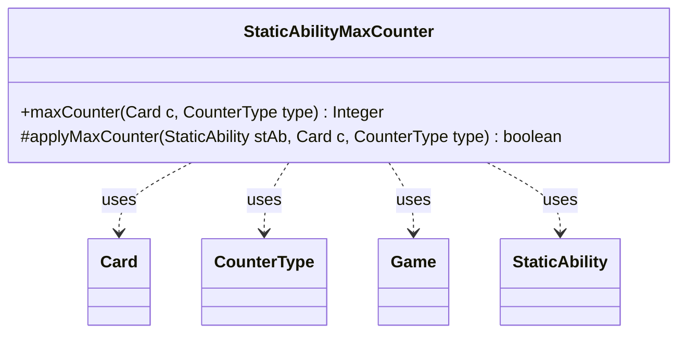

---
aliases:
  - StaticAbilityMaxCounter
tags:
  - java/class
  - module/forge-game
  - pkg/forge/game/staticability
fqn: forge.game.staticability.StaticAbilityMaxCounter
package: forge.game.staticability
module: forge-game
kind: Class
---

# StaticAbilityMaxCounter

**Package:** `forge.game.staticability` &nbsp; **Module:** `forge-game` &nbsp; **Kind:** Class



## Relationships
**Uses:**
- [[forge.game.Game|Game]]
- [[forge.game.card.Card|Card]]
- [[forge.game.card.CounterType|CounterType]]
- [[forge.game.staticability.StaticAbility|StaticAbility]]

## Design Description

StaticAbilityMaxCounter is a stateless utility that resolves the effective maximum number of counters of a given type allowed on a card, enforcing "maximum counter" static abilities found anywhere in the game. Its static `maxCounter` method scans every card in the static-ability source zones, evaluates each candidate `StaticAbility` whose conditions match the `MaxCounter` mode, and returns the most restrictive limit by taking the smallest applicable `MaxNum` value (or null when no cap applies).

Rather than implementing an interface, the class collaborates with the static-ability framework as a focused helper: it queries `Game` for relevant cards, delegates value computation to `AbilityUtils`, and uses the protected `applyMaxCounter` predicate to filter by `CounterType` and `ValidCard` parameters. This separation keeps the matching logic overridable and testable while centralizing counter-cap rules in one cohesive place.

## Source
`forge-game/src/main/java/forge/game/staticability/StaticAbilityMaxCounter.java`

```java
package forge.game.staticability;

import forge.game.Game;
import forge.game.ability.AbilityUtils;
import forge.game.card.Card;
import forge.game.card.CounterType;
import forge.game.zone.ZoneType;

public class StaticAbilityMaxCounter {

    public static Integer maxCounter(final Card c, final CounterType type) {
        final Game game = c.getGame();

        Integer result = null;
        for (final Card ca : game.getCardsIn(ZoneType.STATIC_ABILITIES_SOURCE_ZONES)) {
            for (final StaticAbility stAb : ca.getStaticAbilities()) {
                if (!stAb.checkConditions(StaticAbilityMode.MaxCounter)) {
                    continue;
                }
                if (applyMaxCounter(stAb, c, type)) {
                    int value = AbilityUtils.calculateAmount(stAb.getHostCard(), stAb.getParam("MaxNum"), stAb);
                    if (result == null || result > value) {
                        result = value;
                    }
                }
            }
        }
        return result;
    }

    protected static boolean applyMaxCounter(StaticAbility stAb, final Card c, final CounterType type) {
        if (stAb.hasParam("CounterType")) {
            CounterType t = CounterType.getType(stAb.getParam("CounterType"));
            if (t != null && !type.equals(t)) {
                return false;
            }
        }
        if (!stAb.matchesValidParam("ValidCard", c)) {
            return false;
        }
        return true;
    }
}
```

## Python
`forge/game/staticability/StaticAbilityMaxCounter.py`

```python
from forge.game.Game import Game
from forge.game.ability.AbilityUtils import AbilityUtils
from forge.game.card.Card import Card
from forge.game.card.CounterType import CounterType
from forge.game.zone.ZoneType import ZoneType
from forge.game.staticability.StaticAbility import StaticAbility
from forge.game.staticability.StaticAbilityMode import StaticAbilityMode


class StaticAbilityMaxCounter:

    @staticmethod
    def maxCounter(c: Card, type: CounterType) -> int:
        game = c.getGame()

        result = None
        for ca in game.getCardsIn(ZoneType.STATIC_ABILITIES_SOURCE_ZONES):
            for stAb in ca.getStaticAbilities():
                if not stAb.checkConditions(StaticAbilityMode.MaxCounter):
                    continue
                if StaticAbilityMaxCounter.applyMaxCounter(stAb, c, type):
                    value = AbilityUtils.calculateAmount(stAb.getHostCard(), stAb.getParam("MaxNum"), stAb)
                    if result is None or result > value:
                        result = value
        return result

    @staticmethod
    def applyMaxCounter(stAb: StaticAbility, c: Card, type: CounterType) -> bool:
        if stAb.hasParam("CounterType"):
            t = CounterType.getType(stAb.getParam("CounterType"))
            if t is not None and not type.equals(t):
                return False
        if not stAb.matchesValidParam("ValidCard", c):
            return False
        return True
```
