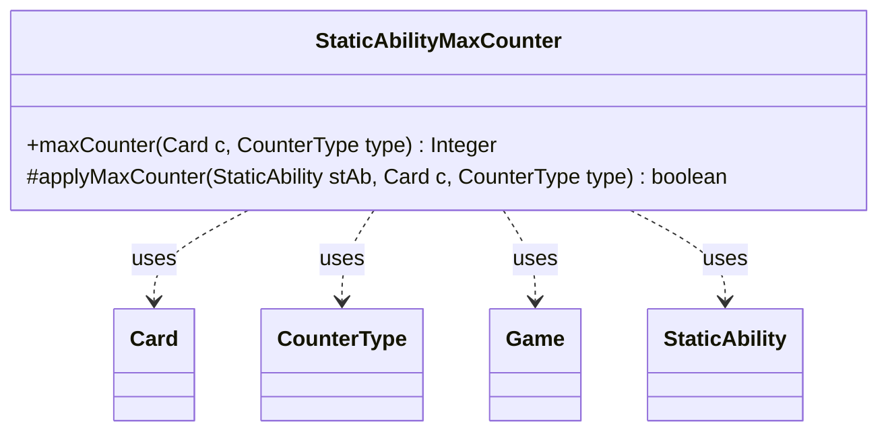

---
aliases:
  - StaticAbilityMaxCounter
tags:
  - java/class
  - module/forge-game
  - pkg/forge/game/staticability
fqn: forge.game.staticability.StaticAbilityMaxCounter
package: forge.game.staticability
module: forge-game
kind: Class
---

# StaticAbilityMaxCounter

**Package:** `forge.game.staticability` &nbsp; **Module:** `forge-game` &nbsp; **Kind:** Class



## Relationships
**Uses:**
- [[forge.game.Game|Game]]
- [[forge.game.card.Card|Card]]
- [[forge.game.card.CounterType|CounterType]]
- [[forge.game.staticability.StaticAbility|StaticAbility]]

## Source
`forge-game/src/main/java/forge/game/staticability/StaticAbilityMaxCounter.java`

```java
package forge.game.staticability;

import forge.game.Game;
import forge.game.ability.AbilityUtils;
import forge.game.card.Card;
import forge.game.card.CounterType;
import forge.game.zone.ZoneType;

public class StaticAbilityMaxCounter {

    public static Integer maxCounter(final Card c, final CounterType type) {
        final Game game = c.getGame();

        Integer result = null;
        for (final Card ca : game.getCardsIn(ZoneType.STATIC_ABILITIES_SOURCE_ZONES)) {
            for (final StaticAbility stAb : ca.getStaticAbilities()) {
                if (!stAb.checkConditions(StaticAbilityMode.MaxCounter)) {
                    continue;
                }
                if (applyMaxCounter(stAb, c, type)) {
                    int value = AbilityUtils.calculateAmount(stAb.getHostCard(), stAb.getParam("MaxNum"), stAb);
                    if (result == null || result > value) {
                        result = value;
                    }
                }
            }
        }
        return result;
    }

    protected static boolean applyMaxCounter(StaticAbility stAb, final Card c, final CounterType type) {
        if (stAb.hasParam("CounterType")) {
            CounterType t = CounterType.getType(stAb.getParam("CounterType"));
            if (t != null && !type.equals(t)) {
                return false;
            }
        }
        if (!stAb.matchesValidParam("ValidCard", c)) {
            return false;
        }
        return true;
    }
}
```
