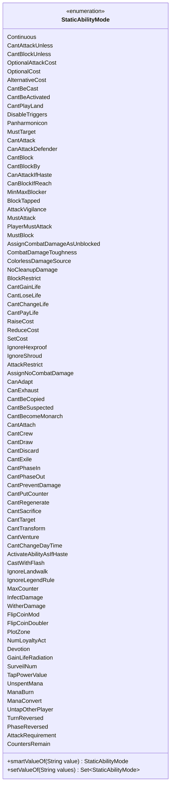

---
aliases:
  - StaticAbilityMode
tags:
  - java/enum
  - module/forge-game
  - pkg/forge/game/staticability
fqn: forge.game.staticability.StaticAbilityMode
package: forge.game.staticability
module: forge-game
kind: Enum
---

# StaticAbilityMode

**Package:** `forge.game.staticability` &nbsp; **Module:** `forge-game` &nbsp; **Kind:** Enum



## Source
`forge-game/src/main/java/forge/game/staticability/StaticAbilityMode.java`

```java
package forge.game.staticability;

import java.util.EnumSet;
import java.util.Set;

public enum StaticAbilityMode {
    Continuous,

    // StaticAbility
    CantAttackUnless,
    CantBlockUnless,
    OptionalAttackCost,

    // GameActionUtil
    OptionalCost,

    // StaticAbilityAlternativeCost
    AlternativeCost,

    // StaticAbilityCantBeCast
    CantBeCast,
    CantBeActivated,
    CantPlayLand,
    // StaticAbilityDisableTriggers
    DisableTriggers,

    // StaticAbilityPanharmonicon
    Panharmonicon,

    // StaticAbilityMustTarget
    MustTarget,

    // StaticAbilityCantAttackBlock
    CantAttack,
    CanAttackDefender,
    CantBlock,
    CantBlockBy,
    CanAttackIfHaste,
    CanBlockIfReach,
    MinMaxBlocker,
    BlockTapped,
    AttackVigilance,

    // StaticAbilityMustAttack
    MustAttack,
    PlayerMustAttack,
    // StaticAbilityMustBlock
    MustBlock,

    // StaticAbilityAssignCombatDamageAsUnblocked
    AssignCombatDamageAsUnblocked,

    // StaticAbilityCombatDamageToughness
    CombatDamageToughness,

    // StaticAbilityColorlessDamageSource
    ColorlessDamageSource,

    // StaticAbilityNoCleanupDamage
    NoCleanupDamage,

    // StaticAbilityBlockRestrict
    BlockRestrict,

    // StaticAbilityCantGainLosePayLife
    CantGainLife,
    CantLoseLife,
    CantChangeLife,
    CantPayLife,

    // CostAdjustment
    RaiseCost,
    ReduceCost,
    SetCost,

    // StaticAbilityIgnoreHexproofShroud
    IgnoreHexproof,
    IgnoreShroud,

    // StaticAbilityAttackRestrict
    AttackRestrict,

    // StaticAbilityAssignNoCombatDamage
    AssignNoCombatDamage,

    // StaticAbilityAdapt
    CanAdapt,

    // StaticAbilityExhaust
    CanExhaust,

    // StaticAbilityCantBeCopied
    CantBeCopied,

    // StaticAbilityCantBeSuspected
    CantBeSuspected,

    // StaticAbilityCantBecomeMonarch
    CantBecomeMonarch,

    // StaticAbilityCantAttach
    CantAttach,

    // StaticAbilityCantCrew
    CantCrew,

    // StaticAbilityCantDraw
    CantDraw,

    // StaticAbilityCantDiscard
    CantDiscard,

    // StaticAbilityCantExile
    CantExile,

    // StaticAbilityCantPhase
    CantPhaseIn,
    CantPhaseOut,

    // StaticAbilityCantPreventDamage
    CantPreventDamage,

    // StaticAbilityCantPutCounter
    CantPutCounter,

    // StaticAbilityCantRegenerate
    CantRegenerate,

    // StaticAbilityCantSacrifice
    CantSacrifice,

    // StaticAbilityCantTarget
    CantTarget,

    // StaticAbilityCantTransform
    CantTransform,

    // StaticAbilityCantVenture
    CantVenture,

    // StaticAbilityCantChangeDayTime
    CantChangeDayTime,

    // StaticAbilityActivateAbilityAsIfHaste
    ActivateAbilityAsIfHaste,

    // StaticAbilityCastWithFlash
    CastWithFlash,

    // StaticAbilityIgnoreLandwalk
    IgnoreLandwalk,
    // StaticAbilityIgnoreLegendRule
    IgnoreLegendRule,

    // StaticAbilityMaxCounter
    MaxCounter,

    // StaticAbilityInfectDamage
    InfectDamage,
    // StaticAbilityWitherDamage
    WitherDamage,

    // StaticAbilityFlipCoinMod
    FlipCoinMod,
    FlipCoinDoubler,

    // StaticAbilityPlotZone
    PlotZone,

    // StaticAbilityNumLoyaltyAct
    NumLoyaltyAct,

    // StaticAbilityDevotion
    Devotion,
    // StaticAbilityGainLifeRadiation
    GainLifeRadiation,

    // StaticAbilitySurveilNum
    SurveilNum,

    // StaticAbilityTapPowerValue
    TapPowerValue,

    // StaticAbilityUnspentMana
    UnspentMana,
    ManaBurn,

    // StaticAbilityManaConvert
    ManaConvert,

    // StaticAbilityUntapOtherPlayer
    UntapOtherPlayer,

    // StaticAbilityTurnPhaseReversed
    TurnReversed,
    PhaseReversed,

    // StaticAbilityAttackRequirement
    AttackRequirement,

    // StaticAbilityCountersRemain
    CountersRemain,
    ;

    public static StaticAbilityMode smartValueOf(final String value) {
        if (value == null) {
            return null;
        }
        final String valToCompate = value.trim();
        for (final StaticAbilityMode v : StaticAbilityMode.values()) {
            if (v.name().compareToIgnoreCase(valToCompate) == 0) {
                return v;
            }
        }
        throw new IllegalArgumentException("No element named " + value + " in enum StaticAbilityMode");
    }

    public static Set<StaticAbilityMode> setValueOf(final String values) {
        final Set<StaticAbilityMode> result = EnumSet.noneOf(StaticAbilityMode.class);
        for (final String s : values.split("[, ]+")) {
            StaticAbilityMode zt = StaticAbilityMode.smartValueOf(s);
            if (zt != null) {
                result.add(zt);
            }
        }
        return result;
    }
}
```
