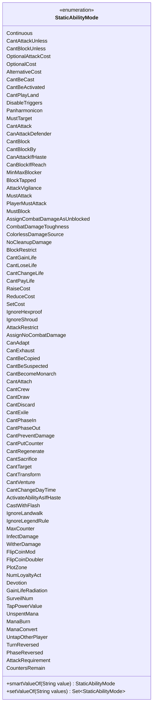

---
aliases:
  - StaticAbilityMode
tags:
  - java/enum
  - module/forge-game
  - pkg/forge/game/staticability
fqn: forge.game.staticability.StaticAbilityMode
package: forge.game.staticability
module: forge-game
kind: Enum
---

# StaticAbilityMode

**Package:** `forge.game.staticability`   **Module:** `forge-game`   **Kind:** Enum



## Design Description

Continuous serves as the base mode for ongoing, layer-applied effects, while the remaining constants enumerate the discrete restriction, cost-modification, combat, and replacement behaviors that the rules engine recognizes—each grouped by the dedicated `StaticAbility*` handler class that interprets it.

As the central vocabulary of the `forge.game.staticability` subsystem, this enum lets static abilities declare their effect category in card scripts, which the parser resolves via the case-insensitive `smartValueOf` lookup and the delimiter-splitting `setValueOf` factory that builds an `EnumSet` of modes. Using `EnumSet` and a single canonical enum keeps mode dispatch type-safe and memory-compact, and the extensive comment-grouped membership reflects a deliberate one-mode-per-handler design that scales as new MTG mechanics are added.

## Source
`forge-game/src/main/java/forge/game/staticability/StaticAbilityMode.java`

```java
package forge.game.staticability;

import java.util.EnumSet;
import java.util.Set;

public enum StaticAbilityMode {
    Continuous,

    // StaticAbility
    CantAttackUnless,
    CantBlockUnless,
    OptionalAttackCost,

    // GameActionUtil
    OptionalCost,

    // StaticAbilityAlternativeCost
    AlternativeCost,

    // StaticAbilityCantBeCast
    CantBeCast,
    CantBeActivated,
    CantPlayLand,
    // StaticAbilityDisableTriggers
    DisableTriggers,

    // StaticAbilityPanharmonicon
    Panharmonicon,

    // StaticAbilityMustTarget
    MustTarget,

    // StaticAbilityCantAttackBlock
    CantAttack,
    CanAttackDefender,
    CantBlock,
    CantBlockBy,
    CanAttackIfHaste,
    CanBlockIfReach,
    MinMaxBlocker,
    BlockTapped,
    AttackVigilance,

    // StaticAbilityMustAttack
    MustAttack,
    PlayerMustAttack,
    // StaticAbilityMustBlock
    MustBlock,

    // StaticAbilityAssignCombatDamageAsUnblocked
    AssignCombatDamageAsUnblocked,

    // StaticAbilityCombatDamageToughness
    CombatDamageToughness,

    // StaticAbilityColorlessDamageSource
    ColorlessDamageSource,

    // StaticAbilityNoCleanupDamage
    NoCleanupDamage,

    // StaticAbilityBlockRestrict
    BlockRestrict,

    // StaticAbilityCantGainLosePayLife
    CantGainLife,
    CantLoseLife,
    CantChangeLife,
    CantPayLife,

    // CostAdjustment
    RaiseCost,
    ReduceCost,
    SetCost,

    // StaticAbilityIgnoreHexproofShroud
    IgnoreHexproof,
    IgnoreShroud,

    // StaticAbilityAttackRestrict
    AttackRestrict,

    // StaticAbilityAssignNoCombatDamage
    AssignNoCombatDamage,

    // StaticAbilityAdapt
    CanAdapt,

    // StaticAbilityExhaust
    CanExhaust,

    // StaticAbilityCantBeCopied
    CantBeCopied,

    // StaticAbilityCantBeSuspected
    CantBeSuspected,

    // StaticAbilityCantBecomeMonarch
    CantBecomeMonarch,

    // StaticAbilityCantAttach
    CantAttach,

    // StaticAbilityCantCrew
    CantCrew,

    // StaticAbilityCantDraw
    CantDraw,

    // StaticAbilityCantDiscard
    CantDiscard,

    // StaticAbilityCantExile
    CantExile,

    // StaticAbilityCantPhase
    CantPhaseIn,
    CantPhaseOut,

    // StaticAbilityCantPreventDamage
    CantPreventDamage,

    // StaticAbilityCantPutCounter
    CantPutCounter,

    // StaticAbilityCantRegenerate
    CantRegenerate,

    // StaticAbilityCantSacrifice
    CantSacrifice,

    // StaticAbilityCantTarget
    CantTarget,

    // StaticAbilityCantTransform
    CantTransform,

    // StaticAbilityCantVenture
    CantVenture,

    // StaticAbilityCantChangeDayTime
    CantChangeDayTime,

    // StaticAbilityActivateAbilityAsIfHaste
    ActivateAbilityAsIfHaste,

    // StaticAbilityCastWithFlash
    CastWithFlash,

    // StaticAbilityIgnoreLandwalk
    IgnoreLandwalk,
    // StaticAbilityIgnoreLegendRule
    IgnoreLegendRule,

    // StaticAbilityMaxCounter
    MaxCounter,

    // StaticAbilityInfectDamage
    InfectDamage,
    // StaticAbilityWitherDamage
    WitherDamage,

    // StaticAbilityFlipCoinMod
    FlipCoinMod,
    FlipCoinDoubler,

    // StaticAbilityPlotZone
    PlotZone,

    // StaticAbilityNumLoyaltyAct
    NumLoyaltyAct,

    // StaticAbilityDevotion
    Devotion,
    // StaticAbilityGainLifeRadiation
    GainLifeRadiation,

    // StaticAbilitySurveilNum
    SurveilNum,

    // StaticAbilityTapPowerValue
    TapPowerValue,

    // StaticAbilityUnspentMana
    UnspentMana,
    ManaBurn,

    // StaticAbilityManaConvert
    ManaConvert,

    // StaticAbilityUntapOtherPlayer
    UntapOtherPlayer,

    // StaticAbilityTurnPhaseReversed
    TurnReversed,
    PhaseReversed,

    // StaticAbilityAttackRequirement
    AttackRequirement,

    // StaticAbilityCountersRemain
    CountersRemain,
    ;

    public static StaticAbilityMode smartValueOf(final String value) {
        if (value == null) {
            return null;
        }
        final String valToCompate = value.trim();
        for (final StaticAbilityMode v : StaticAbilityMode.values()) {
            if (v.name().compareToIgnoreCase(valToCompate) == 0) {
                return v;
            }
        }
        throw new IllegalArgumentException("No element named " + value + " in enum StaticAbilityMode");
    }

    public static Set<StaticAbilityMode> setValueOf(final String values) {
        final Set<StaticAbilityMode> result = EnumSet.noneOf(StaticAbilityMode.class);
        for (final String s : values.split("[, ]+")) {
            StaticAbilityMode zt = StaticAbilityMode.smartValueOf(s);
            if (zt != null) {
                result.add(zt);
            }
        }
        return result;
    }
}
```

## Python
`forge/game/staticability/StaticAbilityMode.py`

```python
from enum import Enum
from typing import Optional, Set


class StaticAbilityMode(Enum):
    Continuous = "Continuous"

    # StaticAbility
    CantAttackUnless = "CantAttackUnless"
    CantBlockUnless = "CantBlockUnless"
    OptionalAttackCost = "OptionalAttackCost"

    # GameActionUtil
    OptionalCost = "OptionalCost"

    # StaticAbilityAlternativeCost
    AlternativeCost = "AlternativeCost"

    # StaticAbilityCantBeCast
    CantBeCast = "CantBeCast"
    CantBeActivated = "CantBeActivated"
    CantPlayLand = "CantPlayLand"
    # StaticAbilityDisableTriggers
    DisableTriggers = "DisableTriggers"

    # StaticAbilityPanharmonicon
    Panharmonicon = "Panharmonicon"

    # StaticAbilityMustTarget
    MustTarget = "MustTarget"

    # StaticAbilityCantAttackBlock
    CantAttack = "CantAttack"
    CanAttackDefender = "CanAttackDefender"
    CantBlock = "CantBlock"
    CantBlockBy = "CantBlockBy"
    CanAttackIfHaste = "CanAttackIfHaste"
    CanBlockIfReach = "CanBlockIfReach"
    MinMaxBlocker = "MinMaxBlocker"
    BlockTapped = "BlockTapped"
    AttackVigilance = "AttackVigilance"

    # StaticAbilityMustAttack
    MustAttack = "MustAttack"
    PlayerMustAttack = "PlayerMustAttack"
    # StaticAbilityMustBlock
    MustBlock = "MustBlock"

    # StaticAbilityAssignCombatDamageAsUnblocked
    AssignCombatDamageAsUnblocked = "AssignCombatDamageAsUnblocked"

    # StaticAbilityCombatDamageToughness
    CombatDamageToughness = "CombatDamageToughness"

    # StaticAbilityColorlessDamageSource
    ColorlessDamageSource = "ColorlessDamageSource"

    # StaticAbilityNoCleanupDamage
    NoCleanupDamage = "NoCleanupDamage"

    # StaticAbilityBlockRestrict
    BlockRestrict = "BlockRestrict"

    # StaticAbilityCantGainLosePayLife
    CantGainLife = "CantGainLife"
    CantLoseLife = "CantLoseLife"
    CantChangeLife = "CantChangeLife"
    CantPayLife = "CantPayLife"

    # CostAdjustment
    RaiseCost = "RaiseCost"
    ReduceCost = "ReduceCost"
    SetCost = "SetCost"

    # StaticAbilityIgnoreHexproofShroud
    IgnoreHexproof = "IgnoreHexproof"
    IgnoreShroud = "IgnoreShroud"

    # StaticAbilityAttackRestrict
    AttackRestrict = "AttackRestrict"

    # StaticAbilityAssignNoCombatDamage
    AssignNoCombatDamage = "AssignNoCombatDamage"

    # StaticAbilityAdapt
    CanAdapt = "CanAdapt"

    # StaticAbilityExhaust
    CanExhaust = "CanExhaust"

    # StaticAbilityCantBeCopied
    CantBeCopied = "CantBeCopied"

    # StaticAbilityCantBeSuspected
    CantBeSuspected = "CantBeSuspected"

    # StaticAbilityCantBecomeMonarch
    CantBecomeMonarch = "CantBecomeMonarch"

    # StaticAbilityCantAttach
    CantAttach = "CantAttach"

    # StaticAbilityCantCrew
    CantCrew = "CantCrew"

    # StaticAbilityCantDraw
    CantDraw = "CantDraw"

    # StaticAbilityCantDiscard
    CantDiscard = "CantDiscard"

    # StaticAbilityCantExile
    CantExile = "CantExile"

    # StaticAbilityCantPhase
    CantPhaseIn = "CantPhaseIn"
    CantPhaseOut = "CantPhaseOut"

    # StaticAbilityCantPreventDamage
    CantPreventDamage = "CantPreventDamage"

    # StaticAbilityCantPutCounter
    CantPutCounter = "CantPutCounter"

    # StaticAbilityCantRegenerate
    CantRegenerate = "CantRegenerate"

    # StaticAbilityCantSacrifice
    CantSacrifice = "CantSacrifice"

    # StaticAbilityCantTarget
    CantTarget = "CantTarget"

    # StaticAbilityCantTransform
    CantTransform = "CantTransform"

    # StaticAbilityCantVenture
    CantVenture = "CantVenture"

    # StaticAbilityCantChangeDayTime
    CantChangeDayTime = "CantChangeDayTime"

    # StaticAbilityActivateAbilityAsIfHaste
    ActivateAbilityAsIfHaste = "ActivateAbilityAsIfHaste"

    # StaticAbilityCastWithFlash
    CastWithFlash = "CastWithFlash"

    # StaticAbilityIgnoreLandwalk
    IgnoreLandwalk = "IgnoreLandwalk"
    # StaticAbilityIgnoreLegendRule
    IgnoreLegendRule = "IgnoreLegendRule"

    # StaticAbilityMaxCounter
    MaxCounter = "MaxCounter"

    # StaticAbilityInfectDamage
    InfectDamage = "InfectDamage"
    # StaticAbilityWitherDamage
    WitherDamage = "WitherDamage"

    # StaticAbilityFlipCoinMod
    FlipCoinMod = "FlipCoinMod"
    FlipCoinDoubler = "FlipCoinDoubler"

    # StaticAbilityPlotZone
    PlotZone = "PlotZone"

    # StaticAbilityNumLoyaltyAct
    NumLoyaltyAct = "NumLoyaltyAct"

    # StaticAbilityDevotion
    Devotion = "Devotion"
    # StaticAbilityGainLifeRadiation
    GainLifeRadiation = "GainLifeRadiation"

    # StaticAbilitySurveilNum
    SurveilNum = "SurveilNum"

    # StaticAbilityTapPowerValue
    TapPowerValue = "TapPowerValue"

    # StaticAbilityUnspentMana
    UnspentMana = "UnspentMana"
    ManaBurn = "ManaBurn"

    # StaticAbilityManaConvert
    ManaConvert = "ManaConvert"

    # StaticAbilityUntapOtherPlayer
    UntapOtherPlayer = "UntapOtherPlayer"

    # StaticAbilityTurnPhaseReversed
    TurnReversed = "TurnReversed"
    PhaseReversed = "PhaseReversed"

    # StaticAbilityAttackRequirement
    AttackRequirement = "AttackRequirement"

    # StaticAbilityCountersRemain
    CountersRemain = "CountersRemain"

    @staticmethod
    def smartValueOf(value: Optional[str]) -> Optional["StaticAbilityMode"]:
        if value is None:
            return None
        valToCompate = value.strip()
        for v in StaticAbilityMode:
            if v.name.lower() == valToCompate.lower():
                return v
        raise ValueError("No element named " + value + " in enum StaticAbilityMode")

    @staticmethod
    def setValueOf(values: str) -> Set["StaticAbilityMode"]:
        result: Set["StaticAbilityMode"] = set()
        for s in re.split(r"[, ]+", values):
            zt = StaticAbilityMode.smartValueOf(s)
            if zt is not None:
                result.add(zt)
        return result


import re
```
