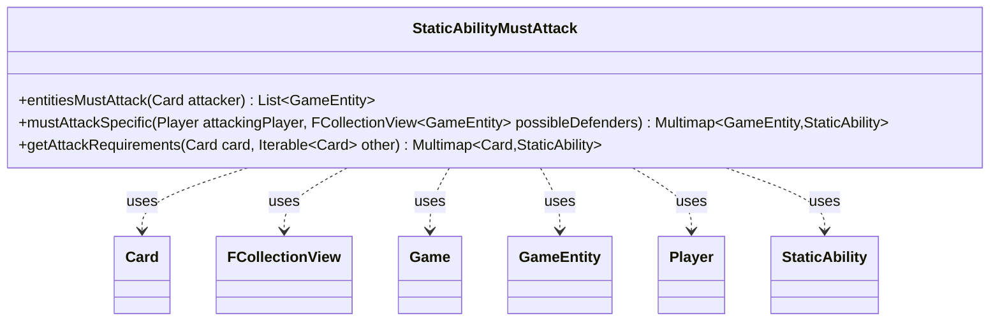

---
aliases:
  - StaticAbilityMustAttack
tags:
  - java/class
  - module/forge-game
  - pkg/forge/game/staticability
fqn: forge.game.staticability.StaticAbilityMustAttack
package: forge.game.staticability
module: forge-game
kind: Class
---

# StaticAbilityMustAttack

**Package:** `forge.game.staticability` &nbsp; **Module:** `forge-game` &nbsp; **Kind:** Class



## Relationships
**Uses:**
- [[forge.game.Game|Game]]
- [[forge.game.GameEntity|GameEntity]]
- [[forge.game.card.Card|Card]]
- [[forge.game.player.Player|Player]]
- [[forge.game.staticability.StaticAbility|StaticAbility]]
- [[forge.util.collect.FCollectionView|FCollectionView]]

## Design Description

StaticAbilityMustAttack is a stateless utility class that resolves the Magic rules for forced attacks, evaluating active static abilities (sourced from the static-ability zones) to determine which creatures or players are compelled to attack and whom they must target. Its three static methods serve distinct rule layers: entitiesMustAttack collects the GameEntities a given attacking Card must attack (honoring CR 506.2 by skipping defenders controlled by the active player), mustAttackSpecific maps which possible defenders an attacking Player is required to assault, and getAttackRequirements gathers per-card attack requirements among a set of attackers.

As a pure helper in the staticability package, it holds no state and is never instantiated; it collaborates with StaticAbility to read conditions and validity parameters, queries the Game for cards in the relevant zones, and returns Guava Multimaps to express the many-to-many relationship between entities and the abilities constraining them.

## Source
`forge-game/src/main/java/forge/game/staticability/StaticAbilityMustAttack.java`

```java
package forge.game.staticability;

import forge.game.Game;
import forge.game.GameEntity;
import forge.game.ability.AbilityUtils;
import forge.game.card.Card;
import forge.game.player.Player;
import forge.game.zone.ZoneType;
import forge.util.collect.FCollectionView;

import java.util.ArrayList;
import java.util.List;

import com.google.common.collect.Multimap;
import com.google.common.collect.MultimapBuilder;

public class StaticAbilityMustAttack {

    public static List<GameEntity> entitiesMustAttack(final Card attacker) {
        final List<GameEntity> entityList = new ArrayList<>();
        final Game game = attacker.getGame();
        for (final Card ca : game.getCardsIn(ZoneType.STATIC_ABILITIES_SOURCE_ZONES)) {
            for (final StaticAbility stAb : ca.getStaticAbilities()) {
                if (!stAb.checkConditions(StaticAbilityMode.MustAttack)) {
                    continue;
                }
                if (stAb.matchesValidParam("ValidCreature", attacker)) {
                    if (stAb.hasParam("MustAttack")) {
                        List<GameEntity> def = AbilityUtils.getDefinedEntities(stAb.getHostCard(), stAb.getParam("MustAttack"), stAb);
                        for (GameEntity e : def) {
                            if ((e instanceof Player attackPl && game.getPhaseHandler().isPlayerTurn(attackPl)) ||
                                    ((e instanceof Card attackPw && game.getPhaseHandler().isPlayerTurn(attackPw.getController())))) {
                                // CR 506.2
                                continue;
                            }
                            entityList.add(e);
                        }
                    } else {
                        // if the list is only the attacker, the attacker must attack, but no specific entity
                        entityList.add(attacker);
                    }
                }
            }
        }
        return entityList;
    }

    public static Multimap<GameEntity, StaticAbility> mustAttackSpecific(final Player attackingPlayer, final FCollectionView<GameEntity> possibleDefenders) {
        Multimap<GameEntity, StaticAbility> result = MultimapBuilder.hashKeys(possibleDefenders.size()).arrayListValues().build();
        for (final Card ca : attackingPlayer.getGame().getCardsIn(ZoneType.STATIC_ABILITIES_SOURCE_ZONES)) {
            for (final StaticAbility stAb : ca.getStaticAbilities()) {
                if (!stAb.checkConditions(StaticAbilityMode.PlayerMustAttack)) {
                    continue;
                }
                if (!stAb.matchesValidParam("ValidPlayer", attackingPlayer)) {
                    continue;
                }
                for (GameEntity ge : possibleDefenders) {
                    if (stAb.matchesValidParam("MustAttack", ge)) {
                        result.put(ge, stAb);
                    }
                }
            }
        }
        return result;
    }

    public static Multimap<Card, StaticAbility> getAttackRequirements(final Card card, Iterable<Card> other) {
        Multimap<Card, StaticAbility> result = MultimapBuilder.hashKeys().arrayListValues().build();
        for (final Card ca : card.getGame().getCardsIn(ZoneType.STATIC_ABILITIES_SOURCE_ZONES)) {
            for (final StaticAbility stAb : ca.getStaticAbilities()) {
                if (!stAb.checkConditions(StaticAbilityMode.AttackRequirement)) {
                    continue;
                }

                if (!stAb.matchesValidParam("ValidCard", card)) {
                    continue;
                }
                for (final Card co : other) {
                    if (stAb.matchesValidParam("ValidAttacker", co)) {
                        result.put(co, stAb);
                    }
                }
            }
        }

        return result;
    }
}
```

## Python
`forge/game/staticability/StaticAbilityMustAttack.py`

```python
from forge.game.Game import Game
from forge.game.GameEntity import GameEntity
from forge.game.ability.AbilityUtils import AbilityUtils
from forge.game.card.Card import Card
from forge.game.player.Player import Player
from forge.game.zone.ZoneType import ZoneType
from forge.util.collect.FCollectionView import FCollectionView

from forge.game.staticability.StaticAbility import StaticAbility
from forge.game.staticability.StaticAbilityMode import StaticAbilityMode

from collections import defaultdict


class StaticAbilityMustAttack:

    @staticmethod
    def entitiesMustAttack(attacker: Card) -> list[GameEntity]:
        entityList: list[GameEntity] = []
        game = attacker.getGame()
        for ca in game.getCardsIn(ZoneType.STATIC_ABILITIES_SOURCE_ZONES):
            for stAb in ca.getStaticAbilities():
                if not stAb.checkConditions(StaticAbilityMode.MustAttack):
                    continue
                if stAb.matchesValidParam("ValidCreature", attacker):
                    if stAb.hasParam("MustAttack"):
                        defs = AbilityUtils.getDefinedEntities(stAb.getHostCard(), stAb.getParam("MustAttack"), stAb)
                        for e in defs:
                            if (isinstance(e, Player) and game.getPhaseHandler().isPlayerTurn(e)) or \
                                    (isinstance(e, Card) and game.getPhaseHandler().isPlayerTurn(e.getController())):
                                # CR 506.2
                                continue
                            entityList.append(e)
                    else:
                        # if the list is only the attacker, the attacker must attack, but no specific entity
                        entityList.append(attacker)
        return entityList

    @staticmethod
    def mustAttackSpecific(attackingPlayer: Player, possibleDefenders: FCollectionView[GameEntity]) -> dict[GameEntity, list[StaticAbility]]:
        result: dict[GameEntity, list[StaticAbility]] = defaultdict(list)
        for ca in attackingPlayer.getGame().getCardsIn(ZoneType.STATIC_ABILITIES_SOURCE_ZONES):
            for stAb in ca.getStaticAbilities():
                if not stAb.checkConditions(StaticAbilityMode.PlayerMustAttack):
                    continue
                if not stAb.matchesValidParam("ValidPlayer", attackingPlayer):
                    continue
                for ge in possibleDefenders:
                    if stAb.matchesValidParam("MustAttack", ge):
                        result[ge].append(stAb)
        return result

    @staticmethod
    def getAttackRequirements(card: Card, other) -> dict[Card, list[StaticAbility]]:
        result: dict[Card, list[StaticAbility]] = defaultdict(list)
        for ca in card.getGame().getCardsIn(ZoneType.STATIC_ABILITIES_SOURCE_ZONES):
            for stAb in ca.getStaticAbilities():
                if not stAb.checkConditions(StaticAbilityMode.AttackRequirement):
                    continue

                if not stAb.matchesValidParam("ValidCard", card):
                    continue
                for co in other:
                    if stAb.matchesValidParam("ValidAttacker", co):
                        result[co].append(stAb)

        return result
```
