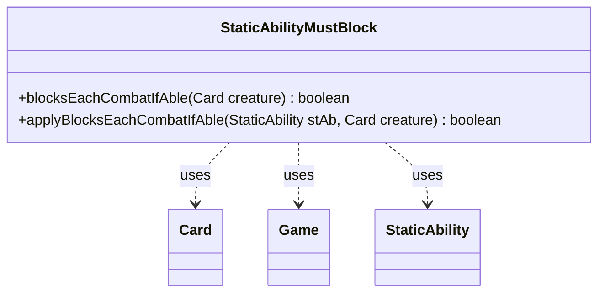

---
aliases:
  - StaticAbilityMustBlock
tags:
  - java/class
  - module/forge-game
  - pkg/forge/game/staticability
fqn: forge.game.staticability.StaticAbilityMustBlock
package: forge.game.staticability
module: forge-game
kind: Class
---

# StaticAbilityMustBlock

**Package:** `forge.game.staticability` &nbsp; **Module:** `forge-game` &nbsp; **Kind:** Class



## Relationships
**Uses:**
- [[forge.game.Game|Game]]
- [[forge.game.card.Card|Card]]
- [[forge.game.staticability.StaticAbility|StaticAbility]]

## Source
`forge-game/src/main/java/forge/game/staticability/StaticAbilityMustBlock.java`

```java
package forge.game.staticability;

import forge.game.Game;
import forge.game.card.Card;
import forge.game.zone.ZoneType;

public class StaticAbilityMustBlock {

    public static boolean blocksEachCombatIfAble(final Card creature)  {
        final Game game = creature.getGame();
        for (final Card ca : game.getCardsIn(ZoneType.STATIC_ABILITIES_SOURCE_ZONES)) {
            for (final StaticAbility stAb : ca.getStaticAbilities()) {
                if (!stAb.checkConditions(StaticAbilityMode.MustBlock)) {
                    continue;
                }
                if (applyBlocksEachCombatIfAble(stAb, creature)) {
                    return true;
                }
            }
        }
        return false;
    }

    public static boolean applyBlocksEachCombatIfAble(final StaticAbility stAb, final Card creature) {
        if (!stAb.matchesValidParam("ValidCreature", creature)) {
            return false;
        }
        return true;
    }
}
```
