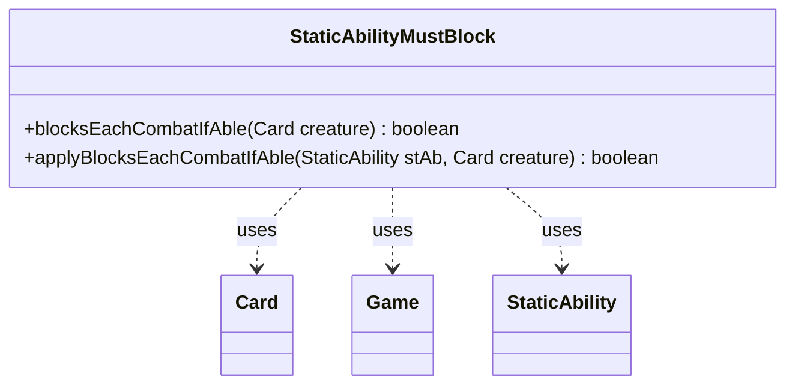

---
aliases:
  - StaticAbilityMustBlock
tags:
  - java/class
  - module/forge-game
  - pkg/forge/game/staticability
fqn: forge.game.staticability.StaticAbilityMustBlock
package: forge.game.staticability
module: forge-game
kind: Class
---

# StaticAbilityMustBlock

**Package:** `forge.game.staticability` &nbsp; **Module:** `forge-game` &nbsp; **Kind:** Class



## Relationships
**Uses:**
- [[forge.game.Game|Game]]
- [[forge.game.card.Card|Card]]
- [[forge.game.staticability.StaticAbility|StaticAbility]]

## Design Description

StaticAbilityMustBlock is a stateless utility that evaluates the "must block each combat if able" static ability for creatures during Magic: The Gathering combat. Its static `blocksEachCombatIfAble` method scans every card in the zones that can host static abilities, filters those whose conditions match the `MustBlock` mode, and delegates to `applyBlocksEachCombatIfAble` to confirm the creature satisfies the ability's `ValidCreature` restriction.

As a helper in the `forge.game.staticability` package, it does not extend `StaticAbility` but collaborates with it, reading each card's declared abilities and using `matchesValidParam` for predicate matching. It reaches the global state through the `Card`'s associated `Game`, querying `ZoneType.STATIC_ABILITIES_SOURCE_ZONES`. The all-static, side-effect-free design reflects an intentional pattern: each static-ability rule lives in its own focused evaluator class invoked on demand by the combat system, keeping the rules engine modular and avoiding shared mutable state.

## Source
`forge-game/src/main/java/forge/game/staticability/StaticAbilityMustBlock.java`

```java
package forge.game.staticability;

import forge.game.Game;
import forge.game.card.Card;
import forge.game.zone.ZoneType;

public class StaticAbilityMustBlock {

    public static boolean blocksEachCombatIfAble(final Card creature)  {
        final Game game = creature.getGame();
        for (final Card ca : game.getCardsIn(ZoneType.STATIC_ABILITIES_SOURCE_ZONES)) {
            for (final StaticAbility stAb : ca.getStaticAbilities()) {
                if (!stAb.checkConditions(StaticAbilityMode.MustBlock)) {
                    continue;
                }
                if (applyBlocksEachCombatIfAble(stAb, creature)) {
                    return true;
                }
            }
        }
        return false;
    }

    public static boolean applyBlocksEachCombatIfAble(final StaticAbility stAb, final Card creature) {
        if (!stAb.matchesValidParam("ValidCreature", creature)) {
            return false;
        }
        return true;
    }
}
```

## Python
`forge/game/staticability/StaticAbilityMustBlock.py`

```python
from forge.game.Game import Game
from forge.game.card.Card import Card
from forge.game.staticability.StaticAbility import StaticAbility
from forge.game.zone.ZoneType import ZoneType
from forge.game.staticability.StaticAbilityMode import StaticAbilityMode


class StaticAbilityMustBlock:

    @staticmethod
    def blocksEachCombatIfAble(creature: Card) -> bool:
        game = creature.getGame()
        for ca in game.getCardsIn(ZoneType.STATIC_ABILITIES_SOURCE_ZONES):
            for stAb in ca.getStaticAbilities():
                if not stAb.checkConditions(StaticAbilityMode.MustBlock):
                    continue
                if StaticAbilityMustBlock.applyBlocksEachCombatIfAble(stAb, creature):
                    return True
        return False

    @staticmethod
    def applyBlocksEachCombatIfAble(stAb: StaticAbility, creature: Card) -> bool:
        if not stAb.matchesValidParam("ValidCreature", creature):
            return False
        return True
```
