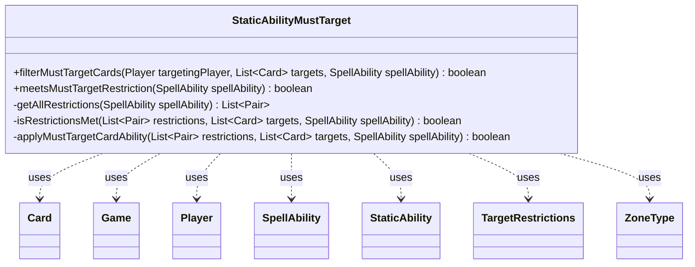

---
aliases:
  - StaticAbilityMustTarget
tags:
  - java/class
  - module/forge-game
  - pkg/forge/game/staticability
fqn: forge.game.staticability.StaticAbilityMustTarget
package: forge.game.staticability
module: forge-game
kind: Class
---

# StaticAbilityMustTarget

**Package:** `forge.game.staticability` &nbsp; **Module:** `forge-game` &nbsp; **Kind:** Class



## Relationships
**Uses:**
- [[forge.game.Game|Game]]
- [[forge.game.card.Card|Card]]
- [[forge.game.player.Player|Player]]
- [[forge.game.spellability.SpellAbility|SpellAbility]]
- [[forge.game.spellability.TargetRestrictions|TargetRestrictions]]
- [[forge.game.staticability.StaticAbility|StaticAbility]]
- [[forge.game.zone.ZoneType|ZoneType]]

## Design Description

StaticAbilityMustTarget is a stateless utility that implements Magic's "must target" continuous effects, enforcing rules that force a spell or ability to direct its targets at cards of a particular type within a particular zone. Through its static entry points it gathers the active restrictions from every relevant static ability in play (`getAllRestrictions`), checks whether a candidate targeting choice satisfies them (`meetsMustTargetRestriction`, `isRestrictionsMet`), and prunes illegal candidates from a target list during targeting (`filterMustTargetCards`, `applyMustTargetCardAbility`).

As a helper in the `staticability` package, it collaborates with `StaticAbility` to read restriction parameters and operates over `SpellAbility`, its `TargetRestrictions`, and `Card`s located via `Game` and `ZoneType`. The all-static, no-state design and `(type, zone)` Pair restrictions reflect its role as pure rules logic invoked by the targeting system; notably it walks sub-abilities, exempts copied spells, and clears all targets when satisfying every restriction is impossible.

## Source
`forge-game/src/main/java/forge/game/staticability/StaticAbilityMustTarget.java`

```java
package forge.game.staticability;

import java.util.ArrayList;
import java.util.List;

import org.apache.commons.lang3.tuple.Pair;

import forge.game.Game;
import forge.game.card.Card;
import forge.game.card.CardLists;
import forge.game.player.Player;
import forge.game.spellability.SpellAbility;
import forge.game.spellability.TargetRestrictions;
import forge.game.zone.ZoneType;

public class StaticAbilityMustTarget {

    public static boolean filterMustTargetCards(Player targetingPlayer, List<Card> targets, final SpellAbility spellAbility) {
        //Only applied when the targeting player and controller are the same
        if (targetingPlayer != spellAbility.getHostCard().getController()) {
            return false;
        }

        List<Pair<String, ZoneType>> restrictions = getAllRestrictions(spellAbility);
        return applyMustTargetCardAbility(restrictions, targets, spellAbility);
    }

    public static boolean meetsMustTargetRestriction(final SpellAbility spellAbility) {
        // Copied spell is not affected.
        // (ChangeTarget does not go this path so not checked here.)
        if (spellAbility.isCopied()) return true;

        final Game game = spellAbility.getHostCard().getGame();
        List<Pair<String, ZoneType>> restrictions = getAllRestrictions(spellAbility);

        if (restrictions.isEmpty()) return true;

        SpellAbility currentAbility = spellAbility;
        boolean usesTargeting = false;
        do {
            if (currentAbility.usesTargeting() && !currentAbility.hasParam("TargetingPlayer")) {
                usesTargeting = true;
                // Check if currentAbility can target any MustTarget cards
                TargetRestrictions tgt = currentAbility.getTargetRestrictions();
                List<ZoneType> zone = tgt.getZone();
                List<Card> validCards = CardLists.getValidCards(game.getCardsIn(zone), tgt.getValidTgts(), currentAbility.getActivatingPlayer(), currentAbility.getHostCard(), currentAbility);
                List<Card> choices = CardLists.getTargetableCards(validCards, currentAbility);

                isRestrictionsMet(restrictions, choices, currentAbility);
            }
            currentAbility = currentAbility.getSubAbility();
        } while (currentAbility != null);

        return !usesTargeting || restrictions.isEmpty();
    }

    private static List<Pair<String, ZoneType>> getAllRestrictions(final SpellAbility spellAbility) {
        final Game game = spellAbility.getHostCard().getGame();
        List<Pair<String, ZoneType>> restrictions = new ArrayList<>();

        for (final Card ca : game.getCardsIn(ZoneType.STATIC_ABILITIES_SOURCE_ZONES)) {
            for (final StaticAbility stAb : ca.getStaticAbilities()) {
                if (!stAb.checkConditions(StaticAbilityMode.MustTarget) || !stAb.matchesValidParam("ValidSA", spellAbility)) {
                    continue;
                }
                Pair<String, ZoneType> newRestriction = Pair.of(stAb.getParam("ValidTarget"), ZoneType.smartValueOf(stAb.getParam("ValidZone")));
                if (!restrictions.contains(newRestriction)) {
                    restrictions.add(newRestriction);
                }
            }
        }

        return restrictions;
    }

    private static boolean isRestrictionsMet(List<Pair<String, ZoneType>> restrictions, List<Card> targets, final SpellAbility spellAbility) {
        for (int i = restrictions.size() - 1; i >= 0; i--) {
            Pair<String, ZoneType> restriction = restrictions.get(i);
            // First, check satisfied restrictions that is already targeted by spellAbility
            boolean found = false;
            for (final Card card : spellAbility.getTargets().getTargetCards()) {
                if (card.getType().hasStringType(restriction.getLeft()) && card.isInZone(restriction.getRight())) {
                    found = true;
                    break;
                }
            }
            if (found) {
                restrictions.remove(i);
                continue;
            }

            // Second check if their are any targetable card with type in zone
            found = false;
            for (final Card card : targets) {
                if (card.getType().hasStringType(restriction.getLeft()) && card.isInZone(restriction.getRight())) {
                    found = true;
                    break;
                }
            }
            if (!found) {
                restrictions.remove(i);
            }
        }

        return restrictions.isEmpty();
    }

    private static boolean applyMustTargetCardAbility(List<Pair<String, ZoneType>> restrictions, List<Card> targets, final SpellAbility spellAbility) {
        if (isRestrictionsMet(restrictions, targets, spellAbility)) {
            return false;
        }

        // If remaining restrictions are larger than possible target numbers, then all targets are cleared (means not possible to target any one)
        final int maxTargets = spellAbility.getMaxTargets();
        final int targeted = spellAbility.getTargets().size();
        if (restrictions.size() > maxTargets - targeted) {
            targets.clear();
            return true;
        }

        // Filter out all cards not satisfying any of the restrictions
        boolean filtered = false;
        for (int i = targets.size() - 1; i >= 0; i--) {
            final Card card = targets.get(i);
            boolean satisfied = false;
            for (Pair<String, ZoneType> restriction : restrictions) {
                if (card.getType().hasStringType(restriction.getLeft()) && card.isInZone(restriction.getRight())) {
                    satisfied = true;
                    break;
                }
            }
            if (!satisfied) {
                targets.remove(i);
                filtered = true;
            }
        }
        return filtered;
    }

}
```

## Python
`forge/game/staticability/StaticAbilityMustTarget.py`

```python
from forge.game.Game import Game
from forge.game.card.Card import Card
from forge.game.card.CardLists import CardLists
from forge.game.player.Player import Player
from forge.game.spellability.SpellAbility import SpellAbility
from forge.game.spellability.TargetRestrictions import TargetRestrictions
from forge.game.staticability.StaticAbility import StaticAbility
from forge.game.staticability.StaticAbilityMode import StaticAbilityMode
from forge.game.zone.ZoneType import ZoneType


class StaticAbilityMustTarget:

    @staticmethod
    def filterMustTargetCards(targetingPlayer, targets, spellAbility):
        # Only applied when the targeting player and controller are the same
        if targetingPlayer != spellAbility.getHostCard().getController():
            return False

        restrictions = StaticAbilityMustTarget.getAllRestrictions(spellAbility)
        return StaticAbilityMustTarget.applyMustTargetCardAbility(restrictions, targets, spellAbility)

    @staticmethod
    def meetsMustTargetRestriction(spellAbility):
        # Copied spell is not affected.
        # (ChangeTarget does not go this path so not checked here.)
        if spellAbility.isCopied():
            return True

        game = spellAbility.getHostCard().getGame()
        restrictions = StaticAbilityMustTarget.getAllRestrictions(spellAbility)

        if not restrictions:
            return True

        currentAbility = spellAbility
        usesTargeting = False
        while True:
            if currentAbility.usesTargeting() and not currentAbility.hasParam("TargetingPlayer"):
                usesTargeting = True
                # Check if currentAbility can target any MustTarget cards
                tgt = currentAbility.getTargetRestrictions()
                zone = tgt.getZone()
                validCards = CardLists.getValidCards(game.getCardsIn(zone), tgt.getValidTgts(), currentAbility.getActivatingPlayer(), currentAbility.getHostCard(), currentAbility)
                choices = CardLists.getTargetableCards(validCards, currentAbility)

                StaticAbilityMustTarget.isRestrictionsMet(restrictions, choices, currentAbility)
            currentAbility = currentAbility.getSubAbility()
            if currentAbility is None:
                break

        return not usesTargeting or not restrictions

    @staticmethod
    def getAllRestrictions(spellAbility):
        game = spellAbility.getHostCard().getGame()
        restrictions = []

        for ca in game.getCardsIn(ZoneType.STATIC_ABILITIES_SOURCE_ZONES):
            for stAb in ca.getStaticAbilities():
                if not stAb.checkConditions(StaticAbilityMode.MustTarget) or not stAb.matchesValidParam("ValidSA", spellAbility):
                    continue
                newRestriction = (stAb.getParam("ValidTarget"), ZoneType.smartValueOf(stAb.getParam("ValidZone")))
                if newRestriction not in restrictions:
                    restrictions.append(newRestriction)

        return restrictions

    @staticmethod
    def isRestrictionsMet(restrictions, targets, spellAbility):
        for i in range(len(restrictions) - 1, -1, -1):
            restriction = restrictions[i]
            # First, check satisfied restrictions that is already targeted by spellAbility
            found = False
            for card in spellAbility.getTargets().getTargetCards():
                if card.getType().hasStringType(restriction[0]) and card.isInZone(restriction[1]):
                    found = True
                    break
            if found:
                del restrictions[i]
                continue

            # Second check if their are any targetable card with type in zone
            found = False
            for card in targets:
                if card.getType().hasStringType(restriction[0]) and card.isInZone(restriction[1]):
                    found = True
                    break
            if not found:
                del restrictions[i]

        return not restrictions

    @staticmethod
    def applyMustTargetCardAbility(restrictions, targets, spellAbility):
        if StaticAbilityMustTarget.isRestrictionsMet(restrictions, targets, spellAbility):
            return False

        # If remaining restrictions are larger than possible target numbers, then all targets are cleared (means not possible to target any one)
        maxTargets = spellAbility.getMaxTargets()
        targeted = spellAbility.getTargets().size()
        if len(restrictions) > maxTargets - targeted:
            targets.clear()
            return True

        # Filter out all cards not satisfying any of the restrictions
        filtered = False
        for i in range(len(targets) - 1, -1, -1):
            card = targets[i]
            satisfied = False
            for restriction in restrictions:
                if card.getType().hasStringType(restriction[0]) and card.isInZone(restriction[1]):
                    satisfied = True
                    break
            if not satisfied:
                del targets[i]
                filtered = True
        return filtered
```
