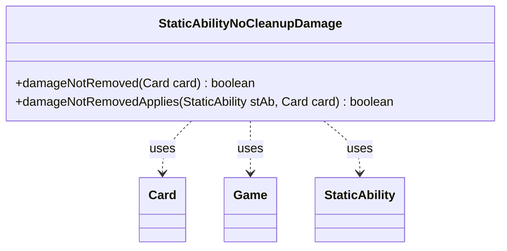

---
aliases:
  - StaticAbilityNoCleanupDamage
tags:
  - java/class
  - module/forge-game
  - pkg/forge/game/staticability
fqn: forge.game.staticability.StaticAbilityNoCleanupDamage
package: forge.game.staticability
module: forge-game
kind: Class
---

# StaticAbilityNoCleanupDamage

**Package:** `forge.game.staticability` &nbsp; **Module:** `forge-game` &nbsp; **Kind:** Class



## Relationships
**Uses:**
- [[forge.game.Game|Game]]
- [[forge.game.card.Card|Card]]
- [[forge.game.staticability.StaticAbility|StaticAbility]]

## Design Description

StaticAbilityNoCleanupDamage is a stateless utility that implements the "damage is not removed during cleanup" static-ability effect, letting Forge keep marked damage on a creature past the normal cleanup step when some permanent grants that exception. Its static `damageNotRemoved` method scans every card in the static-ability source zones, filters their `StaticAbility` entries to those matching the `NoCleanupDamage` mode, and returns true if any applies to the given card; `damageNotRemovedApplies` performs the per-ability `ValidCard` match. Rather than extending `StaticAbility`, it collaborates with it (plus `Card` and `Game`) as a helper in the rule-effect family, reaching the active game through `Card.getGame()`. The split between detection and per-ability predicate keeps the validity test reusable and the zone scan readable.

## Source
`forge-game/src/main/java/forge/game/staticability/StaticAbilityNoCleanupDamage.java`

```java
package forge.game.staticability;

import forge.game.Game;
import forge.game.card.Card;
import forge.game.zone.ZoneType;

public class StaticAbilityNoCleanupDamage {

    static public boolean damageNotRemoved(Card card) {
        final Game game = card.getGame();
        for (final Card ca : game.getCardsIn(ZoneType.STATIC_ABILITIES_SOURCE_ZONES)) {
            for (final StaticAbility stAb : ca.getStaticAbilities()) {
                if (!stAb.checkConditions(StaticAbilityMode.NoCleanupDamage)) {
                    continue;
                }
                if (damageNotRemovedApplies(stAb, card)) {
                    return true;
                }
            }
        }
        return false;
    }

    static public boolean damageNotRemovedApplies(StaticAbility stAb, Card card) {
        if (!stAb.matchesValidParam("ValidCard", card)) {
            return false;
        }
        return true;
    }
}
```

## Python
`forge/game/staticability/StaticAbilityNoCleanupDamage.py`

```python
package forge.game.staticability;

from forge.game.Game import Game
from forge.game.card.Card import Card
from forge.game.zone.ZoneType import ZoneType
from forge.game.staticability.StaticAbility import StaticAbility
from forge.game.staticability.StaticAbilityMode import StaticAbilityMode


class StaticAbilityNoCleanupDamage:

    @staticmethod
    def damageNotRemoved(card: Card) -> bool:
        game = card.getGame()
        for ca in game.getCardsIn(ZoneType.STATIC_ABILITIES_SOURCE_ZONES):
            for stAb in ca.getStaticAbilities():
                if not stAb.checkConditions(StaticAbilityMode.NoCleanupDamage):
                    continue
                if StaticAbilityNoCleanupDamage.damageNotRemovedApplies(stAb, card):
                    return True
        return False

    @staticmethod
    def damageNotRemovedApplies(stAb: StaticAbility, card: Card) -> bool:
        if not stAb.matchesValidParam("ValidCard", card):
            return False
        return True
```
