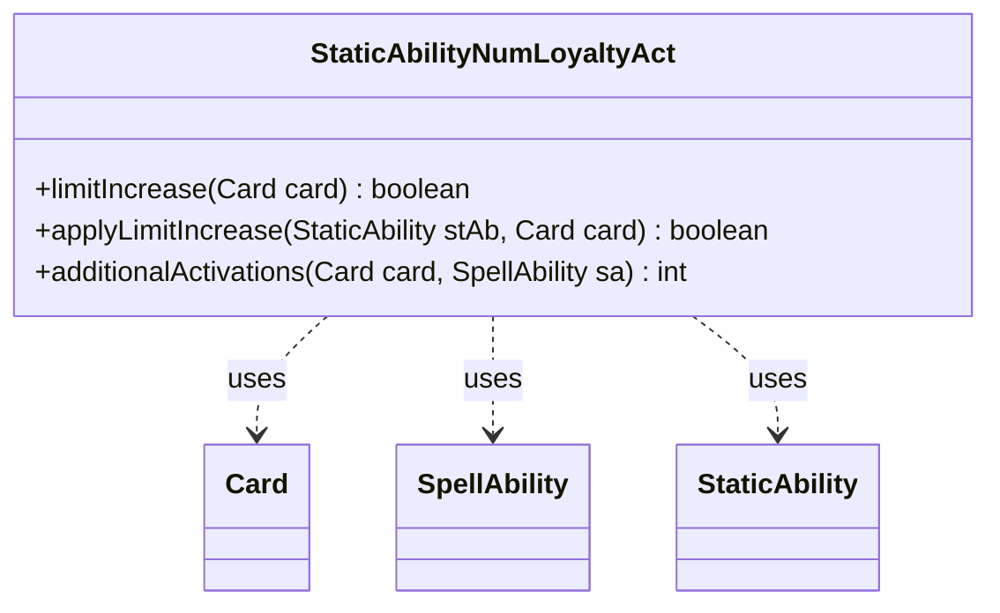

---
aliases:
  - StaticAbilityNumLoyaltyAct
tags:
  - java/class
  - module/forge-game
  - pkg/forge/game/staticability
fqn: forge.game.staticability.StaticAbilityNumLoyaltyAct
package: forge.game.staticability
module: forge-game
kind: Class
---

# StaticAbilityNumLoyaltyAct

**Package:** `forge.game.staticability` &nbsp; **Module:** `forge-game` &nbsp; **Kind:** Class



## Relationships
**Uses:**
- [[forge.game.card.Card|Card]]
- [[forge.game.spellability.SpellAbility|SpellAbility]]
- [[forge.game.staticability.StaticAbility|StaticAbility]]

## Source
`forge-game/src/main/java/forge/game/staticability/StaticAbilityNumLoyaltyAct.java`

```java
package forge.game.staticability;

import forge.game.ability.AbilityUtils;
import forge.game.card.Card;
import forge.game.spellability.SpellAbility;
import forge.game.zone.ZoneType;

/**
 * The Class StaticAbility_NumLoyaltyAct.
 *  - used to modify how many times a planeswalker may activate loyalty abilities per turn
 */
public class StaticAbilityNumLoyaltyAct {

    public static boolean limitIncrease(final Card card) {
        for (final Card ca : card.getGame().getCardsIn(ZoneType.STATIC_ABILITIES_SOURCE_ZONES)) {
            for (final StaticAbility stAb : ca.getStaticAbilities()) {
                if (!stAb.checkConditions(StaticAbilityMode.NumLoyaltyAct)) {
                    continue;
                }

                if (applyLimitIncrease(stAb, card)) {
                    return true;
                }
            }
        }
        return false;
    }

    public static boolean applyLimitIncrease(final StaticAbility stAb, final Card card) {
        if (!stAb.matchesValidParam("ValidCard", card)) {
            return false;
        }

        if (!stAb.hasParam("Twice")) {
            return false;
        }

        return true;
    }

    public static int additionalActivations(final Card card, final SpellAbility sa) {
        int addl = 0;
        for (final Card ca : card.getGame().getCardsIn(ZoneType.STATIC_ABILITIES_SOURCE_ZONES)) {
            for (final StaticAbility stAb : ca.getStaticAbilities()) {
                if (!stAb.checkConditions(StaticAbilityMode.NumLoyaltyAct)) {
                    continue;
                }
                if (!stAb.matchesValidParam("ValidCard", card)) {
                    continue;
                }
                if (stAb.hasParam("Additional")) {
                    if (stAb.hasParam("OnlySourceAbs")) {
                        if (!stAb.getHostCard().getEffectSourceAbility().getRootAbility().getOriginalAbility().equals(sa)) {
                            continue;
                        }
                    }
                    addl += AbilityUtils.calculateAmount(card, stAb.getParam("Additional"), stAb);
                }
            }
        }
        return addl;
    }
}
```
