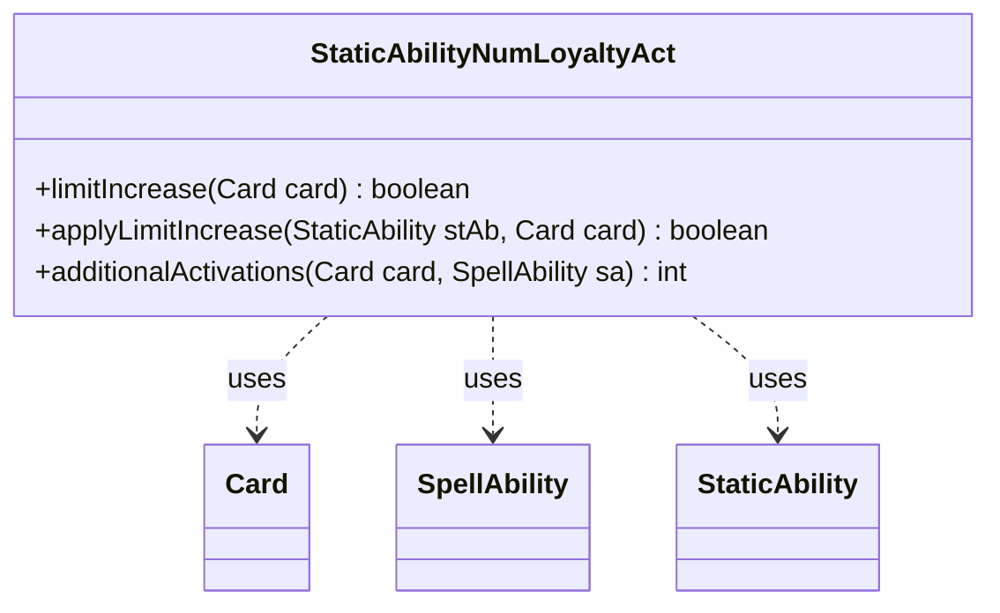

---
aliases:
  - StaticAbilityNumLoyaltyAct
tags:
  - java/class
  - module/forge-game
  - pkg/forge/game/staticability
fqn: forge.game.staticability.StaticAbilityNumLoyaltyAct
package: forge.game.staticability
module: forge-game
kind: Class
---

# StaticAbilityNumLoyaltyAct

**Package:** `forge.game.staticability` &nbsp; **Module:** `forge-game` &nbsp; **Kind:** Class



## Relationships
**Uses:**
- [[forge.game.card.Card|Card]]
- [[forge.game.spellability.SpellAbility|SpellAbility]]
- [[forge.game.staticability.StaticAbility|StaticAbility]]

## Design Description

StaticAbilityNumLoyaltyAct is a stateless utility that implements the "NumLoyaltyAct" static-ability mode, governing how many times a planeswalker may activate its loyalty abilities in a single turn. Its three static methods scan all active static-ability source zones for matching effects: `limitIncrease`/`applyLimitIncrease` report whether a "Twice" effect lets the card activate loyalty abilities more than once, while `additionalActivations` sums any extra activations granted, optionally restricting them to a specific source ability.

Rather than being a `StaticAbility` subtype, it acts as a helper alongside the `StaticAbility` framework, collaborating with `StaticAbility` objects (filtered via `checkConditions` and `matchesValidParam`), the affected `Card`, and the triggering `SpellAbility`. The all-static, instanceless design and reliance on `AbilityUtils.calculateAmount` for dynamic values reflect Forge's convention of centralizing each static-ability mode's evaluation logic in a dedicated, side-effect-free resolver class.

## Source
`forge-game/src/main/java/forge/game/staticability/StaticAbilityNumLoyaltyAct.java`

```java
package forge.game.staticability;

import forge.game.ability.AbilityUtils;
import forge.game.card.Card;
import forge.game.spellability.SpellAbility;
import forge.game.zone.ZoneType;

/**
 * The Class StaticAbility_NumLoyaltyAct.
 *  - used to modify how many times a planeswalker may activate loyalty abilities per turn
 */
public class StaticAbilityNumLoyaltyAct {

    public static boolean limitIncrease(final Card card) {
        for (final Card ca : card.getGame().getCardsIn(ZoneType.STATIC_ABILITIES_SOURCE_ZONES)) {
            for (final StaticAbility stAb : ca.getStaticAbilities()) {
                if (!stAb.checkConditions(StaticAbilityMode.NumLoyaltyAct)) {
                    continue;
                }

                if (applyLimitIncrease(stAb, card)) {
                    return true;
                }
            }
        }
        return false;
    }

    public static boolean applyLimitIncrease(final StaticAbility stAb, final Card card) {
        if (!stAb.matchesValidParam("ValidCard", card)) {
            return false;
        }

        if (!stAb.hasParam("Twice")) {
            return false;
        }

        return true;
    }

    public static int additionalActivations(final Card card, final SpellAbility sa) {
        int addl = 0;
        for (final Card ca : card.getGame().getCardsIn(ZoneType.STATIC_ABILITIES_SOURCE_ZONES)) {
            for (final StaticAbility stAb : ca.getStaticAbilities()) {
                if (!stAb.checkConditions(StaticAbilityMode.NumLoyaltyAct)) {
                    continue;
                }
                if (!stAb.matchesValidParam("ValidCard", card)) {
                    continue;
                }
                if (stAb.hasParam("Additional")) {
                    if (stAb.hasParam("OnlySourceAbs")) {
                        if (!stAb.getHostCard().getEffectSourceAbility().getRootAbility().getOriginalAbility().equals(sa)) {
                            continue;
                        }
                    }
                    addl += AbilityUtils.calculateAmount(card, stAb.getParam("Additional"), stAb);
                }
            }
        }
        return addl;
    }
}
```

## Python
`forge/game/staticability/StaticAbilityNumLoyaltyAct.py`

```python
from forge.game.ability.AbilityUtils import AbilityUtils
from forge.game.card.Card import Card
from forge.game.spellability.SpellAbility import SpellAbility
from forge.game.zone.ZoneType import ZoneType
from forge.game.staticability.StaticAbility import StaticAbility
from forge.game.staticability.StaticAbilityMode import StaticAbilityMode


class StaticAbilityNumLoyaltyAct:
    """
    The Class StaticAbility_NumLoyaltyAct.
     - used to modify how many times a planeswalker may activate loyalty abilities per turn
    """

    @staticmethod
    def limitIncrease(card: Card) -> bool:
        for ca in card.getGame().getCardsIn(ZoneType.STATIC_ABILITIES_SOURCE_ZONES):
            for stAb in ca.getStaticAbilities():
                if not stAb.checkConditions(StaticAbilityMode.NumLoyaltyAct):
                    continue

                if StaticAbilityNumLoyaltyAct.applyLimitIncrease(stAb, card):
                    return True
        return False

    @staticmethod
    def applyLimitIncrease(stAb: StaticAbility, card: Card) -> bool:
        if not stAb.matchesValidParam("ValidCard", card):
            return False

        if not stAb.hasParam("Twice"):
            return False

        return True

    @staticmethod
    def additionalActivations(card: Card, sa: SpellAbility) -> int:
        addl = 0
        for ca in card.getGame().getCardsIn(ZoneType.STATIC_ABILITIES_SOURCE_ZONES):
            for stAb in ca.getStaticAbilities():
                if not stAb.checkConditions(StaticAbilityMode.NumLoyaltyAct):
                    continue
                if not stAb.matchesValidParam("ValidCard", card):
                    continue
                if stAb.hasParam("Additional"):
                    if stAb.hasParam("OnlySourceAbs"):
                        if not stAb.getHostCard().getEffectSourceAbility().getRootAbility().getOriginalAbility().equals(sa):
                            continue
                    addl += AbilityUtils.calculateAmount(card, stAb.getParam("Additional"), stAb)
        return addl
```
