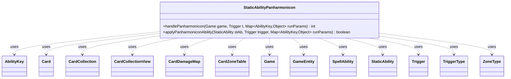

---
aliases:
  - StaticAbilityPanharmonicon
tags:
  - java/class
  - module/forge-game
  - pkg/forge/game/staticability
fqn: forge.game.staticability.StaticAbilityPanharmonicon
package: forge.game.staticability
module: forge-game
kind: Class
---

# StaticAbilityPanharmonicon

**Package:** `forge.game.staticability`   **Module:** `forge-game`   **Kind:** Class



## Relationships
**Uses:**
- [[forge.game.Game|Game]]
- [[forge.game.GameEntity|GameEntity]]
- [[forge.game.ability.AbilityKey|AbilityKey]]
- [[forge.game.card.Card|Card]]
- [[forge.game.card.CardCollection|CardCollection]]
- [[forge.game.card.CardCollectionView|CardCollectionView]]
- [[forge.game.card.CardDamageMap|CardDamageMap]]
- [[forge.game.card.CardZoneTable|CardZoneTable]]
- [[forge.game.spellability.SpellAbility|SpellAbility]]
- [[forge.game.staticability.StaticAbility|StaticAbility]]
- [[forge.game.trigger.Trigger|Trigger]]
- [[forge.game.trigger.TriggerType|TriggerType]]
- [[forge.game.zone.ZoneType|ZoneType]]

## Design Description

StaticAbilityPanharmonicon is a stateless utility class that implements Magic's "abilities trigger an additional time" effects (e.g. Panharmonicon, Yarok). Its two static methods coordinate with the triggering system: `handlePanharmonicon` scans the relevant battlefield cards—using last-known state for leaves-the-battlefield triggers—and counts how many extra times a given `Trigger` should fire, honoring per-turn and per-game activation limits while excluding helper and delayed (spawning-ability) triggers. `applyPanharmonicon­Ability` evaluates a single `StaticAbility` against the trigger's mode, validating source, zone, activator, and target parameters case-by-case across the many `TriggerType` variants.

Rather than extending `StaticAbility`, it acts as a stateless helper invoked by the static-ability framework, delegating to `StaticAbilityMode.Panharmonicon` condition checks. It collaborates broadly with `Game`, `Card`/`CardCollection`, `SpellAbility`, and damage/zone tables (`CardDamageMap`, `CardZoneTable`), reflecting an intent to centralize the comprehensive-rules logic (603.2e) for trigger multiplication in one switchboard.

## Source
`forge-game/src/main/java/forge/game/staticability/StaticAbilityPanharmonicon.java`

```java
package forge.game.staticability;

import forge.game.Game;
import forge.game.GameEntity;
import forge.game.ability.AbilityKey;
import forge.game.card.Card;
import forge.game.card.CardCollection;
import forge.game.card.CardCollectionView;
import forge.game.card.CardDamageMap;
import forge.game.GameObjectPredicates;
import forge.game.card.CardZoneTable;
import forge.game.spellability.SpellAbility;
import forge.game.trigger.Trigger;
import forge.game.trigger.TriggerType;
import forge.game.zone.ZoneType;

import java.util.Collections;
import java.util.List;
import java.util.Map;

import org.apache.commons.lang3.ArrayUtils;

public class StaticAbilityPanharmonicon {

    public static int handlePanharmonicon(final Game game, final Trigger t, final Map<AbilityKey, Object> runParams) {
        int n = 0;

        if (t.isStatic() && t.getMode() != TriggerType.TapsForMana && t.getMode() != TriggerType.ManaAdded) {
            // exclude "helper" trigger
            return n;
        }

        // These effects say "abilities of objects trigger an additional time" which excludes Delayed Trigger
        // 603.2e
        if (t.getSpawningAbility() != null) {
            return n;
        }

        CardCollectionView cardList = null;
        // if LTB look back
        if (t.looksBackInTime()) {
            if (runParams.containsKey(AbilityKey.LastStateBattlefield)) {
                cardList = (CardCollectionView) runParams.get(AbilityKey.LastStateBattlefield);
            }
            if (cardList == null) {
                cardList = game.getLastStateBattlefield();
            }
        } else {
            cardList = game.getCardsIn(ZoneType.STATIC_ABILITIES_SOURCE_ZONES);
        }

        // Checks only the battlefield, as those effects only work from there
        for (final Card ca : cardList) {
            for (final StaticAbility stAb : ca.getStaticAbilities()) {
                if (!stAb.checkConditions(StaticAbilityMode.Panharmonicon)) {
                    continue;
                }
                // it can't trigger more times than the limit allows
                if (t.hasParam("GameActivationLimit") &&
                        t.getActivationsThisGame() + n + 1 >= Integer.parseInt(t.getParam("GameActivationLimit"))) {
                    break;
                }
                if (t.hasParam("ActivationLimit") &&
                        t.getActivationsThisTurn() + n + 1 >= Integer.parseInt(t.getParam("ActivationLimit"))) {
                    break;
                }
                if (applyPanharmoniconAbility(stAb, t, runParams)) {
                    n++;
                }
            }
        }

        return n;
    }

    public static boolean applyPanharmoniconAbility(final StaticAbility stAb, final Trigger trigger, final Map<AbilityKey, Object> runParams) {
        final Card host = stAb.getHostCard();

        final TriggerType trigMode = trigger.getMode();

        // What card is the source of the trigger?
        if (!stAb.matchesValidParam("ValidCard", trigger.getHostCard())) {
            return false;
        }

        // Is our trigger's mode among the other modes?
        if (stAb.hasParam("ValidMode")) {
            if (!ArrayUtils.contains(stAb.getParam("ValidMode").split(","), trigMode.toString())) {
                return false;
            }
        }

        final List<ZoneType> validZones = ZoneType.listValueOf(stAb.getParamOrDefault("ValidZone", "Battlefield"));
        if (!validZones.contains(trigger.getHostCard().getZone().getZoneType())) {
            return false;
        }

        if (trigMode.equals(TriggerType.ChangesZone)) {
            // Cause of the trigger – the card changing zones
            Card moved = (Card) runParams.get(AbilityKey.Card);
            if ("Battlefield".equals(trigger.getParam("Origin"))) {
                moved = (Card) runParams.get(AbilityKey.CardLKI);
            }
            if (!stAb.matchesValidParam("ValidCause", moved)) {
                return false;
            }
            if (!stAb.matchesValidParam("Origin", runParams.get(AbilityKey.Origin))) {
                return false;
            }
            if (!stAb.matchesValidParam("Destination", runParams.get(AbilityKey.Destination))) {
                return false;
            }
        } else if (trigMode.equals(TriggerType.ChangesZoneAll)) {
            // Check if the cards have a trigger at all
            final String origin = stAb.getParam("Origin");
            final String destination = stAb.getParam("Destination");
            // check if some causes were ignored
            CardZoneTable table = (CardZoneTable) runParams.get(AbilityKey.CardsFiltered);
            if (table == null) {
                table = (CardZoneTable) runParams.get(AbilityKey.Cards);
            }

            List<ZoneType> trigOrigin = null;
            List<ZoneType> trigDestination = null;
            if (trigger.hasParam("Destination") && !trigger.getParam("Destination").equals("Any")) {
                trigDestination = ZoneType.listValueOf(trigger.getParam("Destination"));
            }
            if (trigger.hasParam("Origin") && !trigger.getParam("Origin").equals("Any")) {
                trigOrigin = ZoneType.listValueOf(trigger.getParam("Origin"));
            }
            CardCollection causesForTrigger = table.filterCards(trigOrigin, trigDestination, trigger.getParam("ValidCards"), trigger.getHostCard(), trigger);

            CardCollection causesForStatic = table.filterCards(origin == null ? null : List.of(ZoneType.smartValueOf(origin)), destination == null ? null : ZoneType.listValueOf(destination), stAb.getParam("ValidCause"), host, stAb);

            // check that whatever caused the trigger to fire is also a cause the static applies for
            if (Collections.disjoint(causesForTrigger, causesForStatic)) {
                return false;
            }
        } else if (trigMode.equals(TriggerType.Attacks)) {
            if (!stAb.matchesValidParam("ValidCause", runParams.get(AbilityKey.Attacker))) {
                return false;
            }
        } else if (trigMode.equals(TriggerType.AttackersDeclared)
                || trigMode.equals(TriggerType.AttackersDeclaredOneTarget)) {
            if (!stAb.matchesValidParam("ValidCause", runParams.get(AbilityKey.Attackers))) {
                return false;
            }
        } else if (trigMode.equals(TriggerType.SpellCastOrCopy)
                || trigMode.equals(TriggerType.SpellCast) || trigMode.equals(TriggerType.SpellCopy)) {
            // Check if the spell cast and the caster match
            final SpellAbility sa = (SpellAbility) runParams.get(AbilityKey.SpellAbility);
            if (!stAb.matchesValidParam("ValidCause", sa.getHostCard())) {
                return false;
            }
            if (!stAb.matchesValidParam("ValidActivator", sa.getActivatingPlayer())) {
                return false;
            }
        } else if (trigMode.equals(TriggerType.BecomesTarget)) {
            if (!stAb.matchesValidParam("ValidTarget", runParams.get(AbilityKey.Target))) {
                return false;
            }
        } else if (trigMode.equals(TriggerType.BecomesTargetOnce)) {
            if (!stAb.matchesValidParam("ValidTarget", runParams.get(AbilityKey.Targets))) {
                return false;
            }
        } else if (trigMode.equals(TriggerType.DamageDone) || trigMode.equals(TriggerType.DamageDoneOnce)
                || trigMode.equals(TriggerType.DamageAll) || trigMode.equals(TriggerType.DamageDealtOnce)) {
            if (stAb.hasParam("CombatDamage") && stAb.getParam("CombatDamage").equalsIgnoreCase("True") != 
                    (Boolean) runParams.get(AbilityKey.IsCombatDamage)) {
                return false;
            }
            if (trigMode.equals(TriggerType.DamageDone)) {
                if (!stAb.matchesValidParam("ValidSource", runParams.get(AbilityKey.DamageSource))) {
                    return false;
                }
                if (!stAb.matchesValidParam("ValidTarget", runParams.get(AbilityKey.DamageTarget))) {
                    return false;
                }
            }
            if (trigMode.equals(TriggerType.DamageDoneOnce)) {
                if (!stAb.matchesValidParam("ValidTarget", runParams.get(AbilityKey.DamageTarget))) {
                    return false;
                }
                @SuppressWarnings("unchecked")
                Map<Card, Integer> dmgMap = (Map<Card, Integer>) runParams.get(AbilityKey.DamageMap);
                // 1. check it's valid cause for static
                // 2. and it must also be valid for trigger event
                if (dmgMap.keySet().stream().noneMatch(
                        GameObjectPredicates.matchesValidParam(stAb, "ValidSource")
                                .and(GameObjectPredicates.matchesValidParam(trigger, "ValidSource"))
                )) {
                    return false;
                }
                // DamageAmount$ can be ignored for now (its usage doesn't interact with ValidSource from either)
            }
            if (trigMode.equals(TriggerType.DamageDealtOnce)) {
                if (!stAb.matchesValidParam("ValidSource", runParams.get(AbilityKey.DamageSource))) {
                    return false;
                }
                @SuppressWarnings("unchecked")
                Map<GameEntity, Integer> dmgMap = (Map<GameEntity, Integer>) runParams.get(AbilityKey.DamageMap);
                if (dmgMap.keySet().stream().noneMatch(
                        GameObjectPredicates.matchesValidParam(stAb, "ValidTarget")
                                .and(GameObjectPredicates.matchesValidParam(trigger, "ValidTarget"))
                )) {
                    return false;
                }
            }
            if (trigMode.equals(TriggerType.DamageAll)) {
                CardDamageMap table = (CardDamageMap) runParams.get(AbilityKey.DamageMap);
                table = table.filteredMap(trigger.getParam("ValidSource"), trigger.getParam("ValidTarget"), trigger.getHostCard(), trigger);
                table = table.filteredMap(stAb.getParam("ValidSource"), stAb.getParam("ValidTarget"), host, stAb);
                if (table.isEmpty()) {
                    return false;
                }
            }
        } else if (trigMode.equals(TriggerType.TurnFaceUp)) {
            if (!stAb.matchesValidParam("ValidTurned", runParams.get(AbilityKey.Card))) {
                return false;
            }
        }

        return true;
    }
}
```

## Python
`forge/game/staticability/StaticAbilityPanharmonicon.py`

```python
from forge.game.Game import Game
from forge.game.GameEntity import GameEntity
from forge.game.ability.AbilityKey import AbilityKey
from forge.game.card.Card import Card
from forge.game.card.CardCollection import CardCollection
from forge.game.card.CardCollectionView import CardCollectionView
from forge.game.card.CardDamageMap import CardDamageMap
from forge.game.GameObjectPredicates import GameObjectPredicates
from forge.game.card.CardZoneTable import CardZoneTable
from forge.game.spellability.SpellAbility import SpellAbility
from forge.game.staticability.StaticAbility import StaticAbility
from forge.game.staticability.StaticAbilityMode import StaticAbilityMode
from forge.game.trigger.Trigger import Trigger
from forge.game.trigger.TriggerType import TriggerType
from forge.game.zone.ZoneType import ZoneType


class StaticAbilityPanharmonicon:

    @staticmethod
    def handlePanharmonicon(game: Game, t: Trigger, runParams: dict[AbilityKey, object]) -> int:
        n = 0

        if t.isStatic() and t.getMode() != TriggerType.TapsForMana and t.getMode() != TriggerType.ManaAdded:
            # exclude "helper" trigger
            return n

        # These effects say "abilities of objects trigger an additional time" which excludes Delayed Trigger
        # 603.2e
        if t.getSpawningAbility() is not None:
            return n

        cardList: CardCollectionView = None
        # if LTB look back
        if t.looksBackInTime():
            if AbilityKey.LastStateBattlefield in runParams:
                cardList = runParams.get(AbilityKey.LastStateBattlefield)
            if cardList is None:
                cardList = game.getLastStateBattlefield()
        else:
            cardList = game.getCardsIn(ZoneType.STATIC_ABILITIES_SOURCE_ZONES)

        # Checks only the battlefield, as those effects only work from there
        for ca in cardList:
            for stAb in ca.getStaticAbilities():
                if not stAb.checkConditions(StaticAbilityMode.Panharmonicon):
                    continue
                # it can't trigger more times than the limit allows
                if t.hasParam("GameActivationLimit") and \
                        t.getActivationsThisGame() + n + 1 >= int(t.getParam("GameActivationLimit")):
                    break
                if t.hasParam("ActivationLimit") and \
                        t.getActivationsThisTurn() + n + 1 >= int(t.getParam("ActivationLimit")):
                    break
                if StaticAbilityPanharmonicon.applyPanharmoniconAbility(stAb, t, runParams):
                    n += 1

        return n

    @staticmethod
    def applyPanharmoniconAbility(stAb: StaticAbility, trigger: Trigger, runParams: dict[AbilityKey, object]) -> bool:
        host = stAb.getHostCard()

        trigMode = trigger.getMode()

        # What card is the source of the trigger?
        if not stAb.matchesValidParam("ValidCard", trigger.getHostCard()):
            return False

        # Is our trigger's mode among the other modes?
        if stAb.hasParam("ValidMode"):
            if trigMode.toString() not in stAb.getParam("ValidMode").split(","):
                return False

        validZones = ZoneType.listValueOf(stAb.getParamOrDefault("ValidZone", "Battlefield"))
        if trigger.getHostCard().getZone().getZoneType() not in validZones:
            return False

        if trigMode == TriggerType.ChangesZone:
            # Cause of the trigger ΓÇö the card changing zones
            moved = runParams.get(AbilityKey.Card)
            if "Battlefield" == trigger.getParam("Origin"):
                moved = runParams.get(AbilityKey.CardLKI)
            if not stAb.matchesValidParam("ValidCause", moved):
                return False
            if not stAb.matchesValidParam("Origin", runParams.get(AbilityKey.Origin)):
                return False
            if not stAb.matchesValidParam("Destination", runParams.get(AbilityKey.Destination)):
                return False
        elif trigMode == TriggerType.ChangesZoneAll:
            # Check if the cards have a trigger at all
            origin = stAb.getParam("Origin")
            destination = stAb.getParam("Destination")
            # check if some causes were ignored
            table = runParams.get(AbilityKey.CardsFiltered)
            if table is None:
                table = runParams.get(AbilityKey.Cards)

            trigOrigin = None
            trigDestination = None
            if trigger.hasParam("Destination") and trigger.getParam("Destination") != "Any":
                trigDestination = ZoneType.listValueOf(trigger.getParam("Destination"))
            if trigger.hasParam("Origin") and trigger.getParam("Origin") != "Any":
                trigOrigin = ZoneType.listValueOf(trigger.getParam("Origin"))
            causesForTrigger = table.filterCards(trigOrigin, trigDestination, trigger.getParam("ValidCards"), trigger.getHostCard(), trigger)

            causesForStatic = table.filterCards(None if origin is None else [ZoneType.smartValueOf(origin)], None if destination is None else ZoneType.listValueOf(destination), stAb.getParam("ValidCause"), host, stAb)

            # check that whatever caused the trigger to fire is also a cause the static applies for
            if not any(c in causesForStatic for c in causesForTrigger):
                return False
        elif trigMode == TriggerType.Attacks:
            if not stAb.matchesValidParam("ValidCause", runParams.get(AbilityKey.Attacker)):
                return False
        elif trigMode == TriggerType.AttackersDeclared \
                or trigMode == TriggerType.AttackersDeclaredOneTarget:
            if not stAb.matchesValidParam("ValidCause", runParams.get(AbilityKey.Attackers)):
                return False
        elif trigMode == TriggerType.SpellCastOrCopy \
                or trigMode == TriggerType.SpellCast or trigMode == TriggerType.SpellCopy:
            # Check if the spell cast and the caster match
            sa = runParams.get(AbilityKey.SpellAbility)
            if not stAb.matchesValidParam("ValidCause", sa.getHostCard()):
                return False
            if not stAb.matchesValidParam("ValidActivator", sa.getActivatingPlayer()):
                return False
        elif trigMode == TriggerType.BecomesTarget:
            if not stAb.matchesValidParam("ValidTarget", runParams.get(AbilityKey.Target)):
                return False
        elif trigMode == TriggerType.BecomesTargetOnce:
            if not stAb.matchesValidParam("ValidTarget", runParams.get(AbilityKey.Targets)):
                return False
        elif trigMode == TriggerType.DamageDone or trigMode == TriggerType.DamageDoneOnce \
                or trigMode == TriggerType.DamageAll or trigMode == TriggerType.DamageDealtOnce:
            if stAb.hasParam("CombatDamage") and stAb.getParam("CombatDamage").equalsIgnoreCase("True") != \
                    runParams.get(AbilityKey.IsCombatDamage):
                return False
            if trigMode == TriggerType.DamageDone:
                if not stAb.matchesValidParam("ValidSource", runParams.get(AbilityKey.DamageSource)):
                    return False
                if not stAb.matchesValidParam("ValidTarget", runParams.get(AbilityKey.DamageTarget)):
                    return False
            if trigMode == TriggerType.DamageDoneOnce:
                if not stAb.matchesValidParam("ValidTarget", runParams.get(AbilityKey.DamageTarget)):
                    return False
                dmgMap = runParams.get(AbilityKey.DamageMap)
                # 1. check it's valid cause for static
                # 2. and it must also be valid for trigger event
                p1 = GameObjectPredicates.matchesValidParam(stAb, "ValidSource")
                p2 = GameObjectPredicates.matchesValidParam(trigger, "ValidSource")
                if not any(p1(c) and p2(c) for c in dmgMap.keys()):
                    return False
                # DamageAmount$ can be ignored for now (its usage doesn't interact with ValidSource from either)
            if trigMode == TriggerType.DamageDealtOnce:
                if not stAb.matchesValidParam("ValidSource", runParams.get(AbilityKey.DamageSource)):
                    return False
                dmgMap = runParams.get(AbilityKey.DamageMap)
                p1 = GameObjectPredicates.matchesValidParam(stAb, "ValidTarget")
                p2 = GameObjectPredicates.matchesValidParam(trigger, "ValidTarget")
                if not any(p1(c) and p2(c) for c in dmgMap.keys()):
                    return False
            if trigMode == TriggerType.DamageAll:
                table = runParams.get(AbilityKey.DamageMap)
                table = table.filteredMap(trigger.getParam("ValidSource"), trigger.getParam("ValidTarget"), trigger.getHostCard(), trigger)
                table = table.filteredMap(stAb.getParam("ValidSource"), stAb.getParam("ValidTarget"), host, stAb)
                if table.isEmpty():
                    return False
        elif trigMode == TriggerType.TurnFaceUp:
            if not stAb.matchesValidParam("ValidTurned", runParams.get(AbilityKey.Card)):
                return False

        return True
```
