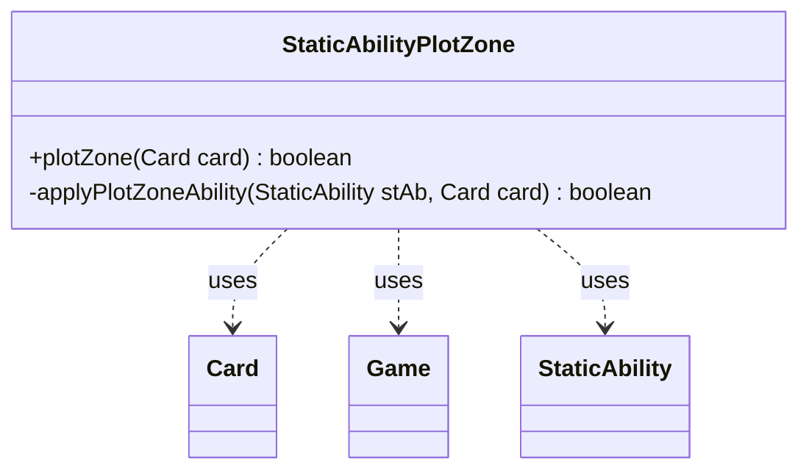

---
aliases:
  - StaticAbilityPlotZone
tags:
  - java/class
  - module/forge-game
  - pkg/forge/game/staticability
fqn: forge.game.staticability.StaticAbilityPlotZone
package: forge.game.staticability
module: forge-game
kind: Class
---

# StaticAbilityPlotZone

**Package:** `forge.game.staticability` &nbsp; **Module:** `forge-game` &nbsp; **Kind:** Class



## Relationships
**Uses:**
- [[forge.game.Game|Game]]
- [[forge.game.card.Card|Card]]
- [[forge.game.staticability.StaticAbility|StaticAbility]]

## Design Description

StaticAbilityPlotZone is a stateless utility that resolves whether a given card may currently be played from a "plotted" zone under Magic's static-ability rules. Its sole public entry point, `plotZone(Card)`, scans every static-ability source zone in the card's `Game`, filters each `StaticAbility` to those whose mode and conditions match `PlotZone`, and returns true on the first applicable rule. The private `applyPlotZoneAbility` isolates the per-ability test, currently a single `ValidCard` validity match. Rather than implementing an interface or extending a supertype, the class follows the package convention of grouping one static-ability mode behind static helpers, collaborating loosely with `Card`, `Game`, and `StaticAbility`. The early-return design intends short-circuit evaluation, and the extracted helper leaves room to grow the applicability check without disturbing the iteration logic.

## Source
`forge-game/src/main/java/forge/game/staticability/StaticAbilityPlotZone.java`

```java
package forge.game.staticability;

import forge.game.Game;
import forge.game.card.Card;
import forge.game.zone.ZoneType;

public class StaticAbilityPlotZone {

    public static boolean plotZone(final Card card) {
        final Game game = card.getGame();
        for (final Card ca : game.getCardsIn(ZoneType.STATIC_ABILITIES_SOURCE_ZONES)) {
            for (final StaticAbility stAb : ca.getStaticAbilities()) {
                if (!stAb.checkConditions(StaticAbilityMode.PlotZone)) {
                    continue;
                }

                if (applyPlotZoneAbility(stAb, card)) {
                    return true;
                }
            }
        }
        return false;
    }

    private static boolean applyPlotZoneAbility(final StaticAbility stAb, final Card card) {
        if (!stAb.matchesValidParam("ValidCard", card)) {
            return false;
        }
        return true;
    }
}
```

## Python
`forge/game/staticability/StaticAbilityPlotZone.py`

```python
from forge.game.Game import Game
from forge.game.card.Card import Card
from forge.game.zone.ZoneType import ZoneType
from forge.game.staticability.StaticAbility import StaticAbility
from forge.game.staticability.StaticAbilityMode import StaticAbilityMode


class StaticAbilityPlotZone:

    @staticmethod
    def plotZone(card: Card) -> bool:
        game = card.getGame()
        for ca in game.getCardsIn(ZoneType.STATIC_ABILITIES_SOURCE_ZONES):
            for stAb in ca.getStaticAbilities():
                if not stAb.checkConditions(StaticAbilityMode.PlotZone):
                    continue

                if StaticAbilityPlotZone.applyPlotZoneAbility(stAb, card):
                    return True
        return False

    @staticmethod
    def applyPlotZoneAbility(stAb: StaticAbility, card: Card) -> bool:
        if not stAb.matchesValidParam("ValidCard", card):
            return False
        return True
```
