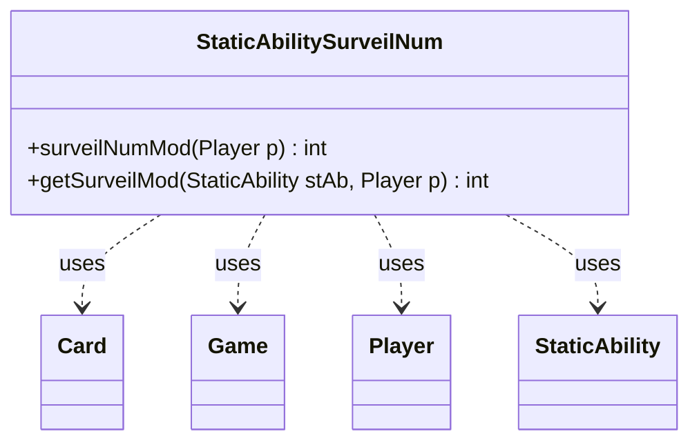

---
aliases:
  - StaticAbilitySurveilNum
tags:
  - java/class
  - module/forge-game
  - pkg/forge/game/staticability
fqn: forge.game.staticability.StaticAbilitySurveilNum
package: forge.game.staticability
module: forge-game
kind: Class
---

# StaticAbilitySurveilNum

**Package:** `forge.game.staticability` &nbsp; **Module:** `forge-game` &nbsp; **Kind:** Class



## Relationships
**Uses:**
- [[forge.game.Game|Game]]
- [[forge.game.card.Card|Card]]
- [[forge.game.player.Player|Player]]
- [[forge.game.staticability.StaticAbility|StaticAbility]]

## Design Description

StaticAbilitySurveilNum is a stateless utility that computes how much a player's surveil count should be modified by continuous static abilities currently in effect. Its `surveilNumMod` entry point scans every card in the static-ability source zones, filters their static abilities to those matching the `SurveilNum` mode and passing their conditions, and sums the per-ability contributions returned by `getSurveilMod`. The helper validates the affected player against the `ValidPlayer` parameter, optionally prompts for confirmation when the ability is `Optional`, and parses the numeric `Num` modifier.

Rather than extending a base type, it collaborates loosely with the static-ability framework, delegating to `StaticAbility` for condition checks and parameter matching while reaching through `Player` and `Game` to enumerate relevant `Card` sources. The all-static, no-instance design reflects its role as a pure query helper invoked wherever the engine resolves a surveil amount.

## Source
`forge-game/src/main/java/forge/game/staticability/StaticAbilitySurveilNum.java`

```java
package forge.game.staticability;

import forge.game.Game;
import forge.game.card.Card;
import forge.game.player.Player;
import forge.game.zone.ZoneType;

public class StaticAbilitySurveilNum {

    public static int surveilNumMod(Player p) {
        final Game game = p.getGame();
        int mod = 0;
        for (final Card ca : game.getCardsIn(ZoneType.STATIC_ABILITIES_SOURCE_ZONES)) {
            for (final StaticAbility stAb : ca.getStaticAbilities()) {
                if (!stAb.checkConditions(StaticAbilityMode.SurveilNum)) {
                    continue;
                }
                mod += getSurveilMod(stAb, p);
            }
        }
        return mod;
    }

    public static int getSurveilMod(final StaticAbility stAb, final Player p) {
        if (!stAb.matchesValidParam("ValidPlayer", p)) {
            return 0;
        }
        if (stAb.hasParam("Optional") && !p.getController().confirmStaticApplication(stAb.getHostCard(), null, stAb.toString() + "?", null)) {
            return 0;
        }
        return Integer.parseInt(stAb.getParam("Num"));
    }

}
```

## Python
`forge/game/staticability/StaticAbilitySurveilNum.py`

```python
package = forge.game.staticability, fqn StaticAbilitySurveilNum.

Java imports: forge.game.Game, forge.game.card.Card, forge.game.player.Player, forge.game.zone.ZoneType. Also uses StaticAbility (same package), StaticAbilityMode (same package).

Let me write the Python port.from forge.game.Game import Game
from forge.game.card.Card import Card
from forge.game.player.Player import Player
from forge.game.zone.ZoneType import ZoneType
from forge.game.staticability.StaticAbility import StaticAbility
from forge.game.staticability.StaticAbilityMode import StaticAbilityMode


class StaticAbilitySurveilNum:

    @staticmethod
    def surveilNumMod(p: Player) -> int:
        game = p.getGame()
        mod = 0
        for ca in game.getCardsIn(ZoneType.STATIC_ABILITIES_SOURCE_ZONES):
            for stAb in ca.getStaticAbilities():
                if not stAb.checkConditions(StaticAbilityMode.SurveilNum):
                    continue
                mod += StaticAbilitySurveilNum.getSurveilMod(stAb, p)
        return mod

    @staticmethod
    def getSurveilMod(stAb: StaticAbility, p: Player) -> int:
        if not stAb.matchesValidParam("ValidPlayer", p):
            return 0
        if stAb.hasParam("Optional") and not p.getController().confirmStaticApplication(stAb.getHostCard(), None, stAb.toString() + "?", None):
            return 0
        return int(stAb.getParam("Num"))
```
