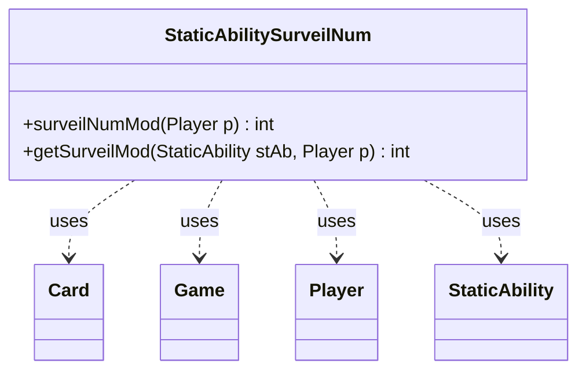

---
aliases:
  - StaticAbilitySurveilNum
tags:
  - java/class
  - module/forge-game
  - pkg/forge/game/staticability
fqn: forge.game.staticability.StaticAbilitySurveilNum
package: forge.game.staticability
module: forge-game
kind: Class
---

# StaticAbilitySurveilNum

**Package:** `forge.game.staticability` &nbsp; **Module:** `forge-game` &nbsp; **Kind:** Class



## Relationships
**Uses:**
- [[forge.game.Game|Game]]
- [[forge.game.card.Card|Card]]
- [[forge.game.player.Player|Player]]
- [[forge.game.staticability.StaticAbility|StaticAbility]]

## Source
`forge-game/src/main/java/forge/game/staticability/StaticAbilitySurveilNum.java`

```java
package forge.game.staticability;

import forge.game.Game;
import forge.game.card.Card;
import forge.game.player.Player;
import forge.game.zone.ZoneType;

public class StaticAbilitySurveilNum {

    public static int surveilNumMod(Player p) {
        final Game game = p.getGame();
        int mod = 0;
        for (final Card ca : game.getCardsIn(ZoneType.STATIC_ABILITIES_SOURCE_ZONES)) {
            for (final StaticAbility stAb : ca.getStaticAbilities()) {
                if (!stAb.checkConditions(StaticAbilityMode.SurveilNum)) {
                    continue;
                }
                mod += getSurveilMod(stAb, p);
            }
        }
        return mod;
    }

    public static int getSurveilMod(final StaticAbility stAb, final Player p) {
        if (!stAb.matchesValidParam("ValidPlayer", p)) {
            return 0;
        }
        if (stAb.hasParam("Optional") && !p.getController().confirmStaticApplication(stAb.getHostCard(), null, stAb.toString() + "?", null)) {
            return 0;
        }
        return Integer.parseInt(stAb.getParam("Num"));
    }

}
```
