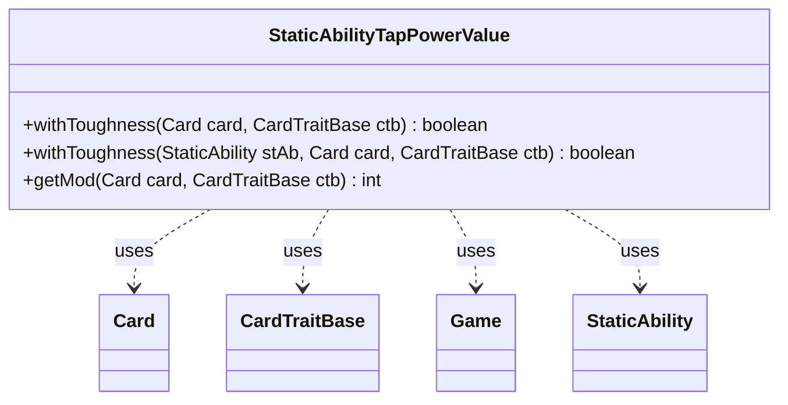

---
aliases:
  - StaticAbilityTapPowerValue
tags:
  - java/class
  - module/forge-game
  - pkg/forge/game/staticability
fqn: forge.game.staticability.StaticAbilityTapPowerValue
package: forge.game.staticability
module: forge-game
kind: Class
---

# StaticAbilityTapPowerValue

**Package:** `forge.game.staticability` &nbsp; **Module:** `forge-game` &nbsp; **Kind:** Class



## Relationships
**Uses:**
- [[forge.game.CardTraitBase|CardTraitBase]]
- [[forge.game.Game|Game]]
- [[forge.game.card.Card|Card]]
- [[forge.game.staticability.StaticAbility|StaticAbility]]

## Design Description

StaticAbilityTapPowerValue is a stateless utility that resolves "tap for power/toughness"-style static abilities, letting a creature's power contribute to or be measured against toughness-based effects. Its static methods sweep every card in the static-ability source zones, filter to abilities whose mode is TapPowerValue and whose conditions and ValidCard/ValidSA parameters match the given card and trait, and then either report whether a Toughness-valued ability applies (`withToughness`) or sum the numeric modifiers across all matching abilities (`getMod`).

As a pure helper in the `forge.game.staticability` package, it has no supertype or state and instead collaborates with the engine types it queries: it reaches the Game through the Card, iterates each card's StaticAbility list, and uses CardTraitBase as the evaluated trait. Centralizing the lookup-and-match logic in one place keeps this static-ability mode's rules consistent wherever power and toughness interact.

## Source
`forge-game/src/main/java/forge/game/staticability/StaticAbilityTapPowerValue.java`

```java
package forge.game.staticability;

import forge.game.CardTraitBase;
import forge.game.Game;
import forge.game.card.Card;
import forge.game.zone.ZoneType;

public class StaticAbilityTapPowerValue {

    public static boolean withToughness(final Card card, final CardTraitBase ctb) {
        final Game game = card.getGame();
        for (final Card ca : game.getCardsIn(ZoneType.STATIC_ABILITIES_SOURCE_ZONES)) {
            for (final StaticAbility stAb : ca.getStaticAbilities()) {
                if (!stAb.checkConditions(StaticAbilityMode.TapPowerValue)) {
                    continue;
                }
                if (withToughness(stAb, card, ctb)) {
                    return true;
                }
            }
        }
        return false;
    }

    public static boolean withToughness(final StaticAbility stAb, final Card card, final CardTraitBase ctb) {
        if (!stAb.getParam("Value").equals("Toughness")) {
            return false;
        }
        if (!stAb.matchesValidParam("ValidCard", card)) {
            return false;
        }
        if (!stAb.matchesValidParam("ValidSA", ctb)) {
            return false;
        }
        return true;
    }

    public static int getMod(final Card card, final CardTraitBase ctb) {
        int i = 0;
        final Game game = card.getGame();
        for (final Card ca : game.getCardsIn(ZoneType.STATIC_ABILITIES_SOURCE_ZONES)) {
            for (final StaticAbility stAb : ca.getStaticAbilities()) {
                if (!stAb.checkConditions(StaticAbilityMode.TapPowerValue)) {
                    continue;
                }
                if (!stAb.matchesValidParam("ValidCard", card)) {
                    continue;
                }
                if (!stAb.matchesValidParam("ValidSA", ctb)) {
                    continue;
                }
                i += Integer.parseInt(stAb.getParam("Value"));
            }
        }
        return i;
    }

}
```

## Python
`forge/game/staticability/StaticAbilityTapPowerValue.py`

```python
from forge.game.CardTraitBase import CardTraitBase
from forge.game.Game import Game
from forge.game.card.Card import Card
from forge.game.zone.ZoneType import ZoneType
from forge.game.staticability.StaticAbility import StaticAbility
from forge.game.staticability.StaticAbilityMode import StaticAbilityMode


class StaticAbilityTapPowerValue:

    @staticmethod
    def withToughness(card, ctb):
        game = card.getGame()
        for ca in game.getCardsIn(ZoneType.STATIC_ABILITIES_SOURCE_ZONES):
            for stAb in ca.getStaticAbilities():
                if not stAb.checkConditions(StaticAbilityMode.TapPowerValue):
                    continue
                if StaticAbilityTapPowerValue.withToughness(stAb, card, ctb):
                    return True
        return False

    @staticmethod
    def withToughness(stAb, card, ctb):
        if not stAb.getParam("Value") == "Toughness":
            return False
        if not stAb.matchesValidParam("ValidCard", card):
            return False
        if not stAb.matchesValidParam("ValidSA", ctb):
            return False
        return True

    @staticmethod
    def getMod(card, ctb):
        i = 0
        game = card.getGame()
        for ca in game.getCardsIn(ZoneType.STATIC_ABILITIES_SOURCE_ZONES):
            for stAb in ca.getStaticAbilities():
                if not stAb.checkConditions(StaticAbilityMode.TapPowerValue):
                    continue
                if not stAb.matchesValidParam("ValidCard", card):
                    continue
                if not stAb.matchesValidParam("ValidSA", ctb):
                    continue
                i += int(stAb.getParam("Value"))
        return i
```
