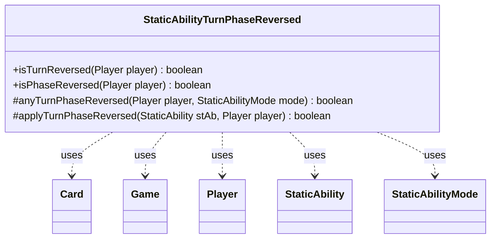

---
aliases:
  - StaticAbilityTurnPhaseReversed
tags:
  - java/class
  - module/forge-game
  - pkg/forge/game/staticability
fqn: forge.game.staticability.StaticAbilityTurnPhaseReversed
package: forge.game.staticability
module: forge-game
kind: Class
---

# StaticAbilityTurnPhaseReversed

**Package:** `forge.game.staticability`   **Module:** `forge-game`   **Kind:** Class



## Relationships
**Uses:**
- [[forge.game.Game|Game]]
- [[forge.game.card.Card|Card]]
- [[forge.game.player.Player|Player]]
- [[forge.game.staticability.StaticAbility|StaticAbility]]
- [[forge.game.staticability.StaticAbilityMode|StaticAbilityMode]]

## Design Description

StaticAbilityTurnPhaseReversed is a stateless utility that evaluates whether a player's turn order or phase sequence is currently reversed by active continuous static abilities. Its public entry points, `isTurnReversed` and `isPhaseReversed`, delegate to the shared helper `anyTurnPhaseReversed`, which scans every `Card` in the game's static-ability source zones, filters each `StaticAbility` by the relevant `StaticAbilityMode` (TurnReversed or PhaseReversed), and applies it via `applyTurnPhaseReversed`, which checks the `ValidPlayer` parameter against the given `Player`.

Notably, each matching ability toggles the result rather than setting it, so an even number of reversal effects cancels out—correctly modeling stacked reversals. Implemented entirely as static methods collaborating with `Game`, `Card`, `Player`, and `StaticAbility`, it follows the package's convention of grouping one static-ability mode's evaluation logic into a dedicated, instance-free helper class.

## Source
`forge-game/src/main/java/forge/game/staticability/StaticAbilityTurnPhaseReversed.java`

```java
package forge.game.staticability;

import forge.game.Game;
import forge.game.card.Card;
import forge.game.player.Player;
import forge.game.zone.ZoneType;

public class StaticAbilityTurnPhaseReversed {
    public static boolean isTurnReversed(Player player) {
        return anyTurnPhaseReversed(player, StaticAbilityMode.TurnReversed);
    }
    public static boolean isPhaseReversed(Player player) {
        return anyTurnPhaseReversed(player, StaticAbilityMode.PhaseReversed);
    }

    protected static boolean anyTurnPhaseReversed(Player player, final StaticAbilityMode mode)
    {
        boolean result = false;
        final Game game = player.getGame();
        for (final Card ca : game.getCardsIn(ZoneType.STATIC_ABILITIES_SOURCE_ZONES)) {
            for (final StaticAbility stAb : ca.getStaticAbilities()) {
                if (!stAb.checkConditions(mode)) {
                    continue;
                }
                if (applyTurnPhaseReversed(stAb, player)) {
                    result = !result;
                }
            }
        }
        return result;
    }

    protected static boolean applyTurnPhaseReversed(StaticAbility stAb, Player player) {
        if (!stAb.matchesValidParam("ValidPlayer", player)) {
            return false;
        }

        return true;
    }
}
```

## Python
`forge/game/staticability/StaticAbilityTurnPhaseReversed.py`

```python
from forge.game.Game import Game
from forge.game.card.Card import Card
from forge.game.player.Player import Player
from forge.game.zone.ZoneType import ZoneType
from forge.game.staticability.StaticAbility import StaticAbility
from forge.game.staticability.StaticAbilityMode import StaticAbilityMode


class StaticAbilityTurnPhaseReversed:
    @staticmethod
    def isTurnReversed(player: Player) -> bool:
        return StaticAbilityTurnPhaseReversed.anyTurnPhaseReversed(player, StaticAbilityMode.TurnReversed)

    @staticmethod
    def isPhaseReversed(player: Player) -> bool:
        return StaticAbilityTurnPhaseReversed.anyTurnPhaseReversed(player, StaticAbilityMode.PhaseReversed)

    @staticmethod
    def anyTurnPhaseReversed(player: Player, mode: StaticAbilityMode) -> bool:
        result = False
        game = player.getGame()
        for ca in game.getCardsIn(ZoneType.STATIC_ABILITIES_SOURCE_ZONES):
            for stAb in ca.getStaticAbilities():
                if not stAb.checkConditions(mode):
                    continue
                if StaticAbilityTurnPhaseReversed.applyTurnPhaseReversed(stAb, player):
                    result = not result
        return result

    @staticmethod
    def applyTurnPhaseReversed(stAb: StaticAbility, player: Player) -> bool:
        if not stAb.matchesValidParam("ValidPlayer", player):
            return False

        return True
```
