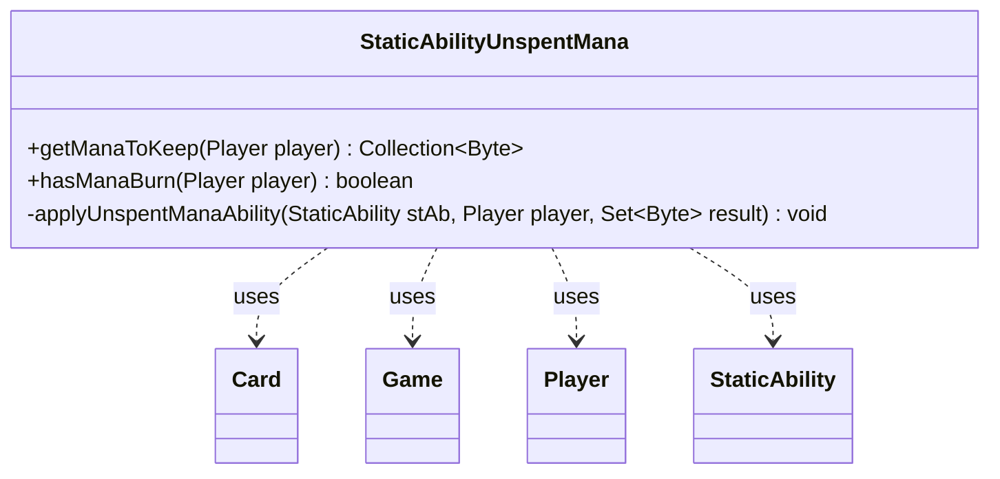

---
aliases:
  - StaticAbilityUnspentMana
tags:
  - java/class
  - module/forge-game
  - pkg/forge/game/staticability
fqn: forge.game.staticability.StaticAbilityUnspentMana
package: forge.game.staticability
module: forge-game
kind: Class
---

# StaticAbilityUnspentMana

**Package:** `forge.game.staticability` &nbsp; **Module:** `forge-game` &nbsp; **Kind:** Class



## Relationships
**Uses:**
- [[forge.game.Game|Game]]
- [[forge.game.card.Card|Card]]
- [[forge.game.player.Player|Player]]
- [[forge.game.staticability.StaticAbility|StaticAbility]]

## Source
`forge-game/src/main/java/forge/game/staticability/StaticAbilityUnspentMana.java`

```java
package forge.game.staticability;

import java.util.Collection;
import java.util.Set;

import com.google.common.collect.Sets;

import forge.card.MagicColor;
import forge.card.mana.ManaAtom;
import forge.game.Game;
import forge.game.card.Card;
import forge.game.player.Player;
import forge.game.zone.ZoneType;

public class StaticAbilityUnspentMana {

    public static Collection<Byte> getManaToKeep(final Player player) {
        final Game game = player.getGame();
        Set<Byte> result = Sets.newHashSet();
        for (final Card ca : game.getCardsIn(ZoneType.STATIC_ABILITIES_SOURCE_ZONES)) {
            for (final StaticAbility stAb : ca.getStaticAbilities()) {
                if (!stAb.checkConditions(StaticAbilityMode.UnspentMana)) {
                    continue;
                }
                applyUnspentManaAbility(stAb, player, result);
            }
        }
        return result;
    }

    public static boolean hasManaBurn(final Player player) {
        final Game game = player.getGame();
        for (final Card ca : game.getCardsIn(ZoneType.STATIC_ABILITIES_SOURCE_ZONES)) {
            for (final StaticAbility stAb : ca.getStaticAbilities()) {
                if (!stAb.checkConditions(StaticAbilityMode.ManaBurn)) {
                    continue;
                }
                if (!stAb.matchesValidParam("ValidPlayer", player)) {
                    return false;
                }
                return true;
            }
        }
        return false;
    }

    private static void applyUnspentManaAbility(final StaticAbility stAb, final Player player, Set<Byte> result) {
        if (!stAb.matchesValidParam("ValidPlayer", player)) {
            return;
        }
        if (!stAb.hasParam("ManaType")) {
            for (byte b : ManaAtom.MANATYPES) {
                result.add(b);
            }
        } else {
            result.add(MagicColor.fromName(stAb.getParam("ManaType")));
        }
    }
}
```
