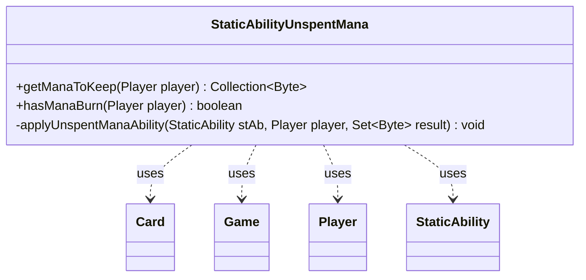

---
aliases:
  - StaticAbilityUnspentMana
tags:
  - java/class
  - module/forge-game
  - pkg/forge/game/staticability
fqn: forge.game.staticability.StaticAbilityUnspentMana
package: forge.game.staticability
module: forge-game
kind: Class
---

# StaticAbilityUnspentMana

**Package:** `forge.game.staticability`   **Module:** `forge-game`   **Kind:** Class



## Relationships
**Uses:**
- [[forge.game.Game|Game]]
- [[forge.game.card.Card|Card]]
- [[forge.game.player.Player|Player]]
- [[forge.game.staticability.StaticAbility|StaticAbility]]

## Design Description

StaticAbilityUnspentMana is a stateless utility class that resolves how a player's unused mana is treated at the end of a step or phase, centralizing the rules logic for "mana doesn't empty" and "mana burn" static abilities. Through the static methods getManaToKeep and hasManaBurn, it scans every Card in the static-ability source zones, filters that card's StaticAbility entries by the relevant StaticAbilityMode, and validates the affected Player before acting. getManaToKeep returns a Collection of color/colorless byte codes to retain—defaulting to all mana types when no ManaType parameter is specified—while hasManaBurn reports whether a player suffers burn. Rather than implementing an interface, it follows the engine's convention of grouping one static-ability category's evaluation into a dedicated helper, collaborating with Game and Card to reach the abilities and delegating condition and parameter matching to StaticAbility.

## Source
`forge-game/src/main/java/forge/game/staticability/StaticAbilityUnspentMana.java`

```java
package forge.game.staticability;

import java.util.Collection;
import java.util.Set;

import com.google.common.collect.Sets;

import forge.card.MagicColor;
import forge.card.mana.ManaAtom;
import forge.game.Game;
import forge.game.card.Card;
import forge.game.player.Player;
import forge.game.zone.ZoneType;

public class StaticAbilityUnspentMana {

    public static Collection<Byte> getManaToKeep(final Player player) {
        final Game game = player.getGame();
        Set<Byte> result = Sets.newHashSet();
        for (final Card ca : game.getCardsIn(ZoneType.STATIC_ABILITIES_SOURCE_ZONES)) {
            for (final StaticAbility stAb : ca.getStaticAbilities()) {
                if (!stAb.checkConditions(StaticAbilityMode.UnspentMana)) {
                    continue;
                }
                applyUnspentManaAbility(stAb, player, result);
            }
        }
        return result;
    }

    public static boolean hasManaBurn(final Player player) {
        final Game game = player.getGame();
        for (final Card ca : game.getCardsIn(ZoneType.STATIC_ABILITIES_SOURCE_ZONES)) {
            for (final StaticAbility stAb : ca.getStaticAbilities()) {
                if (!stAb.checkConditions(StaticAbilityMode.ManaBurn)) {
                    continue;
                }
                if (!stAb.matchesValidParam("ValidPlayer", player)) {
                    return false;
                }
                return true;
            }
        }
        return false;
    }

    private static void applyUnspentManaAbility(final StaticAbility stAb, final Player player, Set<Byte> result) {
        if (!stAb.matchesValidParam("ValidPlayer", player)) {
            return;
        }
        if (!stAb.hasParam("ManaType")) {
            for (byte b : ManaAtom.MANATYPES) {
                result.add(b);
            }
        } else {
            result.add(MagicColor.fromName(stAb.getParam("ManaType")));
        }
    }
}
```

## Python
`forge/game/staticability/StaticAbilityUnspentMana.py`

```python
from forge.card.MagicColor import MagicColor
from forge.card.mana.ManaAtom import ManaAtom
from forge.game.Game import Game
from forge.game.card.Card import Card
from forge.game.player.Player import Player
from forge.game.staticability.StaticAbility import StaticAbility
from forge.game.staticability.StaticAbilityMode import StaticAbilityMode
from forge.game.zone.ZoneType import ZoneType


class StaticAbilityUnspentMana:

    @staticmethod
    def getManaToKeep(player):
        game = player.getGame()
        result = set()
        for ca in game.getCardsIn(ZoneType.STATIC_ABILITIES_SOURCE_ZONES):
            for stAb in ca.getStaticAbilities():
                if not stAb.checkConditions(StaticAbilityMode.UnspentMana):
                    continue
                StaticAbilityUnspentMana.applyUnspentManaAbility(stAb, player, result)
        return result

    @staticmethod
    def hasManaBurn(player):
        game = player.getGame()
        for ca in game.getCardsIn(ZoneType.STATIC_ABILITIES_SOURCE_ZONES):
            for stAb in ca.getStaticAbilities():
                if not stAb.checkConditions(StaticAbilityMode.ManaBurn):
                    continue
                if not stAb.matchesValidParam("ValidPlayer", player):
                    return False
                return True
        return False

    @staticmethod
    def applyUnspentManaAbility(stAb, player, result):
        if not stAb.matchesValidParam("ValidPlayer", player):
            return
        if not stAb.hasParam("ManaType"):
            for b in ManaAtom.MANATYPES:
                result.add(b)
        else:
            result.add(MagicColor.fromName(stAb.getParam("ManaType")))
```
