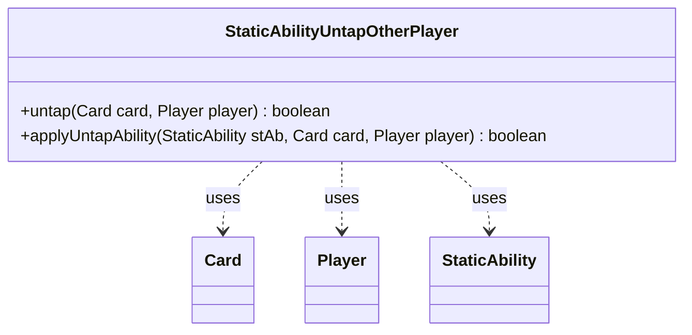

---
aliases:
  - StaticAbilityUntapOtherPlayer
tags:
  - java/class
  - module/forge-game
  - pkg/forge/game/staticability
fqn: forge.game.staticability.StaticAbilityUntapOtherPlayer
package: forge.game.staticability
module: forge-game
kind: Class
---

# StaticAbilityUntapOtherPlayer

**Package:** `forge.game.staticability`   **Module:** `forge-game`   **Kind:** Class



## Relationships
**Uses:**
- [[forge.game.card.Card|Card]]
- [[forge.game.player.Player|Player]]
- [[forge.game.staticability.StaticAbility|StaticAbility]]

## Design Description

StaticAbilityUntapOtherPlayer is a stateless utility class in the `forge.game.staticability` package that resolves "untap during the opponent's untap step" effects—static abilities that let one player untap permanents during another player's turn. Its `untap` entry point scans every card in the game's static-ability source zones, iterates their `StaticAbility` instances, and filters to those whose mode matches `UntapOtherPlayer` and whose conditions hold; `applyUntapAbility` then confirms the candidate `Card` and `Player` satisfy the ability's `ValidCard` and `ValidPlayer` parameters.

Rather than extending a supertype, the class collaborates purely by delegation: it leans on `StaticAbility` for condition and parameter matching and treats `Card` and `Player` as the subjects being validated. The all-static, no-state design and `boolean` short-circuit returns reflect its intent as a lightweight rules-checking helper invoked by the untap logic, mirroring the convention of Forge's other `StaticAbility*` evaluator classes.

## Source
`forge-game/src/main/java/forge/game/staticability/StaticAbilityUntapOtherPlayer.java`

```java
/*
 * Forge: Play Magic: the Gathering.
 * Copyright (C) 2011  Forge Team
 *
 * This program is free software: you can redistribute it and/or modify
 * it under the terms of the GNU General Public License as published by
 * the Free Software Foundation, either version 3 of the License, or
 * (at your option) any later version.
 *
 * This program is distributed in the hope that it will be useful,
 * but WITHOUT ANY WARRANTY; without even the implied warranty of
 * MERCHANTABILITY or FITNESS FOR A PARTICULAR PURPOSE.  See the
 * GNU General Public License for more details.
 *
 * You should have received a copy of the GNU General Public License
 * along with this program.  If not, see <http://www.gnu.org/licenses/>.
 */
package forge.game.staticability;

import forge.game.card.Card;
import forge.game.player.Player;
import forge.game.zone.ZoneType;

public class StaticAbilityUntapOtherPlayer {

    public static boolean untap(final Card card, final Player player) {
        for (final Card ca : card.getGame().getCardsIn(ZoneType.STATIC_ABILITIES_SOURCE_ZONES)) {
            for (final StaticAbility stAb : ca.getStaticAbilities()) {
                if (!stAb.checkConditions(StaticAbilityMode.UntapOtherPlayer)) {
                    continue;
                }

                if (applyUntapAbility(stAb, card, player)) {
                    return true;
                }
            }
        }
        return false;
    }

    public static boolean applyUntapAbility(final StaticAbility stAb, final Card card, final Player player) {
        if (!stAb.matchesValidParam("ValidCard", card)) {
            return false;
        }
        if (!stAb.matchesValidParam("ValidPlayer", player)) {
            return false;
        }
        return true;
    }
}
```

## Python
`forge/game/staticability/StaticAbilityUntapOtherPlayer.py`

```python
from forge.game.card.Card import Card
from forge.game.player.Player import Player
from forge.game.staticability.StaticAbility import StaticAbility
from forge.game.zone.ZoneType import ZoneType
from forge.game.staticability.StaticAbilityMode import StaticAbilityMode


class StaticAbilityUntapOtherPlayer:

    @staticmethod
    def untap(card: Card, player: Player) -> bool:
        for ca in card.getGame().getCardsIn(ZoneType.STATIC_ABILITIES_SOURCE_ZONES):
            for stAb in ca.getStaticAbilities():
                if not stAb.checkConditions(StaticAbilityMode.UntapOtherPlayer):
                    continue

                if StaticAbilityUntapOtherPlayer.applyUntapAbility(stAb, card, player):
                    return True
        return False

    @staticmethod
    def applyUntapAbility(stAb: StaticAbility, card: Card, player: Player) -> bool:
        if not stAb.matchesValidParam("ValidCard", card):
            return False
        if not stAb.matchesValidParam("ValidPlayer", player):
            return False
        return True
```
