---
aliases:
  - StaticAbilityView
tags:
  - java/class
  - module/forge-game
  - pkg/forge/game/staticability
fqn: forge.game.staticability.StaticAbilityView
package: forge.game.staticability
module: forge-game
kind: Class
---

# StaticAbilityView

**Package:** `forge.game.staticability` &nbsp; **Module:** `forge-game` &nbsp; **Kind:** Class

```mermaid
classDiagram
    class StaticAbilityView {
        -long serialVersionUID
        +getCardView() CardView
        +getHostCard() CardView
        ~updateHostCard(StaticAbility st) void
        +toString() String
        +getDescription() String
        ~updateDescription(StaticAbility st) void
        ~StaticAbilityView(StaticAbility st)
        ~StaticAbilityView(StaticAbility st, Tracker tracker)
    }
    StaticAbilityView --|> TrackableObject : extends
    StaticAbilityView ..|> IHasCardView : implements
    StaticAbilityView ..> CardView : uses
    StaticAbilityView ..> StaticAbility : uses
    StaticAbilityView ..> Tracker : uses
```



## Relationships
**Extends:**
- [[forge.trackable.TrackableObject|TrackableObject]]
**Implements:**
- [[forge.game.card.IHasCardView|IHasCardView]]
**Uses:**
- [[forge.game.card.CardView|CardView]]
- [[forge.game.staticability.StaticAbility|StaticAbility]]
- [[forge.trackable.Tracker|Tracker]]

## Source
`forge-game/src/main/java/forge/game/staticability/StaticAbilityView.java`

```java
package forge.game.staticability;

import forge.game.card.CardView;
import forge.game.card.IHasCardView;
import forge.trackable.TrackableObject;
import forge.trackable.TrackableProperty;
import forge.trackable.Tracker;

public class StaticAbilityView extends TrackableObject implements IHasCardView {
    private static final long serialVersionUID = 1L;

    StaticAbilityView(StaticAbility st) {
        this(st, st.getHostCard() == null || st.getHostCard().getGame() == null ? null : st.getHostCard().getGame().getTracker());
    }

    StaticAbilityView(StaticAbility st, Tracker tracker) {
        super(st.getId(), tracker);
        updateHostCard(st);
        updateDescription(st);
    }

    @Override
    public CardView getCardView() {
        return this.getHostCard();
    }

    public CardView getHostCard() {
        return get(TrackableProperty.ST_HostCard);
    }

    void updateHostCard(StaticAbility st) {
        set(TrackableProperty.ST_HostCard, CardView.get(st.getHostCard()));
    }

    @Override
    public String toString() {
        return this.getDescription();
    }

    public String getDescription() {
        return get(TrackableProperty.ST_Description);
    }

    void updateDescription(StaticAbility st) {
        set(TrackableProperty.ST_Description, st.toString());
    }
}
```
