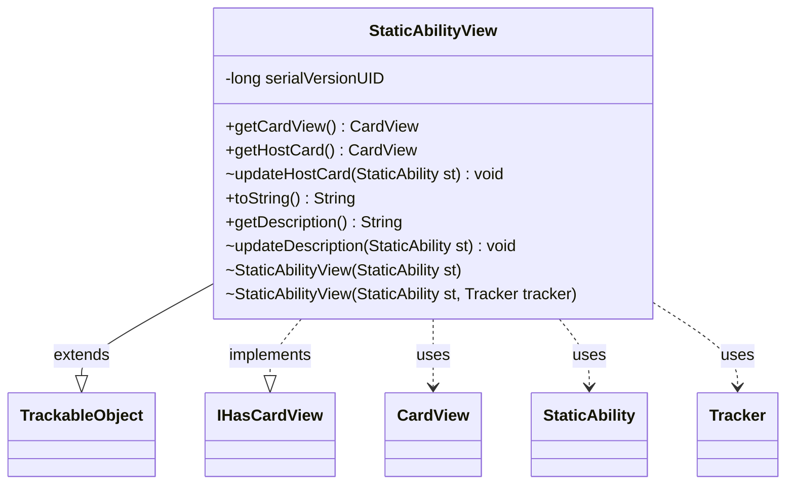

---
aliases:
  - StaticAbilityView
tags:
  - java/class
  - module/forge-game
  - pkg/forge/game/staticability
fqn: forge.game.staticability.StaticAbilityView
package: forge.game.staticability
module: forge-game
kind: Class
---

# StaticAbilityView

**Package:** `forge.game.staticability`   **Module:** `forge-game`   **Kind:** Class



## Relationships
**Extends:**
- [[forge.trackable.TrackableObject|TrackableObject]]
**Implements:**
- [[forge.game.card.IHasCardView|IHasCardView]]
**Uses:**
- [[forge.game.card.CardView|CardView]]
- [[forge.game.staticability.StaticAbility|StaticAbility]]
- [[forge.trackable.Tracker|Tracker]]

## Design Description

StaticAbilityView is a lightweight, serializable presentation/view object that exposes a StaticAbility's display state to the rest of the engine and UI. Extending TrackableObject, it stores its host card and description as tracked properties (ST_HostCard, ST_Description) so changes propagate through the game's change-tracking system; package-private constructors derive the appropriate Tracker from the originating ability's host card and game. By implementing IHasCardView, it advertises an associated CardView—here the host card itself—allowing UI code to resolve the owning card uniformly. The update methods translate model objects (the StaticAbility and its host Card) into view-friendly forms (a CardView and the ability's string description), keeping the mutable game model decoupled from the view layer, while toString simply surfaces the cached description.

## Source
`forge-game/src/main/java/forge/game/staticability/StaticAbilityView.java`

```java
package forge.game.staticability;

import forge.game.card.CardView;
import forge.game.card.IHasCardView;
import forge.trackable.TrackableObject;
import forge.trackable.TrackableProperty;
import forge.trackable.Tracker;

public class StaticAbilityView extends TrackableObject implements IHasCardView {
    private static final long serialVersionUID = 1L;

    StaticAbilityView(StaticAbility st) {
        this(st, st.getHostCard() == null || st.getHostCard().getGame() == null ? null : st.getHostCard().getGame().getTracker());
    }

    StaticAbilityView(StaticAbility st, Tracker tracker) {
        super(st.getId(), tracker);
        updateHostCard(st);
        updateDescription(st);
    }

    @Override
    public CardView getCardView() {
        return this.getHostCard();
    }

    public CardView getHostCard() {
        return get(TrackableProperty.ST_HostCard);
    }

    void updateHostCard(StaticAbility st) {
        set(TrackableProperty.ST_HostCard, CardView.get(st.getHostCard()));
    }

    @Override
    public String toString() {
        return this.getDescription();
    }

    public String getDescription() {
        return get(TrackableProperty.ST_Description);
    }

    void updateDescription(StaticAbility st) {
        set(TrackableProperty.ST_Description, st.toString());
    }
}
```

## Python
`forge/game/staticability/StaticAbilityView.py`

```python
package forge.game.staticability;

from forge.game.card.CardView import CardView
from forge.game.card.IHasCardView import IHasCardView
from forge.trackable.TrackableObject import TrackableObject
from forge.trackable.TrackableProperty import TrackableProperty
from forge.trackable.Tracker import Tracker
from forge.game.staticability.StaticAbility import StaticAbility


class StaticAbilityView(TrackableObject, IHasCardView):
    serialVersionUID = 1

    def __init__(self, st, tracker=None):
        if tracker is None:
            tracker = None if st.getHostCard() is None or st.getHostCard().getGame() is None else st.getHostCard().getGame().getTracker()
        super().__init__(st.getId(), tracker)
        self.updateHostCard(st)
        self.updateDescription(st)

    def getCardView(self):
        return self.getHostCard()

    def getHostCard(self):
        return self.get(TrackableProperty.ST_HostCard)

    def updateHostCard(self, st):
        self.set(TrackableProperty.ST_HostCard, CardView.get(st.getHostCard()))

    def __str__(self):
        return self.getDescription()

    def toString(self):
        return self.getDescription()

    def getDescription(self):
        return self.get(TrackableProperty.ST_Description)

    def updateDescription(self, st):
        self.set(TrackableProperty.ST_Description, st.toString())
```
