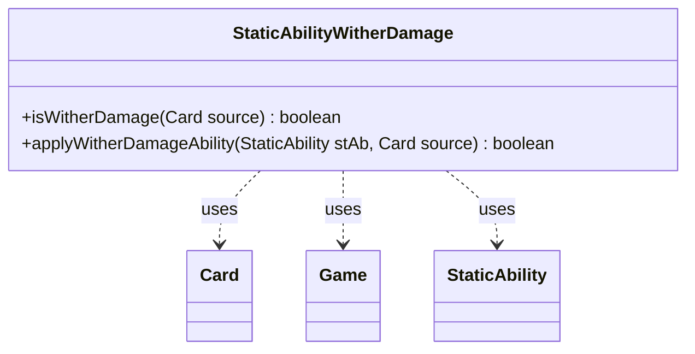

---
aliases:
  - StaticAbilityWitherDamage
tags:
  - java/class
  - module/forge-game
  - pkg/forge/game/staticability
fqn: forge.game.staticability.StaticAbilityWitherDamage
package: forge.game.staticability
module: forge-game
kind: Class
---

# StaticAbilityWitherDamage

**Package:** `forge.game.staticability` &nbsp; **Module:** `forge-game` &nbsp; **Kind:** Class



## Relationships
**Uses:**
- [[forge.game.Game|Game]]
- [[forge.game.card.Card|Card]]
- [[forge.game.staticability.StaticAbility|StaticAbility]]

## Design Description

StaticAbilityWitherDamage is a stateless utility class in the `forge.game.staticability` package that determines whether damage dealt by a given source card should be treated as "wither" damage (damage applied as -1/-1 counters rather than ordinary damage). Its static `isWitherDamage` method scans every card in the game's static-ability source zones, iterates their `StaticAbility` instances, filters those whose conditions match the `WitherDamage` mode, and delegates to `applyWitherDamageAbility`, which confirms the source satisfies the ability's `ValidCard` parameter.

Rather than extending a common base, it acts as a focused helper layered over Forge's continuous static-ability framework, collaborating with `Game` to enumerate relevant zones, `Card` to reach the source's game and ability list, and `StaticAbility` to evaluate conditions and validity. The all-static, short-circuiting design reflects an intent to provide a cheap, side-effect-free rule check callable from the damage-resolution path.

## Source
`forge-game/src/main/java/forge/game/staticability/StaticAbilityWitherDamage.java`

```java
package forge.game.staticability;

import forge.game.Game;
import forge.game.card.Card;
import forge.game.zone.ZoneType;

public class StaticAbilityWitherDamage {

    static public boolean isWitherDamage(Card source) {
        final Game game = source.getGame();
        for (final Card ca : game.getCardsIn(ZoneType.STATIC_ABILITIES_SOURCE_ZONES)) {
            for (final StaticAbility stAb : ca.getStaticAbilities()) {
                if (!stAb.checkConditions(StaticAbilityMode.WitherDamage)) {
                    continue;
                }
                if (applyWitherDamageAbility(stAb, source)) {
                    return true;
                }
            }
        }
        return false;
    }

    static public boolean applyWitherDamageAbility(StaticAbility stAb, Card source) {
        if (!stAb.matchesValidParam("ValidCard", source)) {
            return false;
        }
        return true;
    }
}
```

## Python
`forge/game/staticability/StaticAbilityWitherDamage.py`

```python
from forge.game.Game import Game
from forge.game.card.Card import Card
from forge.game.zone.ZoneType import ZoneType
from forge.game.staticability.StaticAbility import StaticAbility
from forge.game.staticability.StaticAbilityMode import StaticAbilityMode


class StaticAbilityWitherDamage:

    @staticmethod
    def isWitherDamage(source: Card) -> bool:
        game = source.getGame()
        for ca in game.getCardsIn(ZoneType.STATIC_ABILITIES_SOURCE_ZONES):
            for stAb in ca.getStaticAbilities():
                if not stAb.checkConditions(StaticAbilityMode.WitherDamage):
                    continue
                if StaticAbilityWitherDamage.applyWitherDamageAbility(stAb, source):
                    return True
        return False

    @staticmethod
    def applyWitherDamageAbility(stAb: StaticAbility, source: Card) -> bool:
        if not stAb.matchesValidParam("ValidCard", source):
            return False
        return True
```
