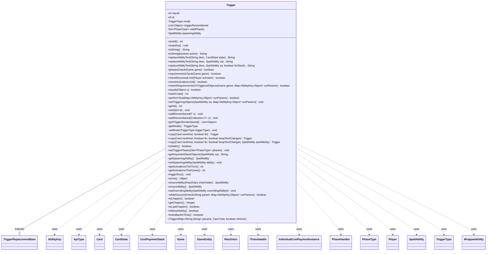

---
aliases:
  - Trigger
tags:
  - java/class
  - module/forge-game
  - pkg/forge/game/trigger
fqn: forge.game.trigger.Trigger
package: forge.game.trigger
module: forge-game
kind: Class
---

# Trigger

**Package:** `forge.game.trigger`   **Module:** `forge-game`   **Kind:** Class



## Relationships
**Extends:**
- [[forge.game.TriggerReplacementBase|TriggerReplacementBase]]
**Uses:**
- [[forge.game.Game|Game]]
- [[forge.game.GameEntity|GameEntity]]
- [[forge.game.IHasSVars|IHasSVars]]
- [[forge.game.ability.AbilityKey|AbilityKey]]
- [[forge.game.ability.ApiType|ApiType]]
- [[forge.game.card.Card|Card]]
- [[forge.game.card.CardState|CardState]]
- [[forge.game.cost.IndividualCostPaymentInstance|IndividualCostPaymentInstance]]
- [[forge.game.phase.PhaseHandler|PhaseHandler]]
- [[forge.game.phase.PhaseType|PhaseType]]
- [[forge.game.player.Player|Player]]
- [[forge.game.spellability.SpellAbility|SpellAbility]]
- [[forge.game.trigger.TriggerType|TriggerType]]
- [[forge.game.trigger.WrappedAbility|WrappedAbility]]
- [[forge.game.zone.CostPaymentStack|CostPaymentStack]]
- [[forge.util.ITranslatable|ITranslatable]]

## Design Description

Trigger is the abstract base for all event-driven abilities in the engine, modeling a Magic card's triggered ability ("when/whenever..."). Constructed only by reflection from a parameter map, host Card, and an intrinsic flag, each instance carries a unique id, a TriggerType mode, optional valid PhaseTypes, and a list of remembered objects. It extends TriggerReplacementBase to share parameter handling and overriding-ability plumbing, and defines the contract subclasses must implement—performTest, setTriggeringObjects, and getImportantStackObjects—so each concrete trigger decides whether a game event matches.

Its concrete responsibilities center on gating and presentation: phasesCheck and requirementsCheck enforce timing and CR-based conditions, checkResolvedLimit/checkActivationLimit bound repeats, and meetsRequirementsOnTriggeredObjects evaluates keyword- and condition-specific rules against runParams. toString and replaceAbilityText render translated, Charm-aware descriptions. Identity is id-based (equals/hashCode), and Cloneable copy methods reissue ids for non-LKI clones, reflecting careful separation of original versus copied game objects.

## Source
`forge-game/src/main/java/forge/game/trigger/Trigger.java`

```java
/*
 * Forge: Play Magic: the Gathering.
 * Copyright (C) 2011  Forge Team
 *
 * This program is free software: you can redistribute it and/or modify
 * it under the terms of the GNU General Public License as published by
 * the Free Software Foundation, either version 3 of the License, or
 * (at your option) any later version.
 *
 * This program is distributed in the hope that it will be useful,
 * but WITHOUT ANY WARRANTY; without even the implied warranty of
 * MERCHANTABILITY or FITNESS FOR A PARTICULAR PURPOSE.  See the
 * GNU General Public License for more details.
 *
 * You should have received a copy of the GNU General Public License
 * along with this program.  If not, see <http://www.gnu.org/licenses/>.
 */
package forge.game.trigger;

import com.google.common.collect.Iterables;
import com.google.common.collect.Lists;
import com.google.common.collect.Sets;
import forge.game.*;
import forge.game.ability.AbilityFactory;
import forge.game.ability.AbilityKey;
import forge.game.ability.ApiType;
import forge.game.ability.effects.CharmEffect;
import forge.game.card.Card;
import forge.game.card.CardState;
import forge.game.cost.IndividualCostPaymentInstance;
import forge.game.keyword.Keyword;
import forge.game.phase.PhaseHandler;
import forge.game.phase.PhaseType;
import forge.game.player.Player;
import forge.game.spellability.SpellAbility;
import forge.game.zone.CostPaymentStack;
import forge.game.zone.ZoneType;
import forge.util.CardTranslation;
import forge.util.ITranslatable;
import forge.util.Lang;
import forge.util.TextUtil;

import org.apache.commons.lang3.StringUtils;

import java.util.*;

/**
 * <p>
 * Abstract Trigger class. Constructed by reflection only
 * </p>
 *
 * @author Forge
 * @version $Id$
 */
public abstract class Trigger extends TriggerReplacementBase {
    private static int maxId = 0;
    private static int nextId() { return ++maxId; }

    /**
     * <p>
     * resetIDs.
     * </p>
     */
    public static void resetIDs() {
        Trigger.maxId = 50000;
    }

    /** The ID. */
    private int id;

    private TriggerType mode;

    private List<Object> triggerRemembered = Lists.newArrayList();

    private Set<PhaseType> validPhases;

    private SpellAbility spawningAbility;

    /**
     * <p>
     * Constructor for Trigger.
     * </p>
     *
     * @param params
     *            a {@link java.util.HashMap} object.
     * @param host
     *            a {@link forge.game.card.Card} object.
     * @param intrinsic
     *            the intrinsic
     */
    public Trigger(final Map<String, String> params, final Card host, final boolean intrinsic) {
        this.id = nextId();
        this.intrinsic = intrinsic;

        this.originalMapParams.putAll(params);
        this.mapParams.putAll(params);
        this.setHostCard(host);

        String triggerZones = getParam("TriggerZones");
        if (null != triggerZones) {
            setActiveZone(EnumSet.copyOf(ZoneType.listValueOf(triggerZones)));
        }

        String triggerPhases = getParam("Phase");
        if (null != triggerPhases) {
            setTriggerPhases(PhaseType.parseRange(triggerPhases));
        }
    }

    /**
     * <p>
     * toString.
     * </p>
     *
     * @return a {@link java.lang.String} object.
     */
    @Override
    public final String toString() {
    	return toString(false);
    }

    public String toString(boolean active) {
        if (!hasParam("TriggerDescription") || isSuppressed()) {
            return "";
        }
        StringBuilder sb = new StringBuilder();
        ITranslatable nameSource = getHostName(this);
        String desc = getParam("TriggerDescription");
        if (!desc.contains("ABILITY")) {
            desc = CardTranslation.translateSingleDescriptionText(getParam("TriggerDescription"), nameSource);
            String translatedName = nameSource.getTranslatedName();
            desc = TextUtil.fastReplace(desc,"CARDNAME", translatedName);
            desc = TextUtil.fastReplace(desc,"NICKNAME", Lang.getInstance().getNickName(translatedName));
            if (desc.contains("ORIGINALHOST") && this.getOriginalHost() != null) {
                desc = TextUtil.fastReplace(desc, "ORIGINALHOST", this.getOriginalHost().getDisplayName());
            }
        }
        if (getHostCard().getEffectSource() != null) {
            if (active)
                desc = TextUtil.fastReplace(desc, "EFFECTSOURCE", getHostCard().getEffectSource().toString());
            else
                desc = TextUtil.fastReplace(desc, "EFFECTSOURCE", getHostCard().getEffectSource().getDisplayName());
        }
        sb.append(desc);
        return sb.toString();
    }

    public final String replaceAbilityText(final String desc, final CardState state) {
        // this function is for ABILITY
        if (!desc.contains("ABILITY")) {
            return desc;
        }
        SpellAbility sa = ensureAbility();

        return replaceAbilityText(desc, sa);
    }

    public final String replaceAbilityText(final String desc, SpellAbility sa) {
        return replaceAbilityText(desc, sa, false);
    }
    public final String replaceAbilityText(final String desc, SpellAbility sa, boolean forStack) {
        String result = desc;

        // this function is for ABILITY
        if (!result.contains("ABILITY")) {
            return result;
        }
        if (sa == null) {
            sa = getOverridingAbility();
        }
        if (sa != null) {
            String saDesc = "";
            boolean digMore = true;
            // if sa is a wrapper, get the Wrapped Ability
            if (sa.isWrapper()) {
                final WrappedAbility wa = (WrappedAbility) sa;
                sa = wa.getWrappedAbility();

                // wrapped Charm spells are special, only get the selected abilities (if there are any yet)
                if (ApiType.Charm.equals(sa.getApi())) {
                    saDesc = sa.getStackDescription();
                    digMore = false;
                }
            }
            if (digMore) { // if ABILITY is used, there is probably Charm somewhere
                SpellAbility trigSA = sa;
                while (trigSA != null) {
                    ApiType api = trigSA.getApi();
                    if (ApiType.Charm.equals(api)) {
                        saDesc = CharmEffect.makeFormatedDescription(trigSA, !forStack);
                        break;
                    }
                    if (ApiType.ImmediateTrigger.equals(api) || ApiType.DelayedTrigger.equals(api)) {
                        trigSA = trigSA.getAdditionalAbility("Execute");
                    } else {
                        trigSA = trigSA.getSubAbility();
                    }
                }
            }
            if (saDesc.isEmpty()) { // in case we haven't found anything better
                saDesc = sa.toString();
            }
            // string might have leading whitespace
            saDesc = saDesc.trim();
            if (!saDesc.isEmpty()) {
                // in case sa starts with CARDNAME, dont lowercase it
                if (!saDesc.startsWith(sa.getHostCard().getName())) {
                    saDesc = saDesc.substring(0, 1).toLowerCase() + saDesc.substring(1);
                }
                if (saDesc.contains("ORIGINALHOST") && sa.getOriginalHost() != null) {
                    saDesc = TextUtil.fastReplace(saDesc, "ORIGINALHOST", sa.getOriginalHost().getDisplayName());
                }
            } else {
                saDesc = "<take no action>"; // printed in case nothing is chosen for the ability (e.g. Charm with Up to X)
            }
            result = TextUtil.fastReplace(result, "ABILITY", saDesc);

            result = CardTranslation.translateMultipleDescriptionText(result, sa.getHostCard());
            String translatedName = sa.getHostCard().getTranslatedName();
            result = TextUtil.fastReplace(result,"CARDNAME", translatedName);
            result = TextUtil.fastReplace(result,"NICKNAME", Lang.getInstance().getNickName(translatedName));
        }

        return result;
    }

    /**
     * <p>
     * phasesCheck.
     * </p>
     *
     * @return a boolean.
     */
    public final boolean phasesCheck(final Game game) {
        PhaseHandler phaseHandler = game.getPhaseHandler();
        if (null != validPhases) {
            if (!validPhases.contains(phaseHandler.getPhase())) {
                return false;
            }
            // add support for calculation if needed
            if (hasParam("PhaseCount") && phaseHandler.getNumMain() + 1 != 2) {
                return false;
            }
        }

        if (hasParam("PlayerTurn")) {
            if (!phaseHandler.isPlayerTurn(this.getHostCard().getController())) {
                return false;
            }
        }

        if (hasParam("NotPlayerTurn")) {
            if (phaseHandler.isPlayerTurn(this.getHostCard().getController())) {
                return false;
            }
        }

        if (hasParam("OpponentTurn")) {
            if (!this.getHostCard().getController().isOpponentOf(phaseHandler.getPlayerTurn())) {
                return false;
            }
        }

        if (hasParam("FirstUpkeep")) {
            if (!phaseHandler.isFirstUpkeep()) {
                return false;
            }
        }

        if (hasParam("FirstUpkeepThisGame")) {
            if (!phaseHandler.isFirstUpkeepThisGame()) {
                return false;
            }
        }

        if (hasParam("FirstCombat")) {
            if (!phaseHandler.isFirstCombat()) {
                return false;
            }
        }

        if (hasParam("TurnCount")) {
            int turn = Integer.parseInt(getParam("TurnCount"));
            if (phaseHandler.getTurn() != turn) {
                return false;
            }
        }

        return true;
    }
    /**
     * <p>
     * requirementsCheck.
     * </p>
     * @param game
     *
     * @return a boolean.
     */
    public final boolean requirementsCheck(Game game) {
        if (hasParam("APlayerHasMoreLifeThanEachOther")) {
            int highestLife = Integer.MIN_VALUE; // Negative base just in case a few Lich's or Platinum Angels are running around
            final List<Player> healthiest = new ArrayList<>();
            for (final Player p : game.getPlayers()) {
                if (p.getLife() > highestLife) {
                    healthiest.clear();
                    highestLife = p.getLife();
                    healthiest.add(p);
                } else if (p.getLife() == highestLife) {
                    highestLife = p.getLife();
                    healthiest.add(p);
                }
            }

            if (healthiest.size() != 1) {
                // More than one player tied for most life
                return false;
            }
        }

        if (hasParam("APlayerHasMostCardsInHand")) {
            int largestHand = 0;
            final List<Player> withLargestHand = new ArrayList<>();
            for (final Player p : game.getPlayers()) {
                if (p.getCardsIn(ZoneType.Hand).size() > largestHand) {
                    withLargestHand.clear();
                    largestHand = p.getCardsIn(ZoneType.Hand).size();
                    withLargestHand.add(p);
                } else if (p.getCardsIn(ZoneType.Hand).size() == largestHand) {
                    largestHand = p.getCardsIn(ZoneType.Hand).size();
                    withLargestHand.add(p);
                }
            }

            if (withLargestHand.size() != 1) {
                // More than one player tied for most life
                return false;
            }
        }

        // host controller will be null when adding card in a simulation game
        if (this.getHostCard().getController() == null || (game.getAge() != GameStage.Play && game.getAge() != GameStage.RestartedByKarn) || !meetsCommonRequirements(this.mapParams)) {
            return false;
        }

        if (!checkResolvedLimit(getHostCard().getController())) {
            return false;
        }

        return true;
    }

    public boolean checkResolvedLimit(Player activator) {
        // CR 603.2i
        if (hasParam("ResolvedLimit")) {
            if (Collections.frequency(getHostCard().getAbilityResolvedThisTurnActivators(getOverridingAbility()), activator)
                    >= Integer.parseInt(getParam("ResolvedLimit"))) {
                return false;
            }
        }
        return true;
    }

    public boolean checkActivationLimit() {
        if (hasParam("ActivationLimit") &&
                getActivationsThisTurn() >= Integer.parseInt(getParam("ActivationLimit"))) {
            return false;
        }
        if (hasParam("GameActivationLimit") && 
            getActivationsThisGame() >= Integer.parseInt(getParam("GameActivationLimit"))) {
                return false;
        }
        return true;
    }

    public boolean meetsRequirementsOnTriggeredObjects(Game game, final Map<AbilityKey, Object> runParams) {
        String condition = getParam("Condition");

        if (isKeyword(Keyword.EVOLVE) || "Evolve".equals(condition)) {
            final Card moved = (Card) runParams.get(AbilityKey.Card);
            if (moved == null) {
                return false;
            }
            // CR 702.100c
            if (!moved.isCreature() || !getHostCard().isCreature()) {
                return false;
            }
            if (moved.getNetPower() <= getHostCard().getNetPower()
                    && moved.getNetToughness() <= getHostCard().getNetToughness()) {
                return false;
            }
        }
        if (isKeyword(Keyword.INCREMENT)) {
            if (!getHostCard().isCreature()) {
                return false;
            }
            final SpellAbility sp = (SpellAbility) runParams.get(AbilityKey.SpellAbility);
            final Player p = getHostCard().getController();
            int v = (int) sp.getPayingMana().stream().filter(m ->  m.getPlayer().equals(p)).count();
            if (v <= getHostCard().getNetPower()
                    && v <= getHostCard().getNetToughness()) {
                return false;
            }
        }

        if (condition == null) {
            return true;
        }

        if ("LifePaid".equals(condition)) {
            final SpellAbility trigSA = (SpellAbility) runParams.get(AbilityKey.SpellAbility);
            if (trigSA != null && trigSA.getAmountLifePaid() <= 0) {
                return false;
            }
        } else if ("NoOpponentHasMoreLifeThanAttacked".equals(condition)) {
            GameEntity attacked = (GameEntity) runParams.get(AbilityKey.Attacked);
            if (attacked == null) {
                attacked = (GameEntity) runParams.get(AbilityKey.Defender);
            }
            // we should not have gotten this far if planeswalker was attacked, but just to be safe
            if (!(attacked instanceof Player)) {
                return false;
            }
            final Player attackedP = (Player) attacked;
            int life = attackedP.getLife();
            boolean found = false;
            for (Player opp : getHostCard().getController().getOpponents()) {
                if (opp.equals(attackedP)) {
                    continue;
                }
                if (opp.getLife() > life) {
                    found = true;
                    break;
                }
            }
            if (found) {
                return false;
            }
        } else if ("Sacrificed".equals(condition)) {
            final SpellAbility trigSA = (SpellAbility) runParams.get(AbilityKey.SpellAbility);
            if (trigSA != null && Iterables.isEmpty(trigSA.getPaidList("Sacrificed"))) {
                return false;
            }
        } else if ("AttackedPlayerWithMostLife".equals(condition)) {
            GameEntity attacked = (GameEntity) runParams.get(AbilityKey.Attacked);
            if (attacked == null) {
                // Check "Defender" too because once triggering objects are set on TriggerAttacks, the value of Attacked
                // ends up being in Defender at that point.
                attacked = (GameEntity) runParams.get(AbilityKey.Defender);
            }
            if (attacked == null || !attacked.isValid("Player.withMostLife",
                    this.getHostCard().getController(), this.getHostCard(), null)) {
                return false;
            }
        } else if ("AttackerHasUnattackedOpp".equals(condition)) {
            Player attacker = (Player) runParams.get(AbilityKey.AttackingPlayer);
            if (game.getCombat().getAttackersAndDefenders().values().containsAll(attacker.getOpponents())) {
                return false;
            }
        }
        
        return true;
    }

    /** {@inheritDoc} */
    @Override
    public final boolean equals(final Object o) {
        if (!(o instanceof Trigger)) {
            return false;
        }

        return this.getId() == ((Trigger) o).getId();
    }

    /** {@inheritDoc} */
    @Override
    public int hashCode() {
        return Objects.hash(Trigger.class, getId());
    }

    /**
     * <p>
     * performTest.
     * </p>
     *
     * @param runParams
     *            a {@link HashMap} object.
     * @return a boolean.
     */
    public abstract boolean performTest(Map<AbilityKey, Object> runParams);

    /**
     * <p>
     * setTriggeringObjects.
     * </p>
     *
     * @param sa
     *            a {@link forge.game.spellability.SpellAbility} object.
     */
    public abstract void setTriggeringObjects(SpellAbility sa, final Map<AbilityKey, Object> runParams);

    /**
     * Gets the id.
     *
     * @return the id
     */
    public int getId() {
        return this.id;
    }

    /**
     * <p>
     * setID.
     * </p>
     *
     * @param id
     *            a int.
     */
    public final void setId(final int id) {
        this.id = id;
    }

    public <T> void addRemembered(T o) {
        this.triggerRemembered.add(o);
    }
    public <T> void addRemembered(Collection<T> o) {
        this.triggerRemembered.addAll(o);
    }

    @Override
    public List<Object> getTriggerRemembered() {
        return this.triggerRemembered;
    }

    /**
     * TODO: Write javadoc for this method.
     * @return the mode
     */
    public TriggerType getMode() {
        return mode;
    }

    /**
     *
     * @param triggerType
     *            the triggerType to set
     * @param triggerType
     */
    void setMode(TriggerType triggerType) {
        mode = triggerType;
    }

    public final Trigger copy(Card newHost, boolean lki) {
        return copy(newHost, lki, false, null);
    }
    public final Trigger copy(Card newHost, boolean lki, boolean keepTextChanges) {
        return copy(newHost, lki, keepTextChanges, null);
    }
    public final Trigger copy(Card newHost, boolean lki, boolean keepTextChanges, SpellAbility spellAbility) {
        final Trigger copy = (Trigger) clone();

        copyHelper(copy, newHost, lki || keepTextChanges);

        if (spellAbility != null) {
            copy.setOverridingAbility(spellAbility);
        } else if (getOverridingAbility() != null) {
            copy.setOverridingAbility(getOverridingAbility().copy(newHost, lki));
        }

        if (!lki) {
            copy.setId(nextId());
        }

        if (validPhases != null) {
            copy.setTriggerPhases(Sets.newEnumSet(validPhases, PhaseType.class));
        }
        copy.setActiveZone(validHostZones);
        return copy;
    }

    public boolean isStatic() {
        return hasParam("Static"); // && params.get("Static").equals("True") [always true if present]
    }

    public void setTriggerPhases(Set<PhaseType> phases) {
        validPhases = phases;
    }

    //public String getImportantStackObjects(SpellAbility sa) { return ""; };
    abstract public String getImportantStackObjects(SpellAbility sa);

    public SpellAbility getSpawningAbility() {
        return spawningAbility;
    }
    public void setSpawningAbility(SpellAbility ability) {
        spawningAbility = ability;
    }

    public int getActivationsThisTurn() {
        return hostCard.getAbilityActivatedThisTurn(this.getOverridingAbility());
    }

    public int getActivationsThisGame() {
        return hostCard.getAbilityActivatedThisGame(this.getOverridingAbility());
    }

    public void triggerRun() {
        if (this.getOverridingAbility() != null) {
            hostCard.addAbilityActivated(this.getOverridingAbility());
        }
    }

    /** {@inheritDoc} */
    @Override
    public final Object clone() {
        try {
            return super.clone();
        } catch (final Exception ex) {
            throw new RuntimeException("Trigger : clone() error, " + ex);
        }
    }

    public SpellAbility ensureAbility(final IHasSVars sVarHolder) {
        SpellAbility sa = getOverridingAbility();
        if (sa == null && hasParam("Execute")) {
            if (this.isIntrinsic() && sVarHolder instanceof CardState state) {
                sa = state.getAbilityForTrigger(getParam("Execute"));
            } else {
                sa = AbilityFactory.getAbility(getHostCard(), getParam("Execute"), sVarHolder);
            }
            setOverridingAbility(sa);
        }
        return sa;
    }

    public SpellAbility ensureAbility() {
        return ensureAbility(this);
    }

    @Override
    public void setOverridingAbility(SpellAbility overridingAbility0) {
        super.setOverridingAbility(overridingAbility0);
        overridingAbility0.setTrigger(this);
    }

    boolean whileKeywordCheck(final String param, final Map<AbilityKey, Object> runParams) {
        IndividualCostPaymentInstance currentPayment = (IndividualCostPaymentInstance) runParams.get(AbilityKey.IndividualCostPaymentInstance);
        if (currentPayment != null) {
            if (matchesValidParam(param, currentPayment.getPayment().getAbility())) return true;
        }

        CostPaymentStack stack = (CostPaymentStack) runParams.get(AbilityKey.CostStack);
        for (IndividualCostPaymentInstance individual : stack) {
            if (matchesValidParam(param, individual.getPayment().getAbility())) return true;
        }

        return false;
    }

    public boolean isChapter() {
        return hasParam("Chapter");
    }
    public Integer getChapter() {
        if (!isChapter())
            return null;
        return Integer.valueOf(getParam("Chapter"));
    }
    public boolean isLastChapter() {
        return isChapter() && getChapter() == getCardState().getFinalChapterNr();
    }

    @Override
    public boolean isManaAbility() {
        if (!TriggerType.TapsForMana.equals(getMode()) && !TriggerType.ManaAdded.equals(getMode())) {
            return false;
        }
        return ensureAbility().isManaAbility();
    }

    public boolean looksBackInTime() {
        return TriggerType.Exploited.equals(getMode()) ||
                TriggerType.Destroyed.equals(getMode()) ||
                TriggerType.Sacrificed.equals(getMode()) || TriggerType.SacrificedOnce.equals(getMode()) ||
                ((TriggerType.ChangesZone.equals(getMode()) || TriggerType.ChangesZoneAll.equals(getMode()))
                        && (StringUtils.contains(getParam("Origin"), "Battlefield") ||
                        (StringUtils.contains(getParam("Origin"), "Graveyard") && !"Battlefield".equals(getParam("Destination"))) ||
                        StringUtils.containsAny(getParam("Destination"), "Library", "Hand")));
    }
}
```

## Python
`forge/game/trigger/Trigger.py`

```python
from forge.game.Game import Game
from forge.game.GameEntity import GameEntity
from forge.game.GameStage import GameStage
from forge.game.IHasSVars import IHasSVars
from forge.game.TriggerReplacementBase import TriggerReplacementBase
from forge.game.ability.AbilityFactory import AbilityFactory
from forge.game.ability.AbilityKey import AbilityKey
from forge.game.ability.ApiType import ApiType
from forge.game.ability.effects.CharmEffect import CharmEffect
from forge.game.card.Card import Card
from forge.game.card.CardState import CardState
from forge.game.cost.IndividualCostPaymentInstance import IndividualCostPaymentInstance
from forge.game.keyword.Keyword import Keyword
from forge.game.phase.PhaseHandler import PhaseHandler
from forge.game.phase.PhaseType import PhaseType
from forge.game.player.Player import Player
from forge.game.spellability.SpellAbility import SpellAbility
from forge.game.trigger.TriggerType import TriggerType
from forge.game.trigger.WrappedAbility import WrappedAbility
from forge.game.zone.CostPaymentStack import CostPaymentStack
from forge.game.zone.ZoneType import ZoneType
from forge.util.CardTranslation import CardTranslation
from forge.util.ITranslatable import ITranslatable
from forge.util.Lang import Lang
from forge.util.TextUtil import TextUtil


class Trigger(TriggerReplacementBase):
    """
    Abstract Trigger class. Constructed by reflection only
    """

    maxId = 0

    @staticmethod
    def nextId():
        Trigger.maxId += 1
        return Trigger.maxId

    @staticmethod
    def resetIDs():
        Trigger.maxId = 50000

    def __init__(self, params: dict[str, str], host: Card, intrinsic: bool):
        super().__init__()
        self.id = Trigger.nextId()
        self.mode = None
        self.triggerRemembered: list = []
        self.validPhases = None
        self.spawningAbility = None

        self.intrinsic = intrinsic

        self.originalMapParams.update(params)
        self.mapParams.update(params)
        self.setHostCard(host)

        triggerZones = self.getParam("TriggerZones")
        if triggerZones is not None:
            self.setActiveZone(set(ZoneType.listValueOf(triggerZones)))

        triggerPhases = self.getParam("Phase")
        if triggerPhases is not None:
            self.setTriggerPhases(PhaseType.parseRange(triggerPhases))

    def toString(self, active=False):
        if not self.hasParam("TriggerDescription") or self.isSuppressed():
            return ""
        sb = []
        nameSource = self.getHostName(self)
        desc = self.getParam("TriggerDescription")
        if "ABILITY" not in desc:
            desc = CardTranslation.translateSingleDescriptionText(self.getParam("TriggerDescription"), nameSource)
            translatedName = nameSource.getTranslatedName()
            desc = TextUtil.fastReplace(desc, "CARDNAME", translatedName)
            desc = TextUtil.fastReplace(desc, "NICKNAME", Lang.getInstance().getNickName(translatedName))
            if "ORIGINALHOST" in desc and self.getOriginalHost() is not None:
                desc = TextUtil.fastReplace(desc, "ORIGINALHOST", self.getOriginalHost().getDisplayName())
        if self.getHostCard().getEffectSource() is not None:
            if active:
                desc = TextUtil.fastReplace(desc, "EFFECTSOURCE", self.getHostCard().getEffectSource().toString())
            else:
                desc = TextUtil.fastReplace(desc, "EFFECTSOURCE", self.getHostCard().getEffectSource().getDisplayName())
        sb.append(desc)
        return "".join(sb)

    def replaceAbilityText(self, desc, arg=None, forStack=False):
        # replaceAbilityText(desc, state: CardState)
        if isinstance(arg, CardState):
            # this function is for ABILITY
            if "ABILITY" not in desc:
                return desc
            sa = self.ensureAbility()
            return self.replaceAbilityText(desc, sa)

        sa = arg
        result = desc

        # this function is for ABILITY
        if "ABILITY" not in result:
            return result
        if sa is None:
            sa = self.getOverridingAbility()
        if sa is not None:
            saDesc = ""
            digMore = True
            # if sa is a wrapper, get the Wrapped Ability
            if sa.isWrapper():
                wa = sa
                sa = wa.getWrappedAbility()

                # wrapped Charm spells are special, only get the selected abilities (if there are any yet)
                if ApiType.Charm.equals(sa.getApi()):
                    saDesc = sa.getStackDescription()
                    digMore = False
            if digMore:  # if ABILITY is used, there is probably Charm somewhere
                trigSA = sa
                while trigSA is not None:
                    api = trigSA.getApi()
                    if ApiType.Charm.equals(api):
                        saDesc = CharmEffect.makeFormatedDescription(trigSA, not forStack)
                        break
                    if ApiType.ImmediateTrigger.equals(api) or ApiType.DelayedTrigger.equals(api):
                        trigSA = trigSA.getAdditionalAbility("Execute")
                    else:
                        trigSA = trigSA.getSubAbility()
            if len(saDesc) == 0:  # in case we haven't found anything better
                saDesc = sa.toString()
            # string might have leading whitespace
            saDesc = saDesc.strip()
            if len(saDesc) != 0:
                # in case sa starts with CARDNAME, dont lowercase it
                if not saDesc.startswith(sa.getHostCard().getName()):
                    saDesc = saDesc[0:1].lower() + saDesc[1:]
                if "ORIGINALHOST" in saDesc and sa.getOriginalHost() is not None:
                    saDesc = TextUtil.fastReplace(saDesc, "ORIGINALHOST", sa.getOriginalHost().getDisplayName())
            else:
                saDesc = "<take no action>"  # printed in case nothing is chosen for the ability (e.g. Charm with Up to X)
            result = TextUtil.fastReplace(result, "ABILITY", saDesc)

            result = CardTranslation.translateMultipleDescriptionText(result, sa.getHostCard())
            translatedName = sa.getHostCard().getTranslatedName()
            result = TextUtil.fastReplace(result, "CARDNAME", translatedName)
            result = TextUtil.fastReplace(result, "NICKNAME", Lang.getInstance().getNickName(translatedName))

        return result

    def phasesCheck(self, game: Game) -> bool:
        phaseHandler = game.getPhaseHandler()
        if self.validPhases is not None:
            if phaseHandler.getPhase() not in self.validPhases:
                return False
            # add support for calculation if needed
            if self.hasParam("PhaseCount") and phaseHandler.getNumMain() + 1 != 2:
                return False

        if self.hasParam("PlayerTurn"):
            if not phaseHandler.isPlayerTurn(self.getHostCard().getController()):
                return False

        if self.hasParam("NotPlayerTurn"):
            if phaseHandler.isPlayerTurn(self.getHostCard().getController()):
                return False

        if self.hasParam("OpponentTurn"):
            if not self.getHostCard().getController().isOpponentOf(phaseHandler.getPlayerTurn()):
                return False

        if self.hasParam("FirstUpkeep"):
            if not phaseHandler.isFirstUpkeep():
                return False

        if self.hasParam("FirstUpkeepThisGame"):
            if not phaseHandler.isFirstUpkeepThisGame():
                return False

        if self.hasParam("FirstCombat"):
            if not phaseHandler.isFirstCombat():
                return False

        if self.hasParam("TurnCount"):
            turn = int(self.getParam("TurnCount"))
            if phaseHandler.getTurn() != turn:
                return False

        return True

    def requirementsCheck(self, game: Game) -> bool:
        if self.hasParam("APlayerHasMoreLifeThanEachOther"):
            highestLife = -2147483648  # Negative base just in case a few Lich's or Platinum Angels are running around
            healthiest = []
            for p in game.getPlayers():
                if p.getLife() > highestLife:
                    healthiest.clear()
                    highestLife = p.getLife()
                    healthiest.append(p)
                elif p.getLife() == highestLife:
                    highestLife = p.getLife()
                    healthiest.append(p)

            if len(healthiest) != 1:
                # More than one player tied for most life
                return False

        if self.hasParam("APlayerHasMostCardsInHand"):
            largestHand = 0
            withLargestHand = []
            for p in game.getPlayers():
                if p.getCardsIn(ZoneType.Hand).size() > largestHand:
                    withLargestHand.clear()
                    largestHand = p.getCardsIn(ZoneType.Hand).size()
                    withLargestHand.append(p)
                elif p.getCardsIn(ZoneType.Hand).size() == largestHand:
                    largestHand = p.getCardsIn(ZoneType.Hand).size()
                    withLargestHand.append(p)

            if len(withLargestHand) != 1:
                # More than one player tied for most life
                return False

        # host controller will be null when adding card in a simulation game
        if self.getHostCard().getController() is None or (game.getAge() != GameStage.Play and game.getAge() != GameStage.RestartedByKarn) or not self.meetsCommonRequirements(self.mapParams):
            return False

        if not self.checkResolvedLimit(self.getHostCard().getController()):
            return False

        return True

    def checkResolvedLimit(self, activator: Player) -> bool:
        # CR 603.2i
        if self.hasParam("ResolvedLimit"):
            if self.getHostCard().getAbilityResolvedThisTurnActivators(self.getOverridingAbility()).count(activator) >= int(self.getParam("ResolvedLimit")):
                return False
        return True

    def checkActivationLimit(self) -> bool:
        if self.hasParam("ActivationLimit") and self.getActivationsThisTurn() >= int(self.getParam("ActivationLimit")):
            return False
        if self.hasParam("GameActivationLimit") and self.getActivationsThisGame() >= int(self.getParam("GameActivationLimit")):
            return False
        return True

    def meetsRequirementsOnTriggeredObjects(self, game: Game, runParams: dict[AbilityKey, object]) -> bool:
        condition = self.getParam("Condition")

        if self.isKeyword(Keyword.EVOLVE) or "Evolve" == condition:
            moved = runParams.get(AbilityKey.Card)
            if moved is None:
                return False
            # CR 702.100c
            if not moved.isCreature() or not self.getHostCard().isCreature():
                return False
            if moved.getNetPower() <= self.getHostCard().getNetPower() and moved.getNetToughness() <= self.getHostCard().getNetToughness():
                return False
        if self.isKeyword(Keyword.INCREMENT):
            if not self.getHostCard().isCreature():
                return False
            sp = runParams.get(AbilityKey.SpellAbility)
            p = self.getHostCard().getController()
            v = sum(1 for m in sp.getPayingMana() if m.getPlayer().equals(p))
            if v <= self.getHostCard().getNetPower() and v <= self.getHostCard().getNetToughness():
                return False

        if condition is None:
            return True

        if "LifePaid" == condition:
            trigSA = runParams.get(AbilityKey.SpellAbility)
            if trigSA is not None and trigSA.getAmountLifePaid() <= 0:
                return False
        elif "NoOpponentHasMoreLifeThanAttacked" == condition:
            attacked = runParams.get(AbilityKey.Attacked)
            if attacked is None:
                attacked = runParams.get(AbilityKey.Defender)
            # we should not have gotten this far if planeswalker was attacked, but just to be safe
            if not isinstance(attacked, Player):
                return False
            attackedP = attacked
            life = attackedP.getLife()
            found = False
            for opp in self.getHostCard().getController().getOpponents():
                if opp.equals(attackedP):
                    continue
                if opp.getLife() > life:
                    found = True
                    break
            if found:
                return False
        elif "Sacrificed" == condition:
            trigSA = runParams.get(AbilityKey.SpellAbility)
            if trigSA is not None and not any(True for _ in trigSA.getPaidList("Sacrificed")):
                return False
        elif "AttackedPlayerWithMostLife" == condition:
            attacked = runParams.get(AbilityKey.Attacked)
            if attacked is None:
                # Check "Defender" too because once triggering objects are set on TriggerAttacks, the value of Attacked
                # ends up being in Defender at that point.
                attacked = runParams.get(AbilityKey.Defender)
            if attacked is None or not attacked.isValid("Player.withMostLife", self.getHostCard().getController(), self.getHostCard(), None):
                return False
        elif "AttackerHasUnattackedOpp" == condition:
            attacker = runParams.get(AbilityKey.AttackingPlayer)
            values = game.getCombat().getAttackersAndDefenders().values()
            if all(o in values for o in attacker.getOpponents()):
                return False

        return True

    def equals(self, o) -> bool:
        if not isinstance(o, Trigger):
            return False

        return self.getId() == o.getId()

    def hashCode(self) -> int:
        return hash((Trigger, self.getId()))

    def performTest(self, runParams: dict[AbilityKey, object]) -> bool:
        raise NotImplementedError

    def setTriggeringObjects(self, sa: SpellAbility, runParams: dict[AbilityKey, object]) -> None:
        raise NotImplementedError

    def getId(self) -> int:
        return self.id

    def setId(self, id: int) -> None:
        self.id = id

    def addRemembered(self, o):
        if isinstance(o, (list, set, tuple, frozenset)):
            self.triggerRemembered.extend(o)
        else:
            self.triggerRemembered.append(o)

    def getTriggerRemembered(self) -> list:
        return self.triggerRemembered

    def getMode(self) -> TriggerType:
        # TODO: Write javadoc for this method.
        return self.mode

    def setMode(self, triggerType: TriggerType) -> None:
        self.mode = triggerType

    def copy(self, newHost: Card, lki: bool, keepTextChanges: bool = False, spellAbility: SpellAbility = None) -> "Trigger":
        copy = self.clone()

        self.copyHelper(copy, newHost, lki or keepTextChanges)

        if spellAbility is not None:
            copy.setOverridingAbility(spellAbility)
        elif self.getOverridingAbility() is not None:
            copy.setOverridingAbility(self.getOverridingAbility().copy(newHost, lki))

        if not lki:
            copy.setId(Trigger.nextId())

        if self.validPhases is not None:
            copy.setTriggerPhases(set(self.validPhases))
        copy.setActiveZone(self.validHostZones)
        return copy

    def isStatic(self) -> bool:
        return self.hasParam("Static")  # && params.get("Static").equals("True") [always true if present]

    def setTriggerPhases(self, phases: set[PhaseType]) -> None:
        self.validPhases = phases

    # def getImportantStackObjects(self, sa): return ""
    def getImportantStackObjects(self, sa: SpellAbility) -> str:
        raise NotImplementedError

    def getSpawningAbility(self) -> SpellAbility:
        return self.spawningAbility

    def setSpawningAbility(self, ability: SpellAbility) -> None:
        self.spawningAbility = ability

    def getActivationsThisTurn(self) -> int:
        return self.hostCard.getAbilityActivatedThisTurn(self.getOverridingAbility())

    def getActivationsThisGame(self) -> int:
        return self.hostCard.getAbilityActivatedThisGame(self.getOverridingAbility())

    def triggerRun(self) -> None:
        if self.getOverridingAbility() is not None:
            self.hostCard.addAbilityActivated(self.getOverridingAbility())

    def clone(self):
        try:
            return super().clone()
        except Exception as ex:
            raise RuntimeError("Trigger : clone() error, " + str(ex))

    def ensureAbility(self, sVarHolder: IHasSVars = None) -> SpellAbility:
        if sVarHolder is None:
            sVarHolder = self
        sa = self.getOverridingAbility()
        if sa is None and self.hasParam("Execute"):
            if self.isIntrinsic() and isinstance(sVarHolder, CardState):
                state = sVarHolder
                sa = state.getAbilityForTrigger(self.getParam("Execute"))
            else:
                sa = AbilityFactory.getAbility(self.getHostCard(), self.getParam("Execute"), sVarHolder)
            self.setOverridingAbility(sa)
        return sa

    def setOverridingAbility(self, overridingAbility0: SpellAbility) -> None:
        super().setOverridingAbility(overridingAbility0)
        overridingAbility0.setTrigger(self)

    def whileKeywordCheck(self, param: str, runParams: dict[AbilityKey, object]) -> bool:
        currentPayment = runParams.get(AbilityKey.IndividualCostPaymentInstance)
        if currentPayment is not None:
            if self.matchesValidParam(param, currentPayment.getPayment().getAbility()):
                return True

        stack = runParams.get(AbilityKey.CostStack)
        for individual in stack:
            if self.matchesValidParam(param, individual.getPayment().getAbility()):
                return True

        return False

    def isChapter(self) -> bool:
        return self.hasParam("Chapter")

    def getChapter(self):
        if not self.isChapter():
            return None
        return int(self.getParam("Chapter"))

    def isLastChapter(self) -> bool:
        return self.isChapter() and self.getChapter() == self.getCardState().getFinalChapterNr()

    def isManaAbility(self) -> bool:
        if not TriggerType.TapsForMana.equals(self.getMode()) and not TriggerType.ManaAdded.equals(self.getMode()):
            return False
        return self.ensureAbility().isManaAbility()

    def looksBackInTime(self) -> bool:
        origin = self.getParam("Origin")
        destination = self.getParam("Destination")
        return TriggerType.Exploited.equals(self.getMode()) or \
            TriggerType.Destroyed.equals(self.getMode()) or \
            TriggerType.Sacrificed.equals(self.getMode()) or TriggerType.SacrificedOnce.equals(self.getMode()) or \
            ((TriggerType.ChangesZone.equals(self.getMode()) or TriggerType.ChangesZoneAll.equals(self.getMode()))
             and ((origin is not None and "Battlefield" in origin) or
                  (origin is not None and "Graveyard" in origin and "Battlefield" != self.getParam("Destination")) or
                  (destination is not None and ("Library" in destination or "Hand" in destination))))
```
