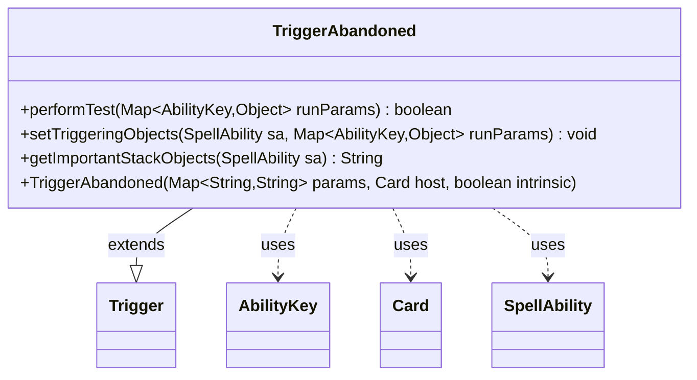

---
aliases:
  - TriggerAbandoned
tags:
  - java/class
  - module/forge-game
  - pkg/forge/game/trigger
fqn: forge.game.trigger.TriggerAbandoned
package: forge.game.trigger
module: forge-game
kind: Class
---

# TriggerAbandoned

**Package:** `forge.game.trigger` &nbsp; **Module:** `forge-game` &nbsp; **Kind:** Class



## Relationships
**Extends:**
- [[forge.game.trigger.Trigger|Trigger]]
**Uses:**
- [[forge.game.ability.AbilityKey|AbilityKey]]
- [[forge.game.card.Card|Card]]
- [[forge.game.spellability.SpellAbility|SpellAbility]]

## Design Description

TriggerAbandoned is a concrete trigger type within Forge's game engine that fires when a scheme card is abandoned. Extending the abstract `Trigger` base class, it specializes the standard trigger lifecycle for the Abandoned event: `performTest` validates the abandoned scheme against the trigger's `ValidCard` parameter using the `AbilityKey.Scheme` run-parameter, and `setTriggeringObjects` propagates that scheme onto the firing `SpellAbility` so downstream effects can reference it.

The class collaborates with `AbilityKey` to key into the run-parameter map, `Card` as its host, and `SpellAbility` as the ability being triggered. Its design intent is minimal and data-driven: it overrides only the hooks that differ from the base behavior, delegating construction to the superclass and returning an empty string from `getImportantStackObjects` since no stack description is needed. This keeps the Abandoned trigger a thin, declarative specialization consistent with Forge's broader trigger framework.

## Source
`forge-game/src/main/java/forge/game/trigger/TriggerAbandoned.java`

```java
/*
 * Forge: Play Magic: the Gathering.
 * Copyright (C) 2011  Forge Team
 *
 * This program is free software: you can redistribute it and/or modify
 * it under the terms of the GNU General Public License as published by
 * the Free Software Foundation, either version 3 of the License, or
 * (at your option) any later version.
 *
 * This program is distributed in the hope that it will be useful,
 * but WITHOUT ANY WARRANTY; without even the implied warranty of
 * MERCHANTABILITY or FITNESS FOR A PARTICULAR PURPOSE.  See the
 * GNU General Public License for more details.
 *
 * You should have received a copy of the GNU General Public License
 * along with this program.  If not, see <http://www.gnu.org/licenses/>.
 */
package forge.game.trigger;

import java.util.Map;

import forge.game.ability.AbilityKey;
import forge.game.card.Card;
import forge.game.spellability.SpellAbility;

/**
 * <p>
 * Trigger_Abandoned class.
 * </p>
 *
 * @author Forge
 */
public class TriggerAbandoned extends Trigger {

    /**
     * <p>
     * Constructor for Trigger_Abandoned.
     * </p>
     *
     * @param params
     *            a {@link java.util.HashMap} object.
     * @param host
     *            a {@link forge.game.card.Card} object.
     * @param intrinsic
     *            the intrinsic
     */
    public TriggerAbandoned(final Map<String, String> params, final Card host, final boolean intrinsic) {
        super(params, host, intrinsic);
    }

    /** {@inheritDoc}
     * @param runParams*/
    @Override
    public final boolean performTest(final Map<AbilityKey, Object> runParams) {
        if (!matchesValidParam("ValidCard", runParams.get(AbilityKey.Scheme))) {
            return false;
        }

        return true;
    }

    /** {@inheritDoc} */
    @Override
    public final void setTriggeringObjects(final SpellAbility sa, Map<AbilityKey, Object> runParams) {
        sa.setTriggeringObjectsFrom(runParams, AbilityKey.Scheme);
    }

    @Override
    public String getImportantStackObjects(SpellAbility sa) {
        return "";
    }
}
```

## Python
`forge/game/trigger/TriggerAbandoned.py`

```python
# Forge: Play Magic: the Gathering.
# Copyright (C) 2011  Forge Team
#
# This program is free software: you can redistribute it and/or modify
# it under the terms of the GNU General Public License as published by
# the Free Software Foundation, either version 3 of the License, or
# (at your option) any later version.
#
# This program is distributed in the hope that it will be useful,
# but WITHOUT ANY WARRANTY; without even the implied warranty of
# MERCHANTABILITY or FITNESS FOR A PARTICULAR PURPOSE.  See the
# GNU General Public License for more details.
#
# You should have received a copy of the GNU General Public License
# along with this program.  If not, see <http://www.gnu.org/licenses/>.

from forge.game.trigger.Trigger import Trigger
from forge.game.ability.AbilityKey import AbilityKey
from forge.game.card.Card import Card
from forge.game.spellability.SpellAbility import SpellAbility


class TriggerAbandoned(Trigger):
    """
    Trigger_Abandoned class.

    @author Forge
    """

    def __init__(self, params: dict[str, str], host: Card, intrinsic: bool):
        super().__init__(params, host, intrinsic)

    def performTest(self, runParams: dict[AbilityKey, object]) -> bool:
        if not self.matchesValidParam("ValidCard", runParams.get(AbilityKey.Scheme)):
            return False

        return True

    def setTriggeringObjects(self, sa: SpellAbility, runParams: dict[AbilityKey, object]) -> None:
        sa.setTriggeringObjectsFrom(runParams, AbilityKey.Scheme)

    def getImportantStackObjects(self, sa: SpellAbility) -> str:
        return ""
```
