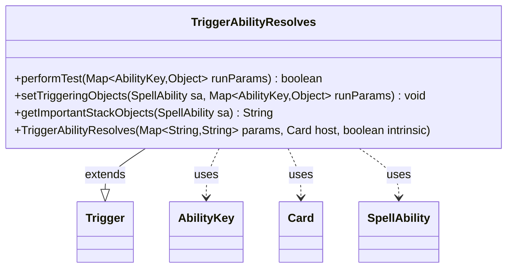

---
aliases:
  - TriggerAbilityResolves
tags:
  - java/class
  - module/forge-game
  - pkg/forge/game/trigger
fqn: forge.game.trigger.TriggerAbilityResolves
package: forge.game.trigger
module: forge-game
kind: Class
---

# TriggerAbilityResolves

**Package:** `forge.game.trigger` &nbsp; **Module:** `forge-game` &nbsp; **Kind:** Class



## Relationships
**Extends:**
- [[forge.game.trigger.Trigger|Trigger]]
**Uses:**
- [[forge.game.ability.AbilityKey|AbilityKey]]
- [[forge.game.card.Card|Card]]
- [[forge.game.spellability.SpellAbility|SpellAbility]]

## Design Description

TriggerAbilityResolves is a concrete trigger that fires whenever a spell or activated/triggered ability finishes resolving, allowing cards to respond to such resolution events. Extending the abstract `Trigger` base, it supplies the three hooks the trigger framework expects: `performTest` validates the resolving `SpellAbility` and its source `Card` against the optional `ValidSpellAbility` and `ValidSource` restrictions; `setTriggeringObjects` exposes the source and the resolved ability to the dependent ability via `AbilityKey` slots; and `getImportantStackObjects` produces a localized summary for the stack display.

It collaborates chiefly through the `AbilityKey`-keyed `runParams` map, reading the `SpellAbility` and `Card` that the game engine passes when the event occurs. The design keeps per-trigger logic minimal, delegating shared matching (`matchesValidParam`) and parameter storage to the superclass, and routes user-facing text through `Localizer` for translation. A defensive null-check with diagnostic output guards against a missing `SpellAbility`, reflecting practical robustness against malformed event parameters.

## Source
`forge-game/src/main/java/forge/game/trigger/TriggerAbilityResolves.java`

```java
/*
 * Forge: Play Magic: the Gathering.
 * Copyright (C) 2011  Forge Team
 *
 * This program is free software: you can redistribute it and/or modify
 * it under the terms of the GNU General Public License as published by
 * the Free Software Foundation, either version 3 of the License, or
 * (at your option) any later version.
 *
 * This program is distributed in the hope that it will be useful,
 * but WITHOUT ANY WARRANTY; without even the implied warranty of
 * MERCHANTABILITY or FITNESS FOR A PARTICULAR PURPOSE.  See the
 * GNU General Public License for more details.
 *
 * You should have received a copy of the GNU General Public License
 * along with this program.  If not, see <http://www.gnu.org/licenses/>.
 */
package forge.game.trigger;

import forge.game.ability.AbilityKey;
import forge.game.card.Card;
import forge.game.spellability.SpellAbility;
import forge.util.Localizer;

import java.util.Map;

public class TriggerAbilityResolves extends Trigger {

    public TriggerAbilityResolves(final Map<String, String> params, final Card host, final boolean intrinsic) {
        super(params, host, intrinsic);
    }

    /** {@inheritDoc}
     * @param runParams*/
    @Override
    public final boolean performTest(final Map<AbilityKey, Object> runParams) {
        final SpellAbility spellAbility = (SpellAbility) runParams.get(AbilityKey.SpellAbility);
        if (spellAbility == null) {
            System.out.println("TriggerAbilityResolves performTest found null spellAbility. runParams2 = " + runParams);
            return false;
        }

        if (!matchesValidParam("ValidSpellAbility", spellAbility)) {
            return false;
        }

        if (!matchesValidParam("ValidSource", runParams.get(AbilityKey.Card))) {
            return false;
        }

        return true;
    }

    /** {@inheritDoc} */
    @Override
    public final void setTriggeringObjects(final SpellAbility sa, Map<AbilityKey, Object> runParams) {
        sa.setTriggeringObject(AbilityKey.Source, runParams.get(AbilityKey.Card));
        sa.setTriggeringObjectsFrom(
                runParams,
                AbilityKey.SpellAbility);
    }

    @Override
    public String getImportantStackObjects(SpellAbility sa) {
        StringBuilder sb = new StringBuilder();
        sb.append(Localizer.getInstance().getMessage("lblSpellAbility")).append(": ").append(sa.getTriggeringObject(AbilityKey.SpellAbility));
        return sb.toString();
    }

}
```

## Python
`forge/game/trigger/TriggerAbilityResolves.py`

```python
from forge.game.trigger.Trigger import Trigger
from forge.game.ability.AbilityKey import AbilityKey
from forge.game.card.Card import Card
from forge.game.spellability.SpellAbility import SpellAbility
from forge.util.Localizer import Localizer

from typing import Map


class TriggerAbilityResolves(Trigger):

    def __init__(self, params: dict[str, str], host: Card, intrinsic: bool):
        super().__init__(params, host, intrinsic)

    def performTest(self, runParams: dict[AbilityKey, object]) -> bool:
        spellAbility = runParams.get(AbilityKey.SpellAbility)
        if spellAbility is None:
            print("TriggerAbilityResolves performTest found null spellAbility. runParams2 = " + str(runParams))
            return False

        if not self.matchesValidParam("ValidSpellAbility", spellAbility):
            return False

        if not self.matchesValidParam("ValidSource", runParams.get(AbilityKey.Card)):
            return False

        return True

    def setTriggeringObjects(self, sa: SpellAbility, runParams: dict[AbilityKey, object]) -> None:
        sa.setTriggeringObject(AbilityKey.Source, runParams.get(AbilityKey.Card))
        sa.setTriggeringObjectsFrom(
            runParams,
            AbilityKey.SpellAbility)

    def getImportantStackObjects(self, sa: SpellAbility) -> str:
        sb = []
        sb.append(Localizer.getInstance().getMessage("lblSpellAbility"))
        sb.append(": ")
        sb.append(str(sa.getTriggeringObject(AbilityKey.SpellAbility)))
        return "".join(sb)
```
