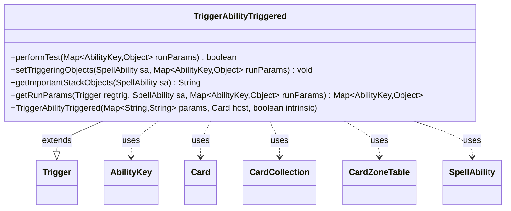

---
aliases:
  - TriggerAbilityTriggered
tags:
  - java/class
  - module/forge-game
  - pkg/forge/game/trigger
fqn: forge.game.trigger.TriggerAbilityTriggered
package: forge.game.trigger
module: forge-game
kind: Class
---

# TriggerAbilityTriggered

**Package:** `forge.game.trigger`   **Module:** `forge-game`   **Kind:** Class



## Relationships
**Extends:**
- [[forge.game.trigger.Trigger|Trigger]]
**Uses:**
- [[forge.game.ability.AbilityKey|AbilityKey]]
- [[forge.game.card.Card|Card]]
- [[forge.game.card.CardCollection|CardCollection]]
- [[forge.game.card.CardZoneTable|CardZoneTable]]
- [[forge.game.spellability.SpellAbility|SpellAbility]]

## Design Description

TriggerAbilityTriggered is a concrete trigger that fires when a spell or ability is put on the stack or "triggered," letting card scripts respond to such events. Extending the abstract Trigger base class, it implements performTest to gate firing against script parameters—ValidMode, ValidDestination, ValidSpellAbility, ValidSource, ValidCause, and TriggeredOwnAbility—reading event data from the AbilityKey-keyed runParams map. setTriggeringObjects exposes the originating SpellAbility, its host Card, and the cause to the responding ability, while getImportantStackObjects supplies a localized description for the stack display.

Notably, the static getRunParams normalizes heterogeneous source events—ChangesZone, ChangesZoneAll, Attacks, and AttackersDeclared variants—into a uniform Cause/Destination representation, drawing on CardCollection, CardZoneTable, and CardLists validation so that diverse game events can be matched through one consistent triggering interface.

## Source
`forge-game/src/main/java/forge/game/trigger/TriggerAbilityTriggered.java`

```java
/*
 * Forge: Play Magic: the Gathering.
 * Copyright (C) 2011  Forge Team
 *
 * This program is free software: you can redistribute it and/or modify
 * it under the terms of the GNU General Public License as published by
 * the Free Software Foundation, either version 3 of the License, or
 * (at your option) any later version.
 *
 * This program is distributed in the hope that it will be useful,
 * but WITHOUT ANY WARRANTY; without even the implied warranty of
 * MERCHANTABILITY or FITNESS FOR A PARTICULAR PURPOSE.  See the
 * GNU General Public License for more details.
 *
 * You should have received a copy of the GNU General Public License
 * along with this program.  If not, see <http://www.gnu.org/licenses/>.
 */
package forge.game.trigger;

import com.google.common.collect.Iterables;
import forge.game.ability.AbilityKey;
import forge.game.card.Card;
import forge.game.card.CardCollection;
import forge.game.card.CardLists;
import forge.game.card.CardZoneTable;
import forge.game.spellability.SpellAbility;
import forge.util.Localizer;
import org.apache.commons.lang3.StringUtils;

import java.util.*;

/**
 * <p>
 * TriggerAbilityTriggered class.
 * </p>
 *
 * @author Forge
 * @version $Id$
 */
public class TriggerAbilityTriggered extends Trigger {

    public TriggerAbilityTriggered(final Map<String, String> params, final Card host, final boolean intrinsic) {
        super(params, host, intrinsic);
    }

    /** {@inheritDoc}
     * @param runParams*/
    @Override
    public final boolean performTest(final Map<AbilityKey, Object> runParams) {
        final SpellAbility spellAbility = (SpellAbility) runParams.get(AbilityKey.SpellAbility);
        if (spellAbility == null) {
            System.out.println("TriggerAbilityTriggered performTest encountered spellAbility == null. runParams2 = " + runParams);
            return false;
        }
        final Card source = spellAbility.getHostCard();
        @SuppressWarnings("unchecked")
        final Iterable<Card> causes = (Iterable<Card>) runParams.get(AbilityKey.Cause);

        if (hasParam("ValidMode")) {
            List<String> validModes = Arrays.asList(getParam("ValidMode").split(","));
            String mode = (String) runParams.get(AbilityKey.Mode);
            if (!validModes.contains(mode)) {
                return false;
            }
        }

        if (hasParam("ValidDestination")) {
            List<String> validDestinations = Arrays.asList(getParam("ValidDestination").split(","));
            List<String> destinations = Arrays.asList(((String)runParams.get(AbilityKey.Destination)).split(","));
            if (Collections.disjoint(validDestinations, destinations)) {
                return false;
            }
        }

        if (!matchesValidParam("ValidSpellAbility", spellAbility)) {
            return false;
        }

        if (!matchesValidParam("ValidSource", source)) {
            return false;
        }

        if (!matchesValidParam("ValidCause", causes)) {
            return false;
        }

        if (hasParam("TriggeredOwnAbility") && !Iterables.contains(causes, source)) {
            return false;
        }

        return true;
    }

    /** {@inheritDoc} */
    @Override
    public final void setTriggeringObjects(final SpellAbility sa, Map<AbilityKey, Object> runParams) {
        final SpellAbility triggeredSA = (SpellAbility) runParams.get(AbilityKey.SpellAbility);
        sa.setTriggeringObject(AbilityKey.Source, triggeredSA.getHostCard());
        sa.setTriggeringObjectsFrom(
                runParams,
                AbilityKey.SpellAbility,
                AbilityKey.Cause);
    }

    @Override
    public String getImportantStackObjects(SpellAbility sa) {
        StringBuilder sb = new StringBuilder();
        sb.append(Localizer.getInstance().getMessage("lblSpellAbility")).append(": ").append(sa.getTriggeringObject(AbilityKey.SpellAbility));
        return sb.toString();
    }

    public static Map<AbilityKey, Object> getRunParams(Trigger regtrig, SpellAbility sa, Map<AbilityKey, Object> runParams) {
        Map<AbilityKey, Object> newRunParams = AbilityKey.newMap();
        newRunParams.put(AbilityKey.Mode, regtrig.getMode().toString());
        if (regtrig.getMode() == TriggerType.ChangesZone) {
            newRunParams.put(AbilityKey.Destination, runParams.getOrDefault(AbilityKey.Destination, ""));
            newRunParams.put(AbilityKey.Cause, List.of(runParams.get(AbilityKey.Card)));
        } else if (regtrig.getMode() == TriggerType.ChangesZoneAll) {
            final CardZoneTable table = (CardZoneTable) runParams.get(AbilityKey.Cards);
            newRunParams.put(AbilityKey.Destination, StringUtils.join(table.columnKeySet(), ","));
            newRunParams.put(AbilityKey.Cause, table.allCards());
        } else if (regtrig.getMode() == TriggerType.Attacks) {
            newRunParams.put(AbilityKey.Cause, List.of(runParams.get(AbilityKey.Attacker)));
        } else if (regtrig.getMode() == TriggerType.AttackersDeclared || regtrig.getMode() == TriggerType.AttackersDeclaredOneTarget) {
            CardCollection attackers = (CardCollection) runParams.get(AbilityKey.Attackers);
            if (regtrig.hasParam("ValidAttackers")) {
                attackers = CardLists.getValidCards(attackers, regtrig.getParam("ValidAttackers"), regtrig.getHostCard().getController(), regtrig.getHostCard(), regtrig);
            }
            newRunParams.put(AbilityKey.Cause, attackers);
        }

        newRunParams.put(AbilityKey.SpellAbility, sa);

        return newRunParams;
    }
}
```

## Python
`forge/game/trigger/TriggerAbilityTriggered.py`

```python
from forge.game.trigger.Trigger import Trigger
from forge.game.trigger.TriggerType import TriggerType
from forge.game.ability.AbilityKey import AbilityKey
from forge.game.card.Card import Card
from forge.game.card.CardCollection import CardCollection
from forge.game.card.CardLists import CardLists
from forge.game.card.CardZoneTable import CardZoneTable
from forge.game.spellability.SpellAbility import SpellAbility
from forge.util.Localizer import Localizer


class TriggerAbilityTriggered(Trigger):
    """
    TriggerAbilityTriggered class.

    @author Forge
    @version $Id$
    """

    def __init__(self, params: dict[str, str], host: Card, intrinsic: bool):
        super().__init__(params, host, intrinsic)

    def performTest(self, runParams: dict[AbilityKey, object]) -> bool:
        spellAbility = runParams.get(AbilityKey.SpellAbility)
        if spellAbility is None:
            print("TriggerAbilityTriggered performTest encountered spellAbility == null. runParams2 = " + str(runParams))
            return False
        source = spellAbility.getHostCard()
        causes = runParams.get(AbilityKey.Cause)

        if self.hasParam("ValidMode"):
            validModes = self.getParam("ValidMode").split(",")
            mode = runParams.get(AbilityKey.Mode)
            if mode not in validModes:
                return False

        if self.hasParam("ValidDestination"):
            validDestinations = self.getParam("ValidDestination").split(",")
            destinations = runParams.get(AbilityKey.Destination).split(",")
            if set(validDestinations).isdisjoint(destinations):
                return False

        if not self.matchesValidParam("ValidSpellAbility", spellAbility):
            return False

        if not self.matchesValidParam("ValidSource", source):
            return False

        if not self.matchesValidParam("ValidCause", causes):
            return False

        if self.hasParam("TriggeredOwnAbility") and source not in causes:
            return False

        return True

    def setTriggeringObjects(self, sa: SpellAbility, runParams: dict[AbilityKey, object]) -> None:
        triggeredSA = runParams.get(AbilityKey.SpellAbility)
        sa.setTriggeringObject(AbilityKey.Source, triggeredSA.getHostCard())
        sa.setTriggeringObjectsFrom(
            runParams,
            AbilityKey.SpellAbility,
            AbilityKey.Cause)

    def getImportantStackObjects(self, sa: SpellAbility) -> str:
        sb = []
        sb.append(Localizer.getInstance().getMessage("lblSpellAbility"))
        sb.append(": ")
        sb.append(str(sa.getTriggeringObject(AbilityKey.SpellAbility)))
        return "".join(sb)

    @staticmethod
    def getRunParams(regtrig: Trigger, sa: SpellAbility, runParams: dict[AbilityKey, object]) -> dict[AbilityKey, object]:
        newRunParams = AbilityKey.newMap()
        newRunParams[AbilityKey.Mode] = regtrig.getMode().toString()
        if regtrig.getMode() == TriggerType.ChangesZone:
            newRunParams[AbilityKey.Destination] = runParams.get(AbilityKey.Destination, "")
            newRunParams[AbilityKey.Cause] = [runParams.get(AbilityKey.Card)]
        elif regtrig.getMode() == TriggerType.ChangesZoneAll:
            table = runParams.get(AbilityKey.Cards)
            newRunParams[AbilityKey.Destination] = ",".join(table.columnKeySet())
            newRunParams[AbilityKey.Cause] = table.allCards()
        elif regtrig.getMode() == TriggerType.Attacks:
            newRunParams[AbilityKey.Cause] = [runParams.get(AbilityKey.Attacker)]
        elif regtrig.getMode() == TriggerType.AttackersDeclared or regtrig.getMode() == TriggerType.AttackersDeclaredOneTarget:
            attackers = runParams.get(AbilityKey.Attackers)
            if regtrig.hasParam("ValidAttackers"):
                attackers = CardLists.getValidCards(attackers, regtrig.getParam("ValidAttackers"), regtrig.getHostCard().getController(), regtrig.getHostCard(), regtrig)
            newRunParams[AbilityKey.Cause] = attackers

        newRunParams[AbilityKey.SpellAbility] = sa

        return newRunParams
```
