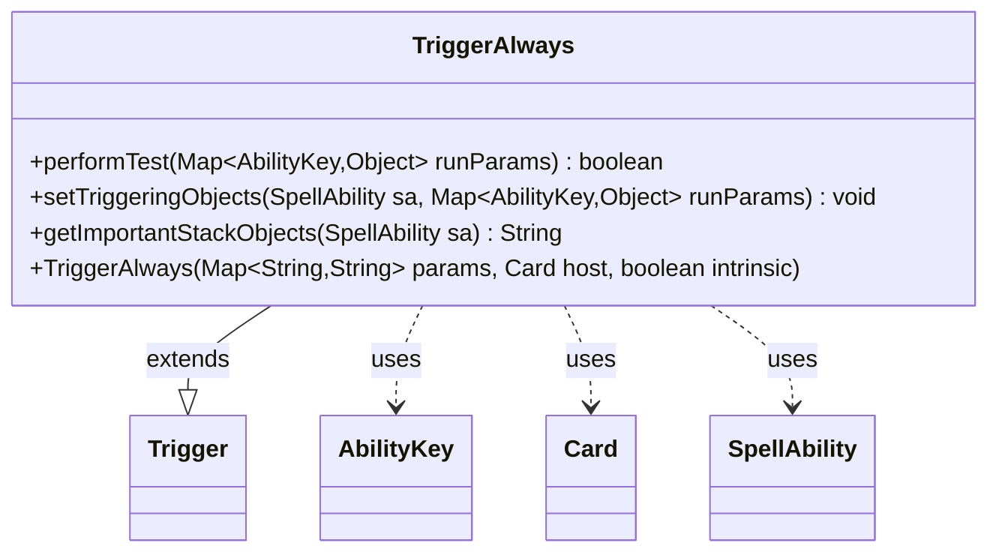

---
aliases:
  - TriggerAlways
tags:
  - java/class
  - module/forge-game
  - pkg/forge/game/trigger
fqn: forge.game.trigger.TriggerAlways
package: forge.game.trigger
module: forge-game
kind: Class
---

# TriggerAlways

**Package:** `forge.game.trigger`   **Module:** `forge-game`   **Kind:** Class



## Relationships
**Extends:**
- [[forge.game.trigger.Trigger|Trigger]]
**Uses:**
- [[forge.game.ability.AbilityKey|AbilityKey]]
- [[forge.game.card.Card|Card]]
- [[forge.game.spellability.SpellAbility|SpellAbility]]

## Design Description

Output one note's worth of work — here's the design description.

The `TriggerAlways` class is a concrete trigger type that fires unconditionally, modeling Magic effects whose triggered ability has no gating condition. Extending the abstract `Trigger` base class, it supplies the minimal behavior required of the hierarchy: `performTest` always returns `true`, so the trigger's condition is perpetually satisfied, while `setTriggeringObjects` is a deliberate no-op since no contextual objects need recording. Its constructor simply forwards the parameter map, host `Card`, and intrinsic flag to the superclass. Collaborating with `AbilityKey`-keyed run-parameter maps and `SpellAbility` during evaluation, it returns an empty string from `getImportantStackObjects`, reflecting that it contributes nothing distinctive to stack identity. The design intent is a lightweight, always-on specialization that lets the trigger framework treat "fires whenever" cases through the same polymorphic interface as conditional triggers.

## Source
`forge-game/src/main/java/forge/game/trigger/TriggerAlways.java`

```java
/*
 * Forge: Play Magic: the Gathering.
 * Copyright (C) 2011  Forge Team
 *
 * This program is free software: you can redistribute it and/or modify
 * it under the terms of the GNU General Public License as published by
 * the Free Software Foundation, either version 3 of the License, or
 * (at your option) any later version.
 * 
 * This program is distributed in the hope that it will be useful,
 * but WITHOUT ANY WARRANTY; without even the implied warranty of
 * MERCHANTABILITY or FITNESS FOR A PARTICULAR PURPOSE.  See the
 * GNU General Public License for more details.
 * 
 * You should have received a copy of the GNU General Public License
 * along with this program.  If not, see <http://www.gnu.org/licenses/>.
 */
package forge.game.trigger;

import java.util.Map;

import forge.game.ability.AbilityKey;
import forge.game.card.Card;
import forge.game.spellability.SpellAbility;

/**
 * <p>
 * Trigger_Always class.
 * </p>
 * 
 * @author Forge
 * @version $Id$
 */
public class TriggerAlways extends Trigger {

    /**
     * <p>
     * Constructor for Trigger_Always.
     * </p>
     * 
     * @param params
     *            a {@link java.util.HashMap} object.
     * @param host
     *            a {@link forge.game.card.Card} object.
     * @param intrinsic
     *            the intrinsic
     */
    public TriggerAlways(final Map<String, String> params, final Card host, final boolean intrinsic) {
        super(params, host, intrinsic);
    }

    /** {@inheritDoc} */
    @Override
    public final boolean performTest(final Map<AbilityKey, Object> runParams) {
        return true;
    }

    /** {@inheritDoc} */
    @Override
    public void setTriggeringObjects(final SpellAbility sa, Map<AbilityKey, Object> runParams) {
    }

    @Override
    public String getImportantStackObjects(SpellAbility sa) {
        return "";
    }
}
```

## Python
`forge/game/trigger/TriggerAlways.py`

```python
from forge.game.trigger.Trigger import Trigger
from forge.game.ability.AbilityKey import AbilityKey
from forge.game.card.Card import Card
from forge.game.spellability.SpellAbility import SpellAbility


class TriggerAlways(Trigger):

    def __init__(self, params: dict[str, str], host: Card, intrinsic: bool):
        super().__init__(params, host, intrinsic)

    def performTest(self, runParams: dict[AbilityKey, object]) -> bool:
        return True

    def setTriggeringObjects(self, sa: SpellAbility, runParams: dict[AbilityKey, object]) -> None:
        pass

    def getImportantStackObjects(self, sa: SpellAbility) -> str:
        return ""
```
