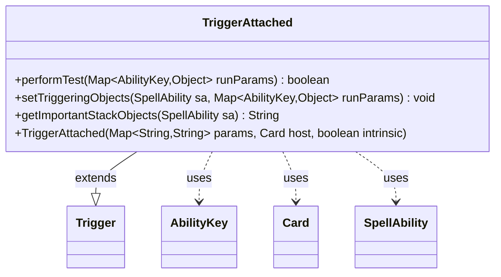

---
aliases:
  - TriggerAttached
tags:
  - java/class
  - module/forge-game
  - pkg/forge/game/trigger
fqn: forge.game.trigger.TriggerAttached
package: forge.game.trigger
module: forge-game
kind: Class
---

# TriggerAttached

**Package:** `forge.game.trigger` &nbsp; **Module:** `forge-game` &nbsp; **Kind:** Class



## Relationships
**Extends:**
- [[forge.game.trigger.Trigger|Trigger]]
**Uses:**
- [[forge.game.ability.AbilityKey|AbilityKey]]
- [[forge.game.card.Card|Card]]
- [[forge.game.spellability.SpellAbility|SpellAbility]]

## Design Description

TriggerAttached is a concrete trigger that fires on attachment events (auras or equipment becoming attached to a permanent). Extending the abstract Trigger base class, it specializes the trigger framework for the attach domain: performTest gates firing by validating the AttachSource and AttachTarget run parameters against the trigger's ValidSource, ValidTarget, and TargetRelativeToSource conditions, while setTriggeringObjects maps those attach-specific keys onto the generic Source and Target slots that downstream SpellAbility logic consumes. It collaborates with AbilityKey as the typed lookup into the runParams map, Card and SpellAbility as the runtime objects it inspects and populates, and overrides getImportantStackObjects to surface a localized "attachee" label for the stack. The design keeps each trigger subclass responsible only for translating its event's parameters into the engine's common triggering vocabulary, delegating shared matching and lifecycle behavior to the supertype.

## Source
`forge-game/src/main/java/forge/game/trigger/TriggerAttached.java`

```java
/*
 * Forge: Play Magic: the Gathering.
 * Copyright (C) 2011  Forge Team
 *
 * This program is free software: you can redistribute it and/or modify
 * it under the terms of the GNU General Public License as published by
 * the Free Software Foundation, either version 3 of the License, or
 * (at your option) any later version.
 * 
 * This program is distributed in the hope that it will be useful,
 * but WITHOUT ANY WARRANTY; without even the implied warranty of
 * MERCHANTABILITY or FITNESS FOR A PARTICULAR PURPOSE.  See the
 * GNU General Public License for more details.
 * 
 * You should have received a copy of the GNU General Public License
 * along with this program.  If not, see <http://www.gnu.org/licenses/>.
 */
package forge.game.trigger;

import java.util.Map;

import forge.game.ability.AbilityKey;
import forge.game.card.Card;
import forge.game.spellability.SpellAbility;
import forge.util.Localizer;

/**
 * <p>
 * Trigger_Attached class.
 * </p>
 * 
 * @author Forge
 * @version $Id: TriggerAttached.java 17802 2012-10-31 08:05:14Z Max mtg $
 */
public class TriggerAttached extends Trigger {

    /**
     * <p>
     * Constructor for Trigger_Attached.
     * </p>
     * 
     * @param params
     *            a {@link java.util.HashMap} object.
     * @param host
     *            a {@link forge.game.card.Card} object.
     * @param intrinsic
     *            the intrinsic
     */
    public TriggerAttached(final Map<String, String> params, final Card host, final boolean intrinsic) {
        super(params, host, intrinsic);
    }

    /** {@inheritDoc}
     * @param runParams*/
    @Override
    public final boolean performTest(final Map<AbilityKey, Object> runParams) {
        if (!matchesValidParam("ValidSource", runParams.get(AbilityKey.AttachSource))) {
            return false;
        }
        if (!matchesValidParam("ValidTarget", runParams.get(AbilityKey.AttachTarget))) {
            return false;
        }
        if (!matchesValidParam("TargetRelativeToSource", runParams.get(AbilityKey.AttachTarget),
                (Card) runParams.get(AbilityKey.AttachSource))) {
            return false;
        }
        
        return true;
    }

    /** {@inheritDoc} */
    @Override
    public final void setTriggeringObjects(final SpellAbility sa, Map<AbilityKey, Object> runParams) {
        sa.setTriggeringObject(AbilityKey.Source, runParams.get(AbilityKey.AttachSource));
        sa.setTriggeringObject(AbilityKey.Target, runParams.get(AbilityKey.AttachTarget));
    }

    @Override
    public String getImportantStackObjects(SpellAbility sa) {
        StringBuilder sb = new StringBuilder();
        sb.append(Localizer.getInstance().getMessage("lblAttachee")).append(": ").append(sa.getTriggeringObject(AbilityKey.Target));
        return sb.toString();
    }
}
```

## Python
`forge/game/trigger/TriggerAttached.py`

```python
from typing import Map

from forge.game.trigger.Trigger import Trigger
from forge.game.ability.AbilityKey import AbilityKey
from forge.game.card.Card import Card
from forge.game.spellability.SpellAbility import SpellAbility
from forge.util.Localizer import Localizer


class TriggerAttached(Trigger):
    """
    Trigger_Attached class.

    @author Forge
    @version $Id: TriggerAttached.java 17802 2012-10-31 08:05:14Z Max mtg $
    """

    def __init__(self, params: dict[str, str], host: Card, intrinsic: bool):
        """
        Constructor for Trigger_Attached.

        :param params: a dict object.
        :param host: a forge.game.card.Card object.
        :param intrinsic: the intrinsic
        """
        super().__init__(params, host, intrinsic)

    def performTest(self, runParams: dict[AbilityKey, object]) -> bool:
        if not self.matchesValidParam("ValidSource", runParams.get(AbilityKey.AttachSource)):
            return False
        if not self.matchesValidParam("ValidTarget", runParams.get(AbilityKey.AttachTarget)):
            return False
        if not self.matchesValidParam("TargetRelativeToSource", runParams.get(AbilityKey.AttachTarget),
                runParams.get(AbilityKey.AttachSource)):
            return False

        return True

    def setTriggeringObjects(self, sa: SpellAbility, runParams: dict[AbilityKey, object]) -> None:
        sa.setTriggeringObject(AbilityKey.Source, runParams.get(AbilityKey.AttachSource))
        sa.setTriggeringObject(AbilityKey.Target, runParams.get(AbilityKey.AttachTarget))

    def getImportantStackObjects(self, sa: SpellAbility) -> str:
        sb = []
        sb.append(Localizer.getInstance().getMessage("lblAttachee"))
        sb.append(": ")
        sb.append(str(sa.getTriggeringObject(AbilityKey.Target)))
        return "".join(sb)
```
