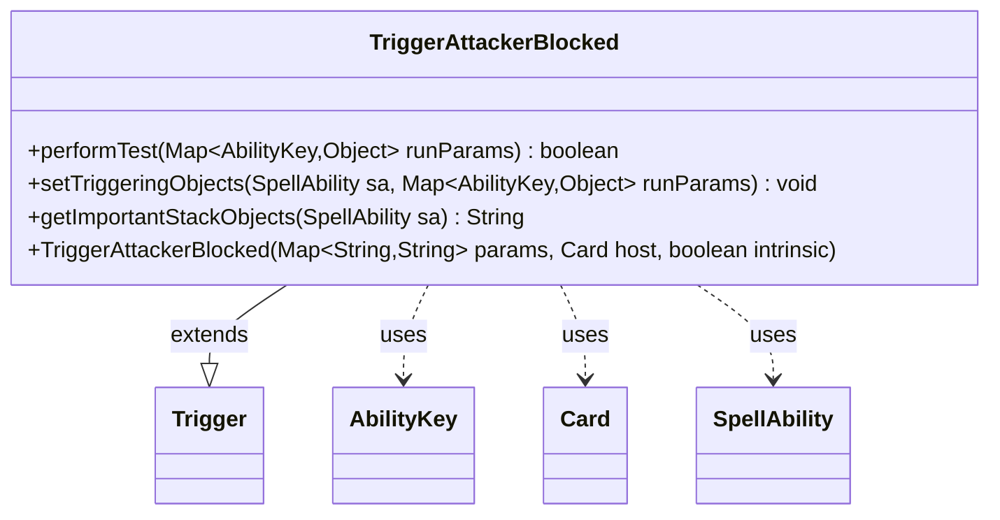

---
aliases:
  - TriggerAttackerBlocked
tags:
  - java/class
  - module/forge-game
  - pkg/forge/game/trigger
fqn: forge.game.trigger.TriggerAttackerBlocked
package: forge.game.trigger
module: forge-game
kind: Class
---

# TriggerAttackerBlocked

**Package:** `forge.game.trigger` &nbsp; **Module:** `forge-game` &nbsp; **Kind:** Class



## Relationships
**Extends:**
- [[forge.game.trigger.Trigger|Trigger]]
**Uses:**
- [[forge.game.ability.AbilityKey|AbilityKey]]
- [[forge.game.card.Card|Card]]
- [[forge.game.spellability.SpellAbility|SpellAbility]]

## Design Description

`TriggerAttackerBlocked` is a concrete trigger that fires whenever an attacking creature becomes blocked, encapsulating the condition-matching and event-binding logic for that combat moment. As a subclass of `Trigger`, it implements the framework's template methods: `performTest` validates the triggering attacker against the `ValidCard` parameter and optionally constrains the blockers via `ValidBlocker`/`ValidBlockerAmount`, using `CardLists` and `Expressions` to count and compare matching cards; `setTriggeringObjects` exposes the attacker, blockers, defender, and defending player to the resulting `SpellAbility`.

The design reflects Forge's data-driven trigger system: combat state arrives through an `AbilityKey`-keyed `runParams` map rather than typed fields, keeping the trigger decoupled from the combat engine. Parameters are read lazily and defaulted (`GE1`), and `getImportantStackObjects` builds a localized, human-readable summary of the attacker and blocker count for stack display, separating presentation from the matching logic.

## Source
`forge-game/src/main/java/forge/game/trigger/TriggerAttackerBlocked.java`

```java
/*
 * Forge: Play Magic: the Gathering.
 * Copyright (C) 2011  Forge Team
 *
 * This program is free software: you can redistribute it and/or modify
 * it under the terms of the GNU General Public License as published by
 * the Free Software Foundation, either version 3 of the License, or
 * (at your option) any later version.
 * 
 * This program is distributed in the hope that it will be useful,
 * but WITHOUT ANY WARRANTY; without even the implied warranty of
 * MERCHANTABILITY or FITNESS FOR A PARTICULAR PURPOSE.  See the
 * GNU General Public License for more details.
 * 
 * You should have received a copy of the GNU General Public License
 * along with this program.  If not, see <http://www.gnu.org/licenses/>.
 */
package forge.game.trigger;

import java.util.Map;

import com.google.common.collect.Iterables;
import forge.game.ability.AbilityKey;
import forge.game.ability.AbilityUtils;
import forge.game.card.Card;
import forge.game.card.CardLists;
import forge.game.spellability.SpellAbility;
import forge.util.Expressions;
import forge.util.Localizer;

/**
 * <p>
 * Trigger_AttackerBlocked class.
 * </p>
 * 
 * @author Forge
 * @version $Id$
 */
public class TriggerAttackerBlocked extends Trigger {

    /**
     * <p>
     * Constructor for Trigger_AttackerBlocked.
     * </p>
     * 
     * @param params
     *            a {@link java.util.HashMap} object.
     * @param host
     *            a {@link forge.game.card.Card} object.
     * @param intrinsic
     *            the intrinsic
     */
    public TriggerAttackerBlocked(final Map<String, String> params, final Card host, final boolean intrinsic) {
        super(params, host, intrinsic);
    }

    /** {@inheritDoc}
     * @param runParams*/
    @Override
    public final boolean performTest(final Map<AbilityKey, Object> runParams) {
        if (!matchesValidParam("ValidCard", runParams.get(AbilityKey.Attacker))) {
            return false;
        }

        if (hasParam("ValidBlocker")) {
            String param = getParamOrDefault("ValidBlockerAmount", "GE1");
            int attackers = CardLists.getValidCardCount((Iterable<Card>) runParams.get(AbilityKey.Blockers), getParam("ValidBlocker"), getHostCard().getController(), getHostCard(), this);
            int amount = AbilityUtils.calculateAmount(getHostCard(), param.substring(2), this);
            if (!Expressions.compare(attackers, param, amount)) {
                return false;
            }
        }

        return true;
    }

    /** {@inheritDoc} */
    @Override
    public final void setTriggeringObjects(final SpellAbility sa, Map<AbilityKey, Object> runParams) {
        sa.setTriggeringObjectsFrom(
            runParams,
            AbilityKey.Attacker,
            AbilityKey.Blockers,
            AbilityKey.Defender,
            AbilityKey.DefendingPlayer
        );
    }

    @Override
    public String getImportantStackObjects(SpellAbility sa) {
        StringBuilder sb = new StringBuilder();
        sb.append(Localizer.getInstance().getMessage("lblAttacker")).append(": ").append(sa.getTriggeringObject(AbilityKey.Attacker)).append(", ");
        sb.append(Localizer.getInstance().getMessage("lblNumberBlockers")).append(": ").append(Iterables.size((Iterable<Card>) sa.getTriggeringObject(AbilityKey.Blockers)));
        return sb.toString();
    }
}
```

## Python
`forge/game/trigger/TriggerAttackerBlocked.py`

```python
from typing import Map

from forge.game.ability.AbilityKey import AbilityKey
from forge.game.ability.AbilityUtils import AbilityUtils
from forge.game.card.Card import Card
from forge.game.card.CardLists import CardLists
from forge.game.spellability.SpellAbility import SpellAbility
from forge.util.Expressions import Expressions
from forge.util.Localizer import Localizer
from forge.game.trigger.Trigger import Trigger


class TriggerAttackerBlocked(Trigger):
    """
    Trigger_AttackerBlocked class.

    @author Forge
    @version $Id$
    """

    def __init__(self, params: dict[str, str], host: Card, intrinsic: bool):
        super().__init__(params, host, intrinsic)

    def performTest(self, runParams: dict[AbilityKey, object]) -> bool:
        if not self.matchesValidParam("ValidCard", runParams.get(AbilityKey.Attacker)):
            return False

        if self.hasParam("ValidBlocker"):
            param = self.getParamOrDefault("ValidBlockerAmount", "GE1")
            attackers = CardLists.getValidCardCount(runParams.get(AbilityKey.Blockers), self.getParam("ValidBlocker"), self.getHostCard().getController(), self.getHostCard(), self)
            amount = AbilityUtils.calculateAmount(self.getHostCard(), param[2:], self)
            if not Expressions.compare(attackers, param, amount):
                return False

        return True

    def setTriggeringObjects(self, sa: SpellAbility, runParams: dict[AbilityKey, object]) -> None:
        sa.setTriggeringObjectsFrom(
            runParams,
            AbilityKey.Attacker,
            AbilityKey.Blockers,
            AbilityKey.Defender,
            AbilityKey.DefendingPlayer
        )

    def getImportantStackObjects(self, sa: SpellAbility) -> str:
        sb = []
        sb.append(Localizer.getInstance().getMessage("lblAttacker"))
        sb.append(": ")
        sb.append(str(sa.getTriggeringObject(AbilityKey.Attacker)))
        sb.append(", ")
        sb.append(Localizer.getInstance().getMessage("lblNumberBlockers"))
        sb.append(": ")
        sb.append(str(Iterables.size(sa.getTriggeringObject(AbilityKey.Blockers))))
        return "".join(sb)
```
