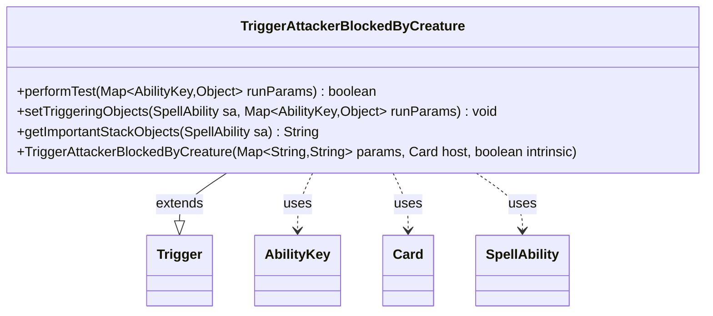

---
aliases:
  - TriggerAttackerBlockedByCreature
tags:
  - java/class
  - module/forge-game
  - pkg/forge/game/trigger
fqn: forge.game.trigger.TriggerAttackerBlockedByCreature
package: forge.game.trigger
module: forge-game
kind: Class
---

# TriggerAttackerBlockedByCreature

**Package:** `forge.game.trigger` &nbsp; **Module:** `forge-game` &nbsp; **Kind:** Class



## Relationships
**Extends:**
- [[forge.game.trigger.Trigger|Trigger]]
**Uses:**
- [[forge.game.ability.AbilityKey|AbilityKey]]
- [[forge.game.card.Card|Card]]
- [[forge.game.spellability.SpellAbility|SpellAbility]]

## Source
`forge-game/src/main/java/forge/game/trigger/TriggerAttackerBlockedByCreature.java`

```java
/*
 * Forge: Play Magic: the Gathering.
 * Copyright (C) 2011  Forge Team
 *
 * This program is free software: you can redistribute it and/or modify
 * it under the terms of the GNU General Public License as published by
 * the Free Software Foundation, either version 3 of the License, or
 * (at your option) any later version.
 * 
 * This program is distributed in the hope that it will be useful,
 * but WITHOUT ANY WARRANTY; without even the implied warranty of
 * MERCHANTABILITY or FITNESS FOR A PARTICULAR PURPOSE.  See the
 * GNU General Public License for more details.
 * 
 * You should have received a copy of the GNU General Public License
 * along with this program.  If not, see <http://www.gnu.org/licenses/>.
 */
package forge.game.trigger;

import java.util.Map;

import forge.game.ability.AbilityKey;
import forge.game.card.Card;
import forge.game.spellability.SpellAbility;
import forge.util.Localizer;

/**
 * <p>
 * Trigger_AttackerBlocked class. Should trigger once for each blocking creature.
 * </p>
 * 
 * @author Forge
 * @version $Id: TriggerAttackerBlocked.java 24769 2014-02-09 13:56:04Z Hellfish $
 */
public class TriggerAttackerBlockedByCreature extends Trigger {

    /**
     * <p>
     * Constructor for Trigger_AttackerBlocked.
     * </p>
     * 
     * @param params
     *            a {@link java.util.HashMap} object.
     * @param host
     *            a {@link forge.game.card.Card} object.
     * @param intrinsic
     *            the intrinsic
     */
    public TriggerAttackerBlockedByCreature(final Map<String, String> params, final Card host, final boolean intrinsic) {
        super(params, host, intrinsic);
    }

    /** {@inheritDoc}
     * @param runParams*/
    @Override
    public final boolean performTest(final Map<AbilityKey, Object> runParams) {
        final Object a = runParams.get(AbilityKey.Attacker),
                b = runParams.get(AbilityKey.Blocker);

        final Card attacker = (Card) a,
                blocker = (Card) b;
        if (hasParam("ValidCard")) {
            final String validCard = getParam("ValidCard");
            if (validCard.equals("LessPowerThanBlocker")) {
                if (attacker.getNetPower() >= blocker.getNetPower()) {
                    return false;
                }
            } else if (!matchesValid(attacker, validCard.split(","))) {
                return false;
            }
        }

        if (hasParam("ValidBlocker")) {
            final String validBlocker = getParam("ValidBlocker");
            if (validBlocker.equals("LessPowerThanAttacker")) {
                if (blocker.getNetPower() >= attacker.getNetPower()) {
                    return false;
                }
            } else if (!matchesValid(blocker, validBlocker.split(","))) {
                return false;
            }
        }

        return true;
    }

    /** {@inheritDoc} */
    @Override
    public final void setTriggeringObjects(final SpellAbility sa, Map<AbilityKey, Object> runParams) {
        sa.setTriggeringObjectsFrom(runParams, AbilityKey.Attacker, AbilityKey.Blocker);
    }

    @Override
    public String getImportantStackObjects(SpellAbility sa) {
        StringBuilder sb = new StringBuilder();
        sb.append(Localizer.getInstance().getMessage("lblAttacker")).append(": ").append(sa.getTriggeringObject(AbilityKey.Attacker)).append(", ");
        sb.append(Localizer.getInstance().getMessage("lblBlocker")).append(": ").append(sa.getTriggeringObject(AbilityKey.Blocker));
        return sb.toString();
    }
}
```
