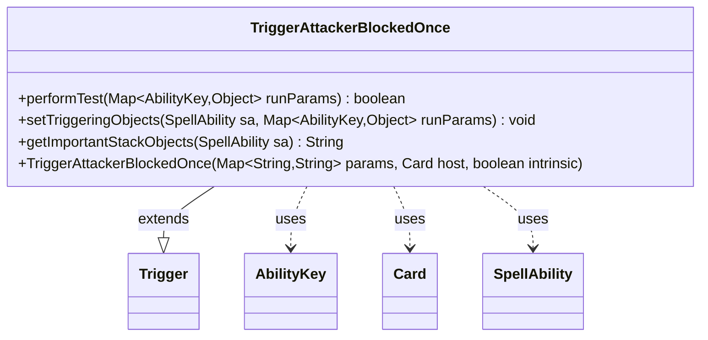

---
aliases:
  - TriggerAttackerBlockedOnce
tags:
  - java/class
  - module/forge-game
  - pkg/forge/game/trigger
fqn: forge.game.trigger.TriggerAttackerBlockedOnce
package: forge.game.trigger
module: forge-game
kind: Class
---

# TriggerAttackerBlockedOnce

**Package:** `forge.game.trigger`   **Module:** `forge-game`   **Kind:** Class



## Relationships
**Extends:**
- [[forge.game.trigger.Trigger|Trigger]]
**Uses:**
- [[forge.game.ability.AbilityKey|AbilityKey]]
- [[forge.game.card.Card|Card]]
- [[forge.game.spellability.SpellAbility|SpellAbility]]

## Design Description

The class TriggerAttackerBlockedOnce models the Magic: The Gathering trigger condition that fires when an attacking creature becomes blocked. It extends the abstract Trigger base class, supplying concrete implementations of the trigger lifecycle: performTest evaluates whether the event's attacking creatures satisfy the card-script's ValidCard filter, while setTriggeringObjects exposes the matched attackers to the resolving SpellAbility under the AbilityKey.Attackers key. As a leaf in the Trigger hierarchy, it is data-driven—configured at construction from a card-script parameter map plus its host Card—and collaborates with AbilityKey to address run-time event parameters. getImportantStackObjects produces a localized, human-readable summary of the attackers for stack display, reflecting an intent to keep trigger feedback presentation-aware while delegating shared mechanics to the superclass.

## Source
`forge-game/src/main/java/forge/game/trigger/TriggerAttackerBlockedOnce.java`

```java
package forge.game.trigger;

import java.util.Map;

import forge.game.ability.AbilityKey;
import forge.game.card.Card;
import forge.game.spellability.SpellAbility;
import forge.util.Localizer;

public class TriggerAttackerBlockedOnce extends Trigger {

    public TriggerAttackerBlockedOnce(Map<String, String> params, Card host, boolean intrinsic) {
        super(params, host, intrinsic);
    }

    /** {@inheritDoc}
     * @param runParams*/
    @Override
    public final boolean performTest(final Map<AbilityKey, Object> runParams) {
        if (!matchesValidParam("ValidCard", runParams.get(AbilityKey.Attackers))) {
            return false;
        }

        return true;
    }

    /** {@inheritDoc} */
    @Override
    public final void setTriggeringObjects(final SpellAbility sa, Map<AbilityKey, Object> runParams) {
        sa.setTriggeringObjectsFrom(runParams, AbilityKey.Attackers);
    }

    @Override
    public String getImportantStackObjects(SpellAbility sa) {
        StringBuilder sb = new StringBuilder();
        sb.append(Localizer.getInstance().getMessage("lblAttackers")).append(": ").append(sa.getTriggeringObject(AbilityKey.Attackers));
        return sb.toString();
    }
}
```

## Python
`forge/game/trigger/TriggerAttackerBlockedOnce.py`

```python
from forge.game.trigger.Trigger import Trigger
from forge.game.ability.AbilityKey import AbilityKey
from forge.game.card.Card import Card
from forge.game.spellability.SpellAbility import SpellAbility
from forge.util.Localizer import Localizer


class TriggerAttackerBlockedOnce(Trigger):

    def __init__(self, params: dict[str, str], host: Card, intrinsic: bool):
        super().__init__(params, host, intrinsic)

    def performTest(self, runParams: dict[AbilityKey, object]) -> bool:
        if not self.matchesValidParam("ValidCard", runParams.get(AbilityKey.Attackers)):
            return False

        return True

    def setTriggeringObjects(self, sa: SpellAbility, runParams: dict[AbilityKey, object]) -> None:
        sa.setTriggeringObjectsFrom(runParams, AbilityKey.Attackers)

    def getImportantStackObjects(self, sa: SpellAbility) -> str:
        sb = []
        sb.append(Localizer.getInstance().getMessage("lblAttackers"))
        sb.append(": ")
        sb.append(str(sa.getTriggeringObject(AbilityKey.Attackers)))
        return "".join(sb)
```
